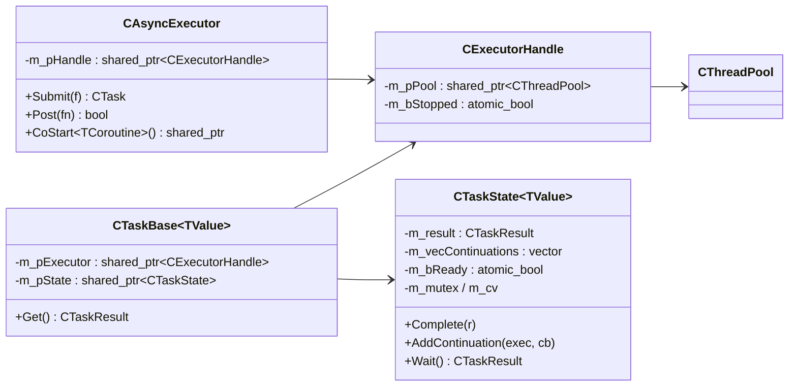

# 异步库 CAsyncExecutor / CTask — 实现文档

> 配套使用文档：[async-usage.md](async-usage.md)
> 源码：`Common/Async/AsyncExecutor.h`（985 行）+ `AsyncExecutor.cpp`（123 行）

## 1. 总体架构



## 2. 关键设计：CExecutorHandle（生命周期加固）

```cpp
struct CExecutorHandle {
    std::shared_ptr<common::thread::CThreadPool> m_pPool; // 线程池对象（任务链持有时不释放）
    std::atomic<bool> m_bStopped;                          // 停止后拒绝新投递
};
```

- `Submit` 创建的任务通过 `shared_ptr<CExecutorHandle>` 引用执行器 → **任务链持有时线程池不被销毁**，
  即使执行器对象先析构，已投递/已链式任务仍安全完成；
- `Stop()` 只置 `m_bStopped=true` + `m_pPool->Stop()`，保留句柄与线程池对象（未启动状态），
  已创建任务仍绑定本执行器（不再异步投递）。

## 3. CTaskState：任务共享状态（核心）

```cpp
std::mutex m_mutex;                   // 保护状态与续接列表
std::condition_variable m_cv;         // 通知 Wait 等待者
std::vector<Continuation> m_vecContinuations; // 未完成时的续接列表
std::atomic<bool> m_bReady;           // 是否已完成
CTaskResult<TValue> m_result;         // 最终结果
```

### Complete：完成并触发续接（锁外调用，防重入死锁）

```cpp
void Complete(const CTaskResult<TValue>& result)
{
    std::vector<Continuation> vecCbs;
    {
        lock;
        if (m_bReady) return;         // 仅首次生效
        m_bReady = true; m_result = result;
        vecCbs.swap(m_vecContinuations);  // 取出全部续接
    }
    m_cv.notify_all();                // 多线程 Get 同一任务：唤醒所有等待者
    for (cb : vecCbs) cb(result);     // 锁外按注册顺序调用续接
}
```

### AddContinuation：未就绪登记 / 已就绪投递

- 未就绪：登记到 `m_vecContinuations`，任务完成时触发；
- 已就绪：**投递到执行器线程池异步执行**（与 JS/C# 一致，回调不在注册线程执行）；
  执行器不可用（停止）→ 返回 `false`（回调不执行）。

### Wait：阻塞取结果

```cpp
// 先短自旋（~50µs，relaxed 读），超时再 m_cv.wait(pred: m_bReady)
// 支持多线程并发 Get 同一任务（Complete 用 notify_all）
```

## 4. Submit：任务投递

```cpp
template <typename TFn>
auto CAsyncExecutor::Submit(TFn f, const CSourceLoc& loc = CSourceLoc()) -> CTask<Result>
{
    CTask<TResult> task;
    task.m_pExecutor = m_pHandle;        // 共享执行器句柄
    task.m_pState->SetLoc(loc);
    auto fnRun = [pState, f]() {
        try { detail::CompleteSuccess(pState, f); }   // f 抛异常？
        catch (...) { pState->Complete(CTaskResult<TResult>::MakeNone(kException)); }
    };
    if (m_pHandle->m_bStopped || !m_pHandle->m_pPool->Submit(fnRun))
        pState->Complete(CTaskResult<TResult>::MakeNone(kNotStarted)); // 未启动 → 立即无值
    return task;
}
```

- 任务异常 → 转为 `kException` 无值终止（**Option 风格，无异常外溢**）；
- 执行器不可用 → 任务立即以 `kNotStarted` 完成（`Get()` 不阻塞）。

## 5. Then：链式续接 + 类型分派

### 类型萃取

```cpp
template <typename T> struct TaskTraits { static const int Kind = 0; using ValueType = T; };
// CTask<U>          → Kind = 1（flatMap）
// CTaskResult<U>    → Kind = 2（原样转发）
template <typename TFn, typename... TArgs> struct TInvokeResult { using type = decltype(...); };
```

### Then 流程（以非 void 上游为例）

```cpp
using TResult = 变换原始返回类型; using TOut = TaskTraits<TResult>::ValueType;
CTask<TOut> taskNext; taskNext.m_pExecutor = 上游句柄; taskNext.m_pState->SetLoc(loc);
上游->AddContinuation(exec, [exec, pNextState, f](upResult) {
    ① 上游无值 → pNextState->Complete(MakeNone(upResult.Reason()));  // 终止传播
    ② TValue valueCopied = upResult.Value();   // 拷贝值，供异步续接安全使用（不引用上游状态）
    ③ fnRun = [pNextState, f, valueCopied]{ detail::RunTransform(pNextState, f, valueCopied,
             TaskKind<TResult>()); };          // 按 Kind 分派
    ④ 执行器投递 fnRun；不可用 → Complete(MakeNone(kStopped));
});
```

### RunTransform 三种分派（Kind 0/1/2）

| Kind | 变换返回 | 行为 |
|---|---|---|
| 0 | 普通值 / void | `CompleteSuccess`（有值传播 / void 完成）；异常 → `kException` |
| 1 | `CTask<TNew>` | flatMap：执行 f 得内部任务，`FlatMapForward` 用 `OnResult` 把内部结果原样转发到下游 |
| 2 | `CTaskResult<TOut>` | 原样转发 `pNextState->Complete(f(...))` |

`CTask<void>` 特化走 `RunTransformVoid`（变换无参），逻辑同构。

## 6. 线程模型

- 任务与续接都在**工作线程**执行（`Submit`/`Then` 注册的工作会投递到线程池）；
- 任务**已完成**时注册回调（`OnSuccess`/`OnNone`/`Then`）→ 投递到执行器**异步触发**（不占用注册线程）；
- 执行器未启动/已停止 → 注册视为失败（回调不执行 / `kStopped` 完成）。

## 7. 其他成员

- `Post`：fire-and-forget，直接 `m_pPool->Submit`（`m_bStopped` 时返回 false）；
- `Stop`：置 `m_bStopped` + `m_pPool->Stop()`（保留句柄，已创建任务仍绑定）；
- `Start`：若曾 Stop 过则**重建句柄与线程池**（隔离旧任务），再 `Start()`；
- `IsStopped` / `IsIdle`：轻量原子读（供协程内联续接负载感知）；
- `AdoptState(pState)`：用已有任务状态构造 CTask（协程 `AsTask` 用）；
- `CoStart`：见 [coroutine-impl.md](coroutine-impl.md)。

## 8. 源码位置调试（NOTHROW_LOC）

调试构建（`-O0`）下 `Submit/Then` 可传 `NOTHROW_LOC`，把注册点 `__PRETTY_FUNCTION__/__FILE__/__LINE__`
存入 `CTaskState::m_loc`，watch 中定位「当前任务是哪里注册的」；发布构建零开销（空位置）。
