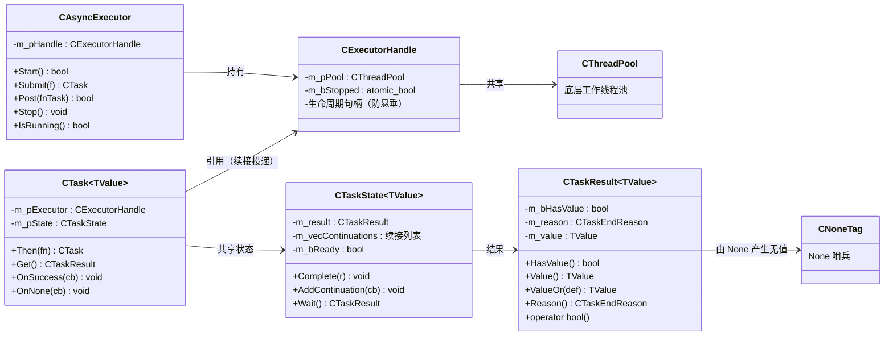
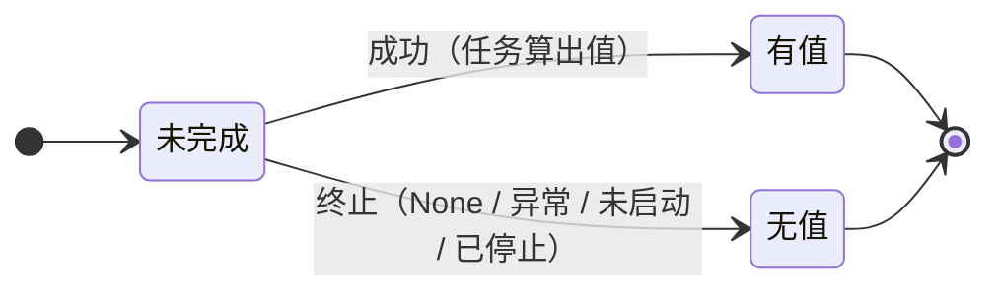
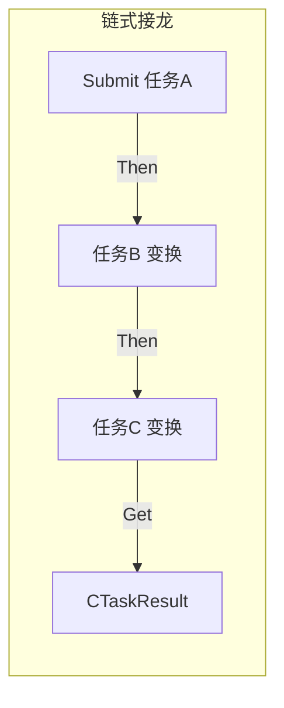
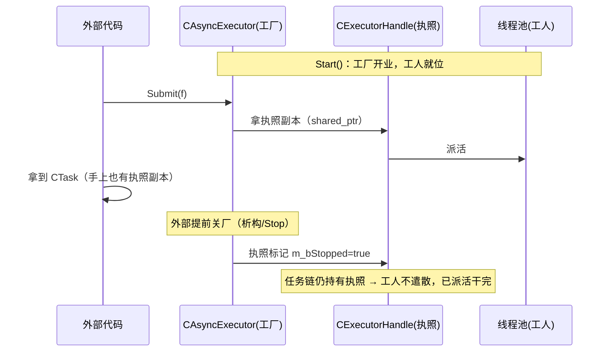
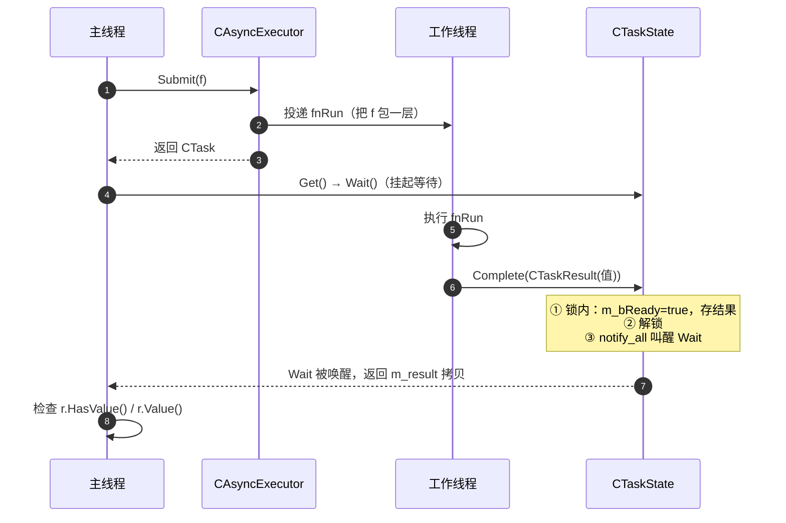
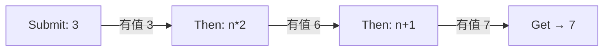
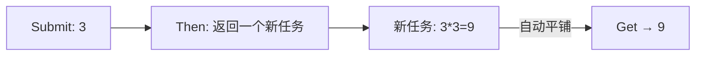
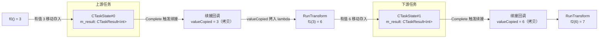
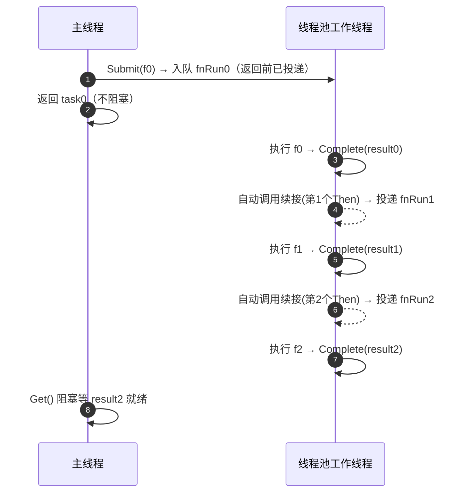
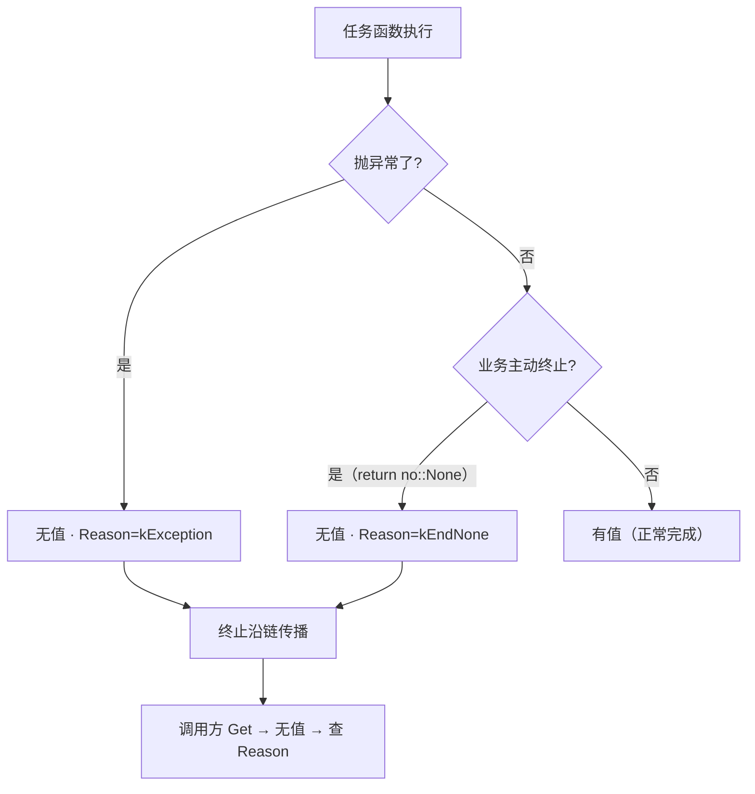

# AsyncExecutorNoThrow 无异常版异步框架解析（Option 风格）

## 1. 这是什么？为什么需要它？

这是 **ServerCore/Common 提供的一套"不抛异常"的异步任务框架**。它允许你像这样写异步代码：

```cpp
namespace no = common::nothrow;

no::CAsyncExecutor exec(2);   // 一个 2 线程的"任务加工厂"
exec.Start();

// 提交一个任务 → 拿结果（全程不需要 try/catch）
no::CTaskResult<int> r = exec.Submit([]() { return 3; })
                             .Then([](int n) { return n * 2; })
                             .Then([](int n) { return n + 1; })
                             .Get();
// r.HasValue() == true，r.Value() == 7
```

**关键思想：采用 Rust Option 风格（有值/无值二态）**：

- **有值（Some）**：任务算出结果，值沿链**传播**，下游继续执行；
- **无值（None）**：链**终止**（正常提前结束），下游全部跳过。

```cpp
// 想终止链？明确返回无值即可
no::CTaskResult<int> r = exec.Submit([]() { return -5; })
    .Then([](int n) -> no::CTaskResult<int> {
        if (n < 0)
        {
            return no::None;      // 无值 → 链终止（正常结束）
        }
        return n * 2;             // 有值 → 传播
    })
    .Then([](int n) { return n + 1; })   // 上游终止，此步被跳过
    .Get();
// r.HasValue() == false
```

> 错误不再是框架的一部分：**错误码是普通值**，由业务自己解释；框架只负责"有没有值"。想要"终止"语义就用 `return no::None;`。

### 和异常版 `AsyncExecutor.h` 的区别

项目里有两套并行实现，别搞混：

| | `common::CAsyncExecutor`（异常版） | `common::nothrow::CAsyncExecutor`（本框架） |
|---|---|---|
| 错误传递 | `std::exception_ptr`（异常指针） | **没有错误类型**，只有有值/无值 |
| `Get()` 返回 | 直接返回值，失败就 `throw` | `CTaskResult<T>`，需检查 `HasValue()` |
| 任务函数抛异常 | 异常沿链传播 | 被捕获转为**无值**（终止原因 `kException`） |
| 业务主动终止 | 无对应概念 | `return no::None;` |
| 调用方 | 要 `try/catch` | **零 try/catch** |

---

## 2. 一图看懂整体架构



**一句话理解每个角色：**

| 类型 | 类比 | 职责 |
|---|---|---|
| `CAsyncExecutor` | 任务加工厂 / 老板 | 收任务、派给工人（线程池） |
| `CExecutorHandle` | 工厂的"营业执照" | 任务链持有它 = 保证工厂不提前倒闭（防悬垂） |
| `CThreadPool` | 工人团队 | 真正干活的线程 |
| `CTask<T>` | 一张"任务单" | 描述一件事 + 能继续追加步骤（Then） |
| `CTaskState<T>` | 任务单背后的"台账" | 记录结果、等结果的人（续接）、通知机制 |
| `CTaskResult<T>` | 任务的"交回单" | 要么有值（Some），要么无值（None） |
| `None` / `CNoneTag` | "无"哨兵 | 显式表达"本任务没有值，链终止" |

---

## 3. 核心概念逐个讲

### 3.1 `CTaskResult<T>` —— 一张"有值或无值"的交回单



- **`HasValue()`**：有值吗？有 → 用 `Value()` 取值
- **无值**：链终止，无值不携带任何"错误对象"；只有**终止原因**（`Reason()`，仅调试用）
- 用构造创建：
  ```cpp
  no::CTaskResult<int> ok(42);                    // 有值（隐式构造）
  no::CTaskResult<int> none;                      // 默认 = 无值（None）
  no::CTaskResult<int> none2(no::None);           // 显式无值
  ```
- 便捷：`if (r)`（`operator bool`）、`r.ValueOr(-1)`（无值给默认值）

> 默认构造 = 无值（终止原因 `kEndNone`），语义上"任务没产出值就当作终止"。

> **实现**：值**内联存储**（对标 `std::optional` / Rust `Option`）：无堆分配、无引用计数。
> 代价是结果拷贝为深拷贝（对小对象开销远小于堆分配）。结果类型需「默认构造 + 可拷贝」；
> move-only 类型（如 `std::unique_ptr`）不支持，可改用 `std::shared_ptr` 包裹。

### 3.2 `None` 与终止原因 `CTaskEndReason`（仅调试）

```cpp
namespace no = common::nothrow;

// ① None 哨兵：显式表达"无值、链终止"
const no::CNoneTag None = no::CNoneTag();   // 写法：return no::None;

// ② 终止原因（detail 内部，仅供调试 / 日志，不参与类型系统）
no::detail::CTaskEndReason reason = r.Reason();
```

内置终止原因（`detail::CTaskEndReason`）：

```text
kEndCompleted = 0  有值（正常完成）
kEndNone      = 1  业务返回 no::None（正常提前终止）
kNotStarted   = 2  执行器没 Start 就 Submit
kStopped      = 3  执行器已停止，再投递被拒
kException    = 4  任务/变换函数抛了异常（被框架捕获转无值）
```

> `Reason()` 不是"错误码"，只是诊断用的原因标签。业务上想区分"为什么终止"，请自己在链里传值（比如返回 `CTaskResult<enum>`），框架不替你做业务判断。

### 3.3 `CTask<T>` —— 任务单，能"接龙"



- `Submit(f)` 造第一张单
- `Then(fn)` 往上追加步骤（上一个的结果是下一个的输入）
  - 变换返回普通值 → 成为下游的有值
  - 变换返回 `CTask` / `CTaskResult` → 自动平铺（flatMap）
  - 变换返回 `no::None` → 下游无值，链终止
- `Get()` 阻塞等到最终结果
- `OnSuccess / OnNone` 挂"有值 / 无值时通知我"的回调（不阻塞）

> **`CTask<void>` 也支持 `Then`**：无参数传入，可继续接链（详见 5.7）。

### 3.4 `CTaskState<T>` —— 幕后的"台账"（内部类）

每个任务背后有一个共享台账，负责三件事：

1. **存结果**：`Complete(result)` 写入最终结果
2. **记人等**：`AddContinuation(cb)` 把"等这个结果的人"记下来
3. **叫醒人**：结果一到，`notify_all()` 叫醒 `Wait` 的人，并逐个调用续接

> 线程安全要点（代码里最重要的一段）：`Complete` 先**在锁内**记录结果、取出续接列表，然后**在锁外**调用续接——这样续接回调里如果再调 `Complete`/`Wait` 不会死锁。

### 3.5 `CAsyncExecutor` + `CExecutorHandle` —— 工厂与"营业执照"



**为什么需要 `CExecutorHandle`？** 防止"工厂倒闭了，任务单还在等结果"的悬垂指针问题：

- 任务链持有 `shared_ptr<CExecutorHandle>`（执照副本）
- 执行器析构 → 只把执照标记 `m_bStopped`，**线程池仍被任务链保住**
- 已投递的任务继续跑完；新投递被拒绝 → 无值（`kStopped`）

> **`CAsyncExecutor` 不再是模板类**（旧版带 `<TError>` 泛化已移除）。错误类型体系已删除，执行器就一种，直接 `no::CAsyncExecutor exec(2);` 即可。

---

## 4. 一次任务的完整生命周期（时序图）



**要点**：`Get()` 是"阻塞等"，`Submit` 是非阻塞的；真正干活的是线程池里的工作线程。

---

## 5. 链式 `Then` 与扁平化 `flatMap`

### 5.1 普通链式（同步变换）



每个 `Then` 把"上一个的有值"喂给"下一个变换函数"。

### 5.2 flatMap：变换函数返回"另一个任务"

有时变换函数自己也要异步（比如查数据库）。`Then` 支持"返回任务"的变换，并自动**平铺**（像 `Promise.then`）：



代码等价于"任务里套任务，但对外看起来是一条平直的链"：

```cpp
exec.Submit([]() { return 3; })
    .Then([&exec](int n) {          // 返回 CTask<int> → 自动平铺
        return exec.Submit([n]() { return n * n; });   // 内层异步任务
    })
    .Then([](int n) { return "平方 = " + std::to_string(n); })
    .Get();
```

框架怎么识别"是普通值、任务、还是结果"？靠编译期类型判定（`detail::TaskTraits`，同时提供 `Kind` 分派与 `ValueType` 解包）：

```mermaid
flowchart TD
    F[Then 的变换函数返回类型] --> Q{是什么?}
    Q -- 普通值 --> S[直接 f(value) → 完成下游]
    Q -- CTask --> F2[把 f(value) 得到的内部任务<br/>注册续接]
    Q -- CTaskResult --> F3[有值 → 继续下游<br/>无值 → 下游无值]
    F2 --> W[内部任务完成 → 转发结果给下游]
    S --> D[下游任务完成]
    W --> D
    F3 --> D
```

### 5.3 无值终止怎么沿链传播？


**一旦某个环节无值，后面所有 `Then` 全部跳过**，终止一路传递到 `Get`（`Reason()` 透传）。这是"正常提前结束"，不是错误。

### 5.4 值在链中如何传递（共享状态信箱 + 拷贝）

每个函数的结果值，靠「每个 `CTask` 背后的 `CTaskState` 共享状态」一级一级传递：



**完整路径（以 `Submit(f0) → Then(f1) → Then(f2)` 为例）：**

| 环节 | 值在哪 | 动作 |
|---|---|---|
| `f0()` 返回 | 临时右值 `3` | **移动**存入 `CTaskState#0.m_result` |
| 续接回调触发 | 参数引用 `m_result` | `upResult.Value()` 读出 `3` |
| `valueCopied` | 续接回调局部变量 | **拷贝**一份（解耦上游生命周期） |
| `fnRun` lambda | 捕获 `valueCopied` | 投递到线程池 |
| `f1(valueCopied)` | 实参 | `const T&` 形参不拷贝；按值形参再拷贝 |
| `f1()` 返回 | `6` | **移动**存入 `CTaskState#1.m_result` |

**两个要点：**

1. **为什么续接里要拷贝 `valueCopied`？** 上游任务可同时挂多个续接（多个 `Then`/`OnSuccess`），且续接在别的线程异步执行。若 lambda 捕获 `m_result` 的引用，上游对象析构后即悬垂。拷贝后 lambda 自己持有值，与上游完全解耦。
2. **约束：链式传值要求 `TValue` 可拷贝**。每次 `Then` 至少 1 拷贝 + 1 移动；大对象建议用 `std::shared_ptr<T>` 作为链中 `TValue`（拷指针不拷内容）。

### 5.5 执行时机：为什么没有 `Execute()`？

链条是**"完成事件自动驱动"**的，不需要手动点火：

1. **`Submit` 返回任务前就已投递**：`Submit(f0)` 内部在返回 `CTask` 之前就调了 `m_pPool->Submit(fnRun)` 把 `f0` 包一层入队，工作线程随即执行。`Submit` 本身就是执行入口。
2. **`Then` 只做两件事**：算好下游类型 + 往上游 `AddContinuation` 挂回调，**不执行任何函数**。
3. **接力靠 `Complete` 自动触发**：上游任务跑完 → `CTaskState::Complete` → 锁外依次调用所有续接 → `Then` 的续接里再把下一个变换投进线程池 → 以此类推。



**一句话**：链条在 `Submit` 那一刻就"点燃"，后面的 `Then` 只是往已点着的引信上接更多步骤；唯一要主动做的是 `Start()`（让线程池有工人）和 `Get()`（阻塞等结果，可省略）。

### 5.6 链式调用是异步的吗？

`Then` 注册是同步的（立即返回下游任务），但**变换函数是否在别的线程执行，取决于有没有活跃执行器**：

| 场景 | 变换函数在哪执行 | 异步？ |
|---|---|---|
| 有活跃执行器（`Submit` 开的链） | 投递到**线程池工作线程** | ✅ 真异步 |
| 执行器未启动 / 已停止（线程池不可用） | 投递失败 → 续接视为失败（下游无值 `kStopped`） | ❌ 失败 |
| 上游无值 | 不执行变换，无值直接完成下游 | 同步传播 |

另外：**上游已完成时再调 `Then`**，续接**不会在注册线程同步触发**——会投递到执行器线程池异步执行（与 JS/C# 一致）；执行器未启动 / 已停止或投递失败时，**视为调用失败**（下游以 `kStopped` 完成），不退回同步执行。

**对调用方的含义：**

- 别假设回调固定在某一线程（可能在任意工作线程；任务已完成时注册的回调经执行器异步投递）；
- 回调里访问共享变量需加锁/原子。

### 5.7 `CTask<void>` 也支持 `Then`

void 任务没有值，但可以继续接链：`Then` 的变换**无参数传入**：

```cpp
no::CTaskResult<int> r =
    exec.Submit([]() { /* 干点事 */ })  // CTask<void>
        .Then([]() { return 42; })        // void → int（无参数）
        .Then([](int n) { return n + 8; }) // 继续正常链
        .Get();
// r.Value() == 50
```

- `CTaskResult<void>` 的 `HasValue()` = "任务完成与否"（无值 → 未完成/终止）
- `OnSuccess` 回调无参；`OnNone` 回调收 `Reason()`
- void 上游返回 `no::None` 同样会终止下游

---

## 6. 无值终止模型



| 无值来源 | 表现 |
|---|---|
| 任务函数 `throw` | 框架捕获 → 无值（`kException`） |
| 业务主动终止 | `return no::None;`（`kEndNone`） |
| 执行器未启动 | 无值（`kNotStarted`） |
| 执行器已停止 | 无值（`kStopped`） |

> **注意**：框架不保留异常文本，也不定义"错误码"。任务抛异常就是"没值了"，具体为什么，业务可以在任务函数里自己记录日志或返回值。错误码是**普通值**，通过链式返回值传播，由业务自行解释。

---

## 7. 线程模型 —— 谁在哪个线程跑？

```mermaid
flowchart TD
    subgraph 主线程
        A[Submit / Then 注册] --> B[Get 阻塞等]
    end
    subgraph 工作线程（线程池）
        C[任务函数 f]
        D[续接 / OnSuccess / OnNone]
    end
    A -.投递.-> C
    C -->|结果完成| D
    B -.被唤醒.-> E[拿到结果]
```

**必须记住的两条规则：**

1. **任务函数和续接在工作线程执行** —— 别在工作线程里碰主线程的私有数据（要加锁或用弱引用）
2. **如果任务已经完成**，你再调 `OnSuccess/OnNone/Then` 注册回调，回调会**投递到执行器异步执行**（执行器不可用时视为调用失败，回调不执行）——所以"回调在哪个线程"不固定，别做线程假设

---

## 8. 代码怎么读（推荐阅读顺序）

| 顺序 | 看什么 | 目的 |
|---|---|---|
| 1 | `CTaskResult<T>`（头文件） | 先懂"结果"长什么样（有值/无值） |
| 2 | `CAsyncExecutor::Submit`（实现） | 懂任务怎么被投递 |
| 3 | `CTaskState::Complete`（实现） | **重点**：线程安全核心，锁外调续接 |
| 4 | `CTask<T>::Then`（实现） | 懂链式怎么串起来 |
| 5 | `detail::RunTransform` / `RunTransformVoid` | 懂 flatMap 分派与 void 链 |
| 6 | `CExecutorHandle` | 懂生命周期安全 |

---

## 9. 常见用法速查

```cpp
namespace no = common::nothrow;

// ① 简单提交
no::CAsyncExecutor exec(2);
exec.Start();
no::CTaskResult<int> r = exec.Submit([]() { return 42; }).Get();
if (r.HasValue())  /* 用 r.Value() */;

// ② 链式
auto r2 = exec.Submit([]() { return 3; })
              .Then([](int n) { return n * 2; })
              .Then([](int n) { return n + 1; })
              .Get();

// ③ flatMap（变换返回任务）
auto r3 = exec.Submit([]() { return 3; })
              .Then([&exec](int n) { return exec.Submit([n]() { return n * n; }); })
              .Get();

// ④ 回调（fire-and-forget）
no::CTask<int> t = exec.Submit([]() { return 7; });
t.OnSuccess([](const int& v) { /* 有值 */ });
t.OnNone([](no::detail::CTaskEndReason) { /* 无值终止 */ });

// ⑤ void 任务（也支持 Then）
no::CTaskResult<void> rv = exec.Submit([]() { /* 干点事 */ }).Get();
auto r5 = exec.Submit([]() { /* 干点事 */ })
              .Then([]() { return 1; })   // void → 值
              .Get();

// ⑥ 手动构造结果（CTaskResult）
auto ok   = no::CTaskResult<int>(1);           // 有值
auto none = no::CTaskResult<int>();            // 无值

// ⑦ 中途终止（Option 风格）
auto r7 = exec.Submit([]() { return -5; })
              .Then([](int n) -> no::CTaskResult<int> {
                  if (n < 0) return no::None;  // 终止
                  return n * 2;                // 传播
              })
              .Then([](int n) { return n + 1; })
              .Get();

exec.Stop(); // 优雅关闭：等已提交任务完成
```

---

## 10. 设计取舍：为什么选 eager（即时执行）而非手动触发/惰性？

异步框架存在三种执行模型：

| 模型 | 语义 | 触发点 | 代表 |
|---|---|---|---|
| **eager 即时** | "接上即跑"，链条是自动流水线 | `Submit` 调用那一刻 | JS Promise、C# `Task.Run`、Boost.Asio、Go goroutine、**本项目** |
| **lazy 惰性** | 构建与运行分离，构建完只是描述 | 额外 `subscribe()`/`spawn()`/`get()` | Rust Future、Python asyncio、Rx 冷 Observable、`std::launch::deferred` |
| **手动触发** | 显式 `Execute()`/`Start()` 点燃 | 用户手动调用 | C# `new Task(...).Start()` |

**本项目为什么选 eager：**

1. **消灭"忘记启动"这类错误类别**——手动触发漏调 = 任务永挂起、`Get()` 死等，是最难排查的 bug；eager 让链条自跑，少一个出错维度。
2. **与 continuation 模型天然契合**——执行时机内嵌在"完成事件流"里（`Complete` 触发续接），若改手动触发等于把"何时调 `Complete`"暴露给用户。
3. **`Submit` 本身就是启动**——触发动作存在，只是不叫 `Execute` 叫 `Submit`；`Then` 不触发因为它只是接上一步，接力由完成事件自动进行。

**各语言/框架一览：**

| 语言/框架 | 触发模型 | 说明 |
|---|---|---|
| JS Promise | eager | `new Promise(executor)` 时 executor 立即执行；`.then` 只注册 |
| C# | 两者 | `Task.Run`/async 方法 eager；`new Task(...)` 需 `.Start()` |
| C++ `std::async` | 默认 eager | 默认新线程立即跑；`launch::deferred` 惰性到 `get()` |
| C++ Boost.Asio | eager | 调用 `async_*` 即发起，靠 completion handler 自动接力（与本项目同构） |
| Rust Future | lazy | 必须 `poll`/`spawn` 才推进；可组合、可取消 |
| Python asyncio | lazy | coroutine 对象不跑，必须 `await`/`create_task` |
| Rx 冷 Observable | lazy | 每次 `subscribe()` 重新执行（可重放） |
| Go goroutine | eager | `go f()` 立即调度 |

**关键洞察**：基于"完成回调自动接力"的框架基本都是 eager（Promise、Asio、本项目）；lazy 的代价是必须有个"材料化"步骤（`subscribe`/`spawn`/`await`），换来可组合、可取消、可重放。本项目的定位是**一次性流水线 + 线程池执行器**，不是可重放的数据流（那是 Rx 的领域），eager 是正确选择。

**如果将来真要惰性**：优先在框架外实现（把整条链封装成一个 `std::function` 工厂，需要时再 `Submit`），而不是给核心引擎加惰性模式——避免污染主路径的简单性。

---

## 附：术语小抄

| 术语 | 含义 |
|---|---|
| Option 风格 | 结果 = 有值（Some）或无值（None），无值即终止（类似 Rust `Option` / C++ `std::optional`） |
| `None` 哨兵 | 显式构造无值结果的标记（`CNoneTag`） |
| `fire-and-forget` | 注册回调但不阻塞等待 |
| `flatMap` / 平铺 | 变换返回任务/结果时自动拆包接续 |
| 续接 (Continuation) | 等任务结果的通知回调 |
| 句柄 (Handle) | 共享资源引用，保命用 |
| `CTaskEndReason` | 终止原因（仅调试/日志，不参与类型系统） |

> 完整可运行示例见 `examples/nothrow_demo.cpp`（`cd examples && make run`）。
