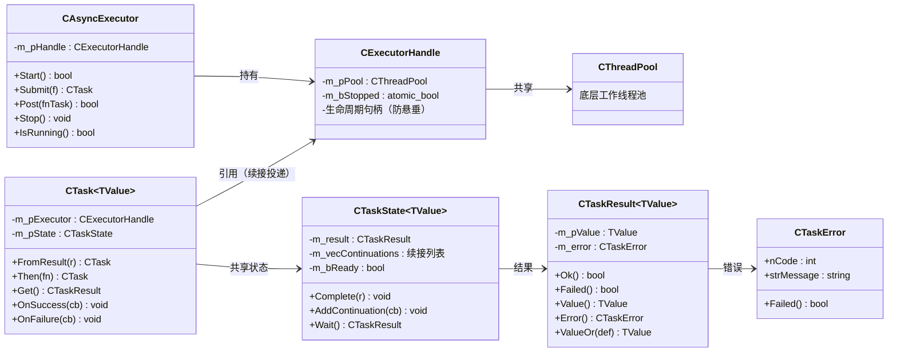
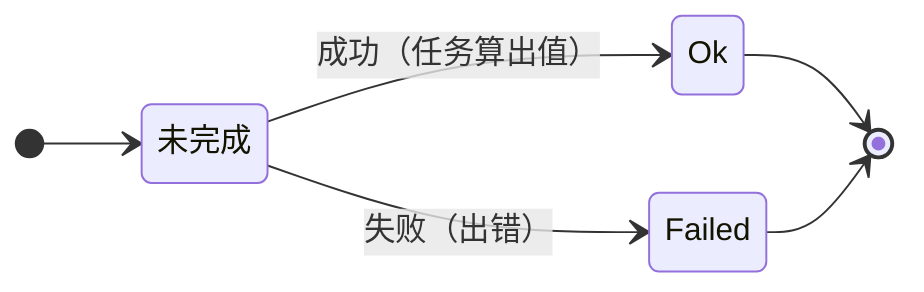
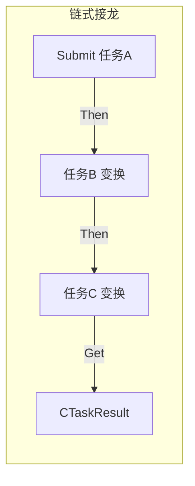
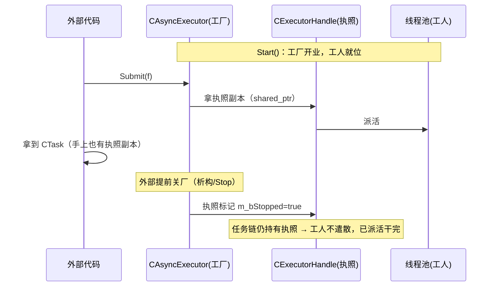
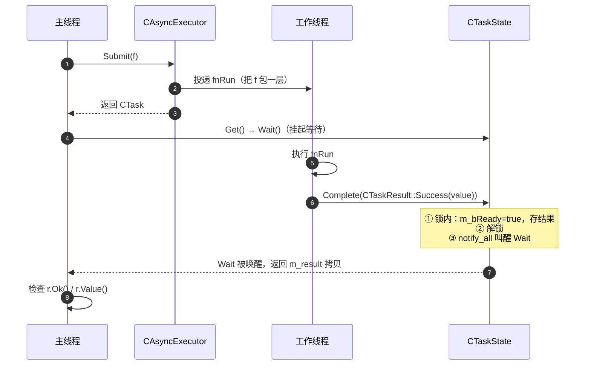
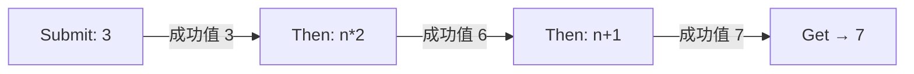
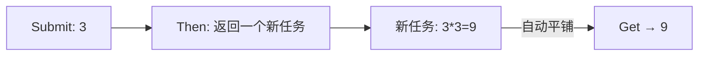
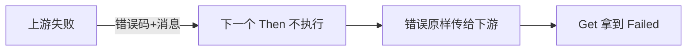

# AsyncExecutorNoThrow 无异常版异步框架解析

## 1. 这是什么？为什么需要它？

这是 **ServerCore/Common 提供的一套"不抛异常"的异步任务框架**。它允许你像这样写异步代码：

```cpp
namespace no = common::nothrow;

no::CAsyncExecutor exec(2);   // 一个 2 线程的"任务加工厂"
exec.Start();

// 提交一个任务 → 拿结果（全程不需要 try/catch）
no::CTaskResult<int> r = exec.Submit([]() { return 3; })
                             .Then([](int n) { return n * 2; })
                             .Then([](int n) { return n + 1; })
                             .Get();
// r.Ok() == true，r.Value() == 7
```

**关键思想：错误不用异常传递，而是打包成一个"结果对象"**（类似 C++23 的 `std::expected<T, Error>`）：

| 传统异常风格 | 本框架风格 |
|---|---|
| 函数抛 `throw`，调用方 `catch` | 函数返回 `CTaskResult`，调用方查 `Ok()/Failed()` |
| 错误类型靠异常类区分 | 错误 = 错误码 `nCode` + 消息 `strMessage` |
| 忘记 catch 会崩 | 忘记检查只会拿到"失败的结果" |

### 和异常版 `AsyncExecutor.h` 的区别

项目里有两套并行实现，别搞混：

| | `common::CAsyncExecutor`（异常版） | `common::nothrow::CAsyncExecutor`（本框架） |
|---|---|---|
| 错误传递 | `std::exception_ptr`（异常指针） | 错误码 + 消息（`CTaskError`） |
| `Get()` 返回 | 直接返回值，失败就 `throw` | `CTaskResult<T>`，需检查 `Ok()` |
| 任务函数抛异常 | 异常沿链传播 | 被捕获转为 `kTaskFailed` 错误码 |
| 调用方 | 要 `try/catch` | **零 try/catch** |

---

## 2. 一图看懂整体架构



**一句话理解每个角色：**

| 类型 | 类比 | 职责 |
|---|---|---|
| `CAsyncExecutor` | 任务加工厂 / 老板 | 收任务、派给工人（线程池） |
| `CExecutorHandle` | 工厂的"营业执照" | 任务链持有它 = 保证工厂不提前倒闭（防悬垂） |
| `CThreadPool` | 工人团队 | 真正干活的线程 |
| `CTask<T>` | 一张"任务单" | 描述一件事 + 能继续追加步骤（Then） |
| `CTaskState<T>` | 任务单背后的"台账" | 记录结果、等结果的人（续接）、通知机制 |
| `CTaskResult<T>` | 任务的"交回单" | 要么成功带结果，要么失败带错误 |
| `CTaskError` | 错误说明 | 错误码 + 人类可读的消息 |

---

## 3. 核心概念逐个讲

### 3.1 `CTaskResult<T>` —— 一张"要么成功要么失败"的交回单



- **`Ok()`**：成功了吗？成功 → 用 `Value()` 取值
- **`Failed()`**：失败了吗？失败 → 用 `Error()` 拿 `CTaskError`
- 两者互斥：**成功必有值，失败必有错误**
- 用工厂创建：
  ```cpp
  auto ok   = CTaskResult<int>::Success(42);          // 成功带值
  auto fail = CTaskResult<int>::Failure(1001, "出错"); // 失败带错误码+消息
  ```
- 便捷：`if (r)`（`operator bool`）、`r.ValueOr(-1)`（失败给默认值）

> 默认构造 = 失败态（`kTaskFailed + "uninitialized"`），防止"看起来成功其实没值"的坑。

### 3.2 `CTaskError` —— 错误本身

```cpp
struct CTaskError {
    int nCode;            // 错误码：kTaskOk / kTaskFailed / 自定义业务码(如 1001)
    std::string strMessage; // 可读描述
    bool Failed() const;   // nCode != kTaskOk
};
```

框架内置错误码（`TaskErrorCode`）：

```text
kTaskOk = 0              成功
kTaskFailed              任务函数抛了异常（被框架捕获）
kExecutorNotStarted      执行器没 Start 就 Submit
kExecutorStopped         执行器已停止，再投递被拒
```

> `nCode` 用 `int` 而不是枚举：业务方可以传自己的业务错误码（1000+），枚举只是框架内置的建议集合。

### 3.3 `CTask<T>` —— 任务单，能"接龙"



- `Submit(f)` 造第一张单
- `Then(fn)` 往上追加步骤（上一个的结果是下一个的输入）
- `Get()` 阻塞等到最终结果
- `FromResult(r)` 直接拿一个现成结果起跑
- `OnSuccess / OnFailure` 挂"成功/失败时通知我"的回调（不阻塞）

### 3.4 `CTaskState<T>` —— 幕后的"台账"（内部类）

每个任务背后有一个共享台账，负责三件事：

1. **存结果**：`Complete(result)` 写入最终结果
2. **记人等**：`AddContinuation(cb)` 把"等这个结果的人"记下来
3. **叫醒人**：结果一到，`notify_all()` 叫醒 `Wait` 的人，并逐个调用续接

> 线程安全要点（代码里最重要的一段）：`Complete` 先**在锁内**记录结果、取出续接列表，然后**在锁外**调用续接——这样续接回调里如果再调 `Complete`/`Wait` 不会死锁。

### 3.5 `CAsyncExecutor` + `CExecutorHandle` —— 工厂与"营业执照"



**为什么需要 `CExecutorHandle`？** 防止"工厂倒闭了，任务单还在等结果"的悬垂指针问题：

- 任务链持有 `shared_ptr<CExecutorHandle>`（执照副本）
- 执行器析构 → 只把执照标记 `m_bStopped`，**线程池仍被任务链保住**
- 已投递的任务继续跑完；新投递被拒绝 → `kExecutorStopped`

---

## 4. 一次任务的完整生命周期（时序图）



**要点**：`Get()` 是"阻塞等"，`Submit` 是非阻塞的；真正干活的是线程池里的工作线程。

---

## 5. 链式 `Then` 与扁平化 `flatMap`

### 5.1 普通链式（同步变换）



每个 `Then` 把"上一个的成功值"喂给"下一个变换函数"。

### 5.2 flatMap：变换函数返回"另一个任务"

有时变换函数自己也要异步（比如查数据库）。`Then` 支持"返回任务"的变换，并自动**平铺**（像 `Promise.then`）：



代码等价于"任务里套任务，但对外看起来是一条平直的链"：

```cpp
exec.Submit([]() { return 3; })
    .Then([&exec](int n) {          // 返回 CTask<int> → 自动平铺
        return exec.Submit([n]() { return n * n; });   // 内层异步任务
    })
    .Then([](int n) { return "平方 = " + std::to_string(n); })
    .Get();
```

框架怎么识别"是普通值还是任务"？靠编译期类型判定（`detail::IsTask`）：

```mermaid
flowchart TD
    F[Then 的变换函数返回类型] --> Q{是不是 CTask?}
    Q -- 否 --> S[直接 f(value) → 完成下游]
    Q -- 是 --> F2[把 f(value) 得到的内部任务\n注册 OnSuccess/OnFailure]
    F2 --> W[内部任务完成 → 转发结果给下游]
    S --> D[下游任务完成]
    W --> D
```

### 5.3 错误怎么沿链传播？



**一旦某个环节失败，后面所有 `Then` 全部跳过**，错误一路传递到 `Get`。

---

## 6. 错误处理模型

```mermaid
flowchart TD
    T[任务函数执行] --> Q{抛异常了?}
    Q -- 是 --> E1[kTaskFailed + what()]
    Q -- 否 --> Q2{业务代码主动失败?}
    Q2 -- 是 --> E2[业务自定义错误码]
    Q2 -- 否 --> E3[Success(值)]
    E1 --> P[错误沿链传播]
    E2 --> P
    P --> G[调用方 Get → Failed → 查 Error]
```

| 错误来源 | 表现 |
|---|---|
| 任务函数 `throw` | 框架捕获 → `kTaskFailed` + `what()` 文本 |
| 业务主动失败 | `CTaskResult::Failure(业务码, 消息)` |
| 执行器未启动 | `kExecutorNotStarted` |
| 执行器已停止 | `kExecutorStopped` |

---

## 7. 线程模型 —— 谁在哪个线程跑？

```mermaid
flowchart TD
    subgraph 主线程
        A[Submit / Then 注册] --> B[Get 阻塞等]
    end
    subgraph 工作线程（线程池）
        C[任务函数 f]
        D[续接 / OnSuccess / OnFailure]
    end
    A -.投递.-> C
    C -->|结果完成| D
    B -.被唤醒.-> E[拿到结果]
```

**必须记住的两条规则：**

1. **任务函数和续接在工作线程执行** —— 别在工作线程里碰主线程的私有数据（要加锁或用弱引用）
2. **如果任务已经完成**，你再调 `OnSuccess/OnFailure/Then` 注册回调，回调会在**你当前线程**同步触发——所以"回调在哪个线程"不固定，别做线程假设

---

## 8. 代码怎么读（推荐阅读顺序）

| 顺序 | 看什么 | 目的 |
|---|---|---|
| 1 | `CTaskResult<T>`（头文件） | 先懂"结果"长什么样 |
| 2 | `CAsyncExecutor::Submit`（实现） | 懂任务怎么被投递 |
| 3 | `CTaskState::Complete`（实现） | **重点**：线程安全核心，锁外调续接 |
| 4 | `CTask<T>::Then`（实现） | 懂链式怎么串起来 |
| 5 | `detail::RunTransform` 两个重载 | 懂 flatMap 分派 |
| 6 | `CExecutorHandle` | 懂生命周期安全 |

---

## 9. 常见用法速查

```cpp
namespace no = common::nothrow;

// ① 简单提交
no::CAsyncExecutor exec(2);
exec.Start();
no::CTaskResult<int> r = exec.Submit([]() { return 42; }).Get();
if (r.Ok())  /* 用 r.Value() */;

// ② 链式
auto r2 = exec.Submit([]() { return 3; })
              .Then([](int n) { return n * 2; })
              .Then([](int n) { return n + 1; })
              .Get();

// ③ flatMap（变换返回任务）
auto r3 = exec.Submit([]() { return 3; })
              .Then([&exec](int n) { return exec.Submit([n]() { return n * n; }); })
              .Get();

// ④ 回调（fire-and-forget）
no::CTask<int> t = exec.Submit([]() { return 7; });
t.OnSuccess([](const int& v) { /* 成功 */ });
t.OnFailure([](const no::CTaskError& e) { /* 失败 */ });

// ⑤ void 任务
no::CTaskResult<void> rv = exec.Submit([]() { /* 干点事 */ }).Get();

// ⑥ 手动构造结果 / 预置失败
auto ok   = no::CTaskResult<int>::Success(1);
auto fail = no::CTaskResult<int>::Failure(1001, "业务错误");
auto r4   = no::CTask<int>::FromResult(fail).Then([](int){ return 0; }).Get(); // 沿链传播

exec.Stop(); // 优雅关闭：等已提交任务完成
```

---

## 附：术语小抄

| 术语 | 含义 |
|---|---|
| `expected` 风格 | 结果 = 值或错误二选一（C++23 `std::expected`） |
| `fire-and-forget` | 注册回调但不阻塞等待 |
| `flatMap` / 平铺 | 变换返回任务时自动拆包接续 |
| 续接 (Continuation) | 等任务结果的通知回调 |
| 句柄 (Handle) | 共享资源引用，保命用 |

> 完整可运行示例见 `examples/nothrow_demo.cpp`（`cd examples && make run`）。
