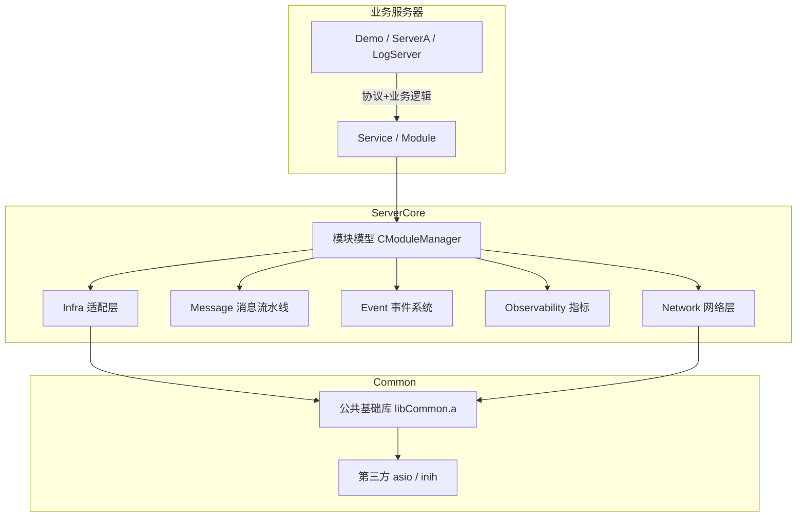
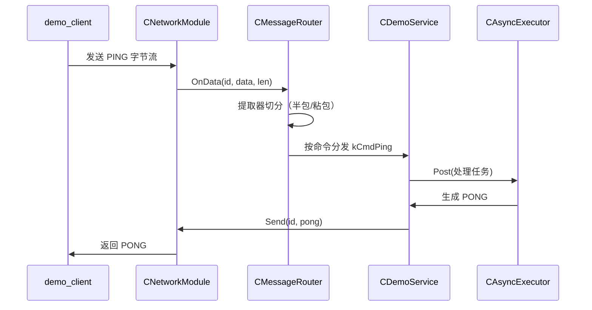

# 总体架构

## 分层



- **业务服务器**：只实现协议（提取器）与业务处理器，通过组合根装配模块。
- **ServerCore**：提供模块模型、生命周期、依赖注入、网络、消息、事件、指标等基础设施。
- **Common**：服务器无关的基础库（日志、配置、网络、定时器、线程池、序列化等）。

## 生命周期

```
main
  ↓
Application::Initialize()
  ├── RegisterModules()      # 组合根：new 模块并注册到 CModuleManager
  └── ModuleManager::InitializeAll()  # 按依赖拓扑初始化，传入 CResolveContext
        ↓
Application::Start()
  └── ModuleManager::StartAll()       # 按依赖拓扑启动
        ↓
Application::Run()           # 主循环（等待停止信号 / SIGUSR1 状态报告）
        ↓
Application::Shutdown()
  └── ModuleManager::StopAll() → ShutdownAll() → Clear()  # 逆序释放
```

## 模块依赖与拓扑

- 模块在构造函数中通过 `AddDependency(iid)` 声明硬依赖；
- `CModuleManager` 按依赖拓扑排序初始化 / 启动（依赖在前），逆序停止 / 关闭；
- 某一步失败时逆序回滚已完成的模块，保证状态一致。

## 依赖注入

`CModuleManager::InitializeAll()` 构造 `CResolveContext` 传给每个模块的
`Initialize(ctx)`。模块按类型（或显式 iid）解析依赖接口，详见
[dependency-injection.md](dependency-injection.md)。

## 数据流（以 Demo 回显为例）


