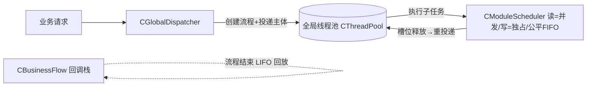

# Exec 并发调度组件库 — 使用文档

> 对应目录：`ServerCore/Exec`（命名空间 `sc`）
> 实现细节见：[exec-impl.md](exec-impl.md)

## 1. 这是什么

`ServerCore/Exec` 是服务器框架的**并发调度组件库**，为模块业务提供「全局线程池执行 + 模块级读写并发控制 + 业务流程回调栈」的完整方案：

- **全局调度器** `CGlobalDispatcher`：唯一向全局线程池投递业务任务的入口，管理各模块调度器注册表；
- **模块级读写调度器** `CModuleScheduler`：控制每个模块内读/写子任务的并发
  （读可多线程并发、写独占、**公平 FIFO**）；
- **业务流程** `CBusinessFlow`：一次业务处理的载体（贯穿全程的回调栈 + 子任务计数 + 完成判定）；
- **回调栈** `CCallbackStack`：业务处理结束时 **LIFO 逐个出栈**触发回调（消除回调地狱）。

设计目标：**替代旧异步/协程框架**作为模块业务的新并发控制，仅依赖全局线程池
`common::thread::CThreadPool`（只执行、不调度），不依赖 `CAsyncExecutor`/`CCoroutine`。

## 2. 执行模型



1. 业务请求到达 → `Dispatch(fnBody)` 创建 `CBusinessFlow`，主体投递到全局线程池；
2. 主体在线程池**单个线程**内执行，通过 `spFlow->SubmitTask(调度器, kRead/kWrite, fnTask)` 提交子任务；
3. 子任务能进模块（读写规则允许）→ 投递线程池执行；否则**留在统一队列**，槽位释放后按序放行（线程不阻塞、及时归还）；
4. 子任务内可继续提交子任务（嵌套，跨模块链式）；
5. 主体结束（`Complete`）+ 全部子任务排空 → 回调栈 LIFO 回放。

## 3. 组件与职责

| 组件 | 文件 | 职责 |
|---|---|---|
| `CGlobalDispatcher` | `GlobalDispatcher.h` | 唯一投递入口；模块调度器注册/查找；`DrainAll` |
| `CModuleScheduler` | `ModuleScheduler.h` | 模块级读/写子任务调度（并发控制 + 公平 FIFO） |
| `CBusinessFlow` | `BusinessFlow.h` | 业务流程：回调栈 + 子任务计数 + 完成判定 |
| `CCallbackStack` | `CallbackStack.h` | 线程安全回调栈（LIFO 回放） |

## 4. 快速上手

```cpp
#include "Exec/GlobalDispatcher.h"
#include "Exec/ModuleScheduler.h"
#include "Thread/ThreadPool.h"

// 1) 全局线程池 + 全局调度器（线程池生命周期由持有方管理）
common::thread::CThreadPool pool(8);
pool.Start();
sc::CGlobalDispatcher dispatcher(&pool);

// 2) 模块持有自己的读写调度器，并向全局调度器注册
sc::CModuleScheduler m_scheduler(&pool, /*nMaxReaders=*/8);
dispatcher.RegisterScheduler("my-module", &m_scheduler);

// 3) 收到业务请求：投递一个业务流程
dispatcher.Dispatch(
    [this](const std::shared_ptr<sc::CBusinessFlow>& spFlow)
    {
        std::shared_ptr<sc::CBusinessFlow> sp = spFlow; // 按值捕获保活
        // 一次处理：产生多个读/写子任务
        sp->SubmitTask(&m_scheduler, sc::CModuleScheduler::ETaskKind::kRead,
            [sp, this]()
            {
                // 读业务……可继续调其他模块
                sp->SubmitTask(pOther->Scheduler(), sc::CModuleScheduler::ETaskKind::kWrite,
                    [this]() { /* 写业务 */ });
            });
        sp->SubmitTask(&m_scheduler, sc::CModuleScheduler::ETaskKind::kWrite,
            [this]() { /* 写业务 */ });
        // 流程收尾：全部子任务完成后 LIFO 回放
        sp->Callbacks().Push([this]() { /* 回复/审计/释放 */ });
    });
```

## 5. 提交子任务（读/写）

`CBusinessFlow::SubmitTask` 是唯一的子任务提交入口，**自动配对** `BeginTask/EndTask`（漏配会导致流程永不结束）：

```cpp
// kRead：可多线程并发进入（上限由调度器 nMaxReaders 控制）
sp->SubmitTask(pModule->Scheduler(), sc::CModuleScheduler::ETaskKind::kRead, fnTask);
// kWrite：独占，排斥模块内所有读写子任务
sp->SubmitTask(pModule->Scheduler(), sc::CModuleScheduler::ETaskKind::kWrite, fnTask);
```

- 子任务内可**继续提交**（嵌套/跨模块链式），同样自动计数；
- 子任务内可向流程回调栈压栈；
- 返回 `false` 表示调度器为空或线程池不可用（此时子任务不会执行）。

## 6. 回调栈（流程收尾）

```cpp
// 业务处理中随时压栈（线程安全）
sp->Callbacks().Push([this]() { /* 收尾动作 */ });

// 流程结束时由框架自动逐个出栈（LIFO）触发 RunAll；
// 单个回调异常被捕获并记录日志，不影响其余回调。
```

典型用途：回复客户端、审计日志、释放临时资源、跨模块后处理、事务收尾。

## 7. 调度语义

- **读（kRead）**：可多线程并发进入；`nMaxReaders` 控制上限（0 = 不设上限）；
- **写（kWrite）**：独占，排斥模块内所有读写子任务；
- **公平 FIFO**：同一模块严格按提交顺序放行——任务不会越过先前提交的任务；
  排队的写**不会插队**到先前排队的读前面；队首写等先前读者排空后执行，其后的读/写一并等待。
- **非阻塞**：进不了模块的子任务留在队列，槽位释放后重投递；线程池线程永不被业务锁阻塞。

## 8. 生命周期与线程安全

- `CBusinessFlow` 必须由 `Dispatch` 以 `shared_ptr` 创建；**子任务必须按值捕获**流程的
  `shared_ptr` 保活（禁止按引用跨线程持有）；
- `Dispatch` / `RegisterScheduler` / `FindScheduler` / `SubmitTask` / `Callbacks().Push`
  均可跨线程调用；
- 模块调度器生命周期由模块持有；`RegisterScheduler` 注册期间不得析构。

## 9. 关闭顺序（反了会卡死）

```text
1. 停止业务投递（不再 Dispatch）
2. dispatcher.DrainAll()   // 等待所有已注册模块调度器排空
3. pool.Stop()             // 最后停线程池
```

## 10. 与 COM 模块整合

- 模块组合一个 `CModuleScheduler`（组合优于继承），`Start()` 注册、`Stop()` 注销；
- 全局调度器可仿照 `IThreadPool` 用 `SC_INTERFACE` 暴露为接口，经 `CResolveContext` 注入；
- 模块业务入口 → `dispatcher->Dispatch(...)` 包装成流程；`HandleRequest` 式业务处理
  在流程主体内扇出子任务（参见 `Tests/test_exec.cpp` 的 `Exec_Sim_BusinessLoad` 负载模拟）。

## 11. 测试

`Tests/test_exec.cpp`（16 项 Exec 用例）：回调栈 LIFO、流程完成、读并发、写独占、
公平 FIFO 顺序、同模块重入、多模块链式、高并发读、多生产者、多模块压力、持续业务负载模拟。

```text
./build.sh -t          # 构建全部并运行单元测试
./build/release/tests  # 或直接运行
```
