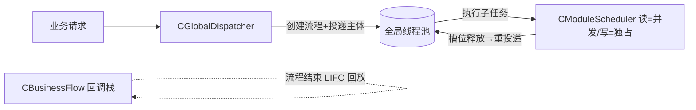

# Exec 并发调度框架

ServerCore 的**新并发控制框架**：全局线程池 + 模块级读写调度 + 业务流程回调栈。
设计目标替代旧异步/协程框架作为模块业务的并发控制手段，**不依赖**
`common::async::CAsyncExecutor` / `CCoroutine`，仅依赖全局线程池
`common::thread::CThreadPool`（只执行、不调度）。

## 解决的问题

- **消除回调地狱**：业务流程以「子任务 + 回调栈」组织，回调在流程结束时
  LIFO 统一回放，而非逐层嵌套回调。
- **控制模块读写并发**：同一模块的读子任务可多线程并发，写子任务独占，
  写任务排斥模块内其他读写业务流程。

## 组件

| 组件 | 文件 | 职责 |
|---|---|---|
| `CCallbackStack` | `Exec/CallbackStack.h` | 业务流程回调栈（线程安全，LIFO 回放） |
| `CModuleScheduler` | `Exec/ModuleScheduler.h` | 模块级读/写子任务调度（非阻塞排队 + 重投递） |
| `CBusinessFlow` | `Exec/BusinessFlow.h` | 业务流程：回调栈 + 子任务计数 + 完成判定 |
| `CGlobalDispatcher` | `Exec/GlobalDispatcher.h` | 全局调度器：唯一投递入口 + 模块调度器注册表 |

## 执行模型



1. 业务请求到达 → `Dispatch(fnBody)` 创建 `CBusinessFlow`，主体投递到全局线程池；
2. 主体调用 `spFlow->SubmitTask(调度器, kRead/kWrite, fnTask)` 提交子任务；
3. 子任务能进模块（读写规则允许）→ 投递线程池执行；否则**排队**，槽位释放后重投递
   （线程及时归还，不阻塞）；
4. 子任务内可继续调用其他模块（嵌套子任务，同样自动计数）；
5. 主体结束（`Complete`）+ 全部子任务排空 → 回调栈 LIFO 回放。

## 读写调度规则

- **读（kRead）**：可多个线程并发进入；`nMaxReaders` 控制上限（0 = 不设上限）。
- **写（kWrite）**：独占，排斥模块内所有读写子任务。
- **公平 FIFO**：统一队列严格按提交顺序放行——任务不会越过先前提交的任务执行；
  排队的写不会插队到先前排队的读前面；队首写等待先前读者排空后再执行，
  其后的读/写一并等待（不越过该写）。

调度器采用**非阻塞**语义：进不了模块的任务留在统一队列，槽位释放后由调度器
按序重新投递到线程池。线程池线程永远不会被业务锁阻塞。

## 使用示例

```cpp
// 模块持有调度器；全局线程池由持有方管理（如 Infra 线程池模块）。
sc::CModuleScheduler m_scheduler(&pool, /*nMaxReaders*/ 8);
dispatcher.RegisterScheduler(GetName(), &m_scheduler);

// 业务请求入口
dispatcher->Dispatch(
    [this](const std::shared_ptr<sc::CBusinessFlow>& spFlow)
    {
        std::shared_ptr<sc::CBusinessFlow> sp = spFlow; // 按值捕获保活
        // 读子任务（并发）
        sp->SubmitTask(&m_scheduler, sc::CModuleScheduler::ETaskKind::kRead,
            [sp, this]()
            {
                // 读业务……可继续调其他模块
                sp->SubmitTask(pOther->Scheduler(), sc::CModuleScheduler::ETaskKind::kWrite,
                    [this]() { /* 写业务 */ });
            });
        // 流程收尾：结束后 LIFO 回放
        sp->Callbacks().Push([this]() { /* 回复/审计/释放 */ });
    });
```

## 约束与要点

- `CBusinessFlow` 必须由 `Dispatch` 以 `shared_ptr` 创建；子任务**必须按值**
  捕获流程的 `shared_ptr` 保活（禁止按引用跨线程持有）。
- 子任务内可继续提交子任务（含 `Complete()` 之后、流程回放之前），
  但**回调栈回放后不得再提交**。
- 每个 `SubmitTask` 自动配对 `BeginTask/EndTask`；漏配会导致流程永不结束。
- 任务/回调不应抛异常；框架捕获并记录日志（线程池 worker 不捕获异常，
  抛出不安全）。
- 关闭顺序：先停业务投递 → 各模块调度器 `Drain()` → 最后 `CThreadPool::Stop()`。

## 测试

`Tests/test_exec.cpp`：9 项并发正确性用例（回调栈 LIFO、流程完成、读并发、
写独占、同模块重入、多模块链式、排空、压力），不变量**按模块**独立统计。

```text
./build.sh -t          # 构建全部并运行单元测试
./build/release/tests  # 或直接运行
```
