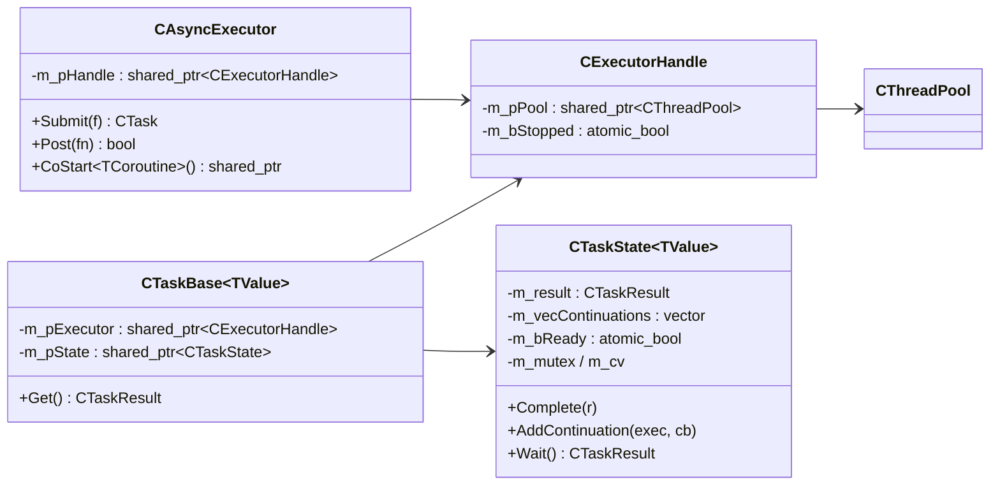
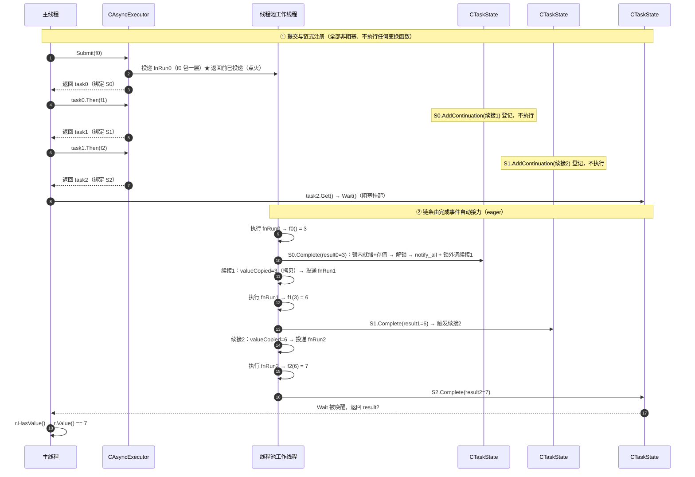

# 异步库 CAsyncExecutor / CTask — 实现文档

> 配套使用文档：[async-usage.md](async-usage.md)
> 源码：`Common/Async/AsyncExecutor.h`（985 行）+ `AsyncExecutor.cpp`（123 行）

## 1. 总体架构



## 2. CExecutorHandle：生命周期加固的核心

```cpp
struct CExecutorHandle {
    std::shared_ptr<common::thread::CThreadPool> m_pPool; // 线程池对象（任务链持有时不释放）
    std::atomic<bool> m_bStopped;                          // 停止后拒绝新投递
};
```

**为什么需要它（防悬垂）**：任务链和线程池之间夹一层共享句柄，解决「工厂倒闭了、任务单还在等结果」的悬垂指针问题：

- `Submit` 创建的任务通过 `shared_ptr<CExecutorHandle>` 引用执行器 → **任务链持有时线程池不被销毁**，
  即使执行器对象先析构，已投递/已链式任务仍安全完成；
- 执行器析构 → 只把执照标记 `m_bStopped=true`，**线程池仍被任务链保住**；已投递任务继续跑完，
  新投递被拒 → 无值（`kStopped`）；
- `Stop()` 置 `m_bStopped=true` + `m_pPool->Stop()`，保留句柄与线程池对象（未启动状态）。

## 3. CTaskState：任务共享状态（核心）

```cpp
std::mutex m_mutex;                   // 保护状态与续接列表
std::condition_variable m_cv;         // 通知 Wait 等待者
std::vector<Continuation> m_vecContinuations; // 未完成时的续接列表
std::atomic<bool> m_bReady;           // 是否已完成
CTaskResult<TValue> m_result;         // 最终结果
```

### Complete：完成并触发续接（锁外调用，防重入死锁）

```cpp
void Complete(const CTaskResult<TValue>& result)
{
    std::vector<Continuation> vecCbs;
    {
        lock;
        if (m_bReady) return;         // 仅首次生效
        m_bReady = true; m_result = result;
        vecCbs.swap(m_vecContinuations);  // 取出全部续接
    }
    m_cv.notify_all();                // 多线程 Get 同一任务：唤醒所有等待者
    for (cb : vecCbs) cb(result);     // 锁外按注册顺序调用续接（续接内再 Complete/Wait 不死锁）
}
```

### AddContinuation：未就绪登记 / 已就绪投递

- 未就绪：登记到 `m_vecContinuations`，任务完成时触发；
- 已就绪：**投递到执行器线程池异步执行**（与 JS/C# 一致，回调不在注册线程执行）；
  执行器不可用（停止）→ 返回 `false`（回调不执行）。

### Wait：阻塞取结果

```cpp
// 先短自旋（~50µs，relaxed 读），超时再 m_cv.wait(pred: m_bReady)
// 支持多线程并发 Get 同一任务（Complete 用 notify_all）
```

## 4. 一次任务的完整生命周期（含 Then 链）

以 `exec.Submit(f0).Then(f1).Then(f2).Get()` 为例，完整链路：



**要点**：
- `Submit` 在返回 `CTask` **之前就已投递**（`Submit` 本身就是执行入口，链条在此「点火」）；
- `Then` 只做两件事：**算下游类型 + 往上游 `AddContinuation` 挂续接**，返回下一个任务（未点火），不执行任何函数；
- **接力靠 `Complete` 自动触发**：上游任务跑完 → `CTaskState::Complete` → 锁外依次调用所有续接 →
  `Then` 的续接里再把下一个变换投递进线程池 → 以此类推，直到最后一个任务完成唤醒 `Get`；
- 每个任务对应一个 `CTaskState`，值在链中「移动存结果 → 续接拷贝 → 变换」逐级传递（见 §6 值传递路径）。

## 5. Submit：任务投递

```cpp
template <typename TFn>
auto CAsyncExecutor::Submit(TFn f, const CSourceLoc& loc = CSourceLoc()) -> CTask<Result>
{
    CTask<TResult> task;
    task.m_pExecutor = m_pHandle;        // 共享执行器句柄
    task.m_pState->SetLoc(loc);
    auto fnRun = [pState, f]() {
        try { detail::CompleteSuccess(pState, f); }   // f 抛异常？
        catch (...) { pState->Complete(CTaskResult<TResult>::MakeNone(kException)); }
    };
    if (m_pHandle->m_bStopped || !m_pHandle->m_pPool->Submit(fnRun))
        pState->Complete(CTaskResult<TResult>::MakeNone(kNotStarted)); // 未启动 → 立即无值
    return task;
}
```

- 任务异常 → 转为 `kException` 无值终止（**Option 风格，无异常外溢**）；
- 执行器不可用 → 任务立即以 `kNotStarted` 完成（`Get()` 不阻塞）。

## 6. Then：链式续接 + 类型分派

### 类型萃取

```cpp
template <typename T> struct TaskTraits { static const int Kind = 0; using ValueType = T; };
// CTask<U>          → Kind = 1（flatMap）
// CTaskResult<U>    → Kind = 2（原样转发）
template <typename TFn, typename... TArgs> struct TInvokeResult { using type = decltype(...); };
```

### Then 流程（以非 void 上游为例）

```cpp
using TResult = 变换原始返回类型; using TOut = TaskTraits<TResult>::ValueType;
CTask<TOut> taskNext; taskNext.m_pExecutor = 上游句柄; taskNext.m_pState->SetLoc(loc);
上游->AddContinuation(exec, [exec, pNextState, f](upResult) {
    ① 上游无值 → pNextState->Complete(MakeNone(upResult.Reason()));  // 终止传播
    ② TValue valueCopied = upResult.Value();   // 拷贝值，供异步续接安全使用（不引用上游状态）
    ③ fnRun = [pNextState, f, valueCopied]{ detail::RunTransform(pNextState, f, valueCopied,
             TaskKind<TResult>()); };          // 按 Kind 分派
    ④ 执行器投递 fnRun；不可用 → Complete(MakeNone(kStopped));
});
```

### RunTransform 三种分派（Kind 0/1/2）

| Kind | 变换返回 | 行为 |
|---|---|---|
| 0 | 普通值 / void | `CompleteSuccess`（有值传播 / void 完成）；异常 → `kException` |
| 1 | `CTask<TNew>` | flatMap：执行 f 得内部任务，`FlatMapForward` 用 `OnResult` 把内部结果原样转发到下游 |
| 2 | `CTaskResult<TOut>` | 原样转发 `pNextState->Complete(f(...))` |

`CTask<void>` 特化走 `RunTransformVoid`（变换无参），逻辑同构。

### 值在链中的传递（共享状态信箱 + 拷贝）

以 `Submit(f0) → Then(f1) → Then(f2)` 为例：

| 环节 | 值在哪 | 动作 |
|---|---|---|
| `f0()` 返回 | 临时右值 `3` | **移动**存入 `CTaskState#0.m_result` |
| 续接回调触发 | 参数引用 `m_result` | `upResult.Value()` 读出 `3` |
| `valueCopied` | 续接回调局部变量 | **拷贝**一份（解耦上游生命周期） |
| `fnRun` lambda | 捕获 `valueCopied` | 投递到线程池 |
| `f1(valueCopied)` | 实参 | `const T&` 形参不拷贝；按值形参再拷贝 |
| `f1()` 返回 | `6` | **移动**存入 `CTaskState#1.m_result` |

**为什么续接里要拷贝 `valueCopied`？** 上游任务可同时挂多个续接（多个 `Then`/`OnSuccess`），
且续接在别的线程异步执行。若 lambda 捕获 `m_result` 的引用，上游对象析构后即悬垂；拷贝后
lambda 自己持有值，与上游完全解耦。

**约束**：链式传值要求 `TValue` 可拷贝（每次 `Then` 至少 1 拷贝 + 1 移动）；大对象建议用
`std::shared_ptr<T>` 作为链中 `TValue`（拷指针不拷内容）。

## 7. 线程模型

- 任务与续接都在**工作线程**执行（`Submit`/`Then` 注册的工作会投递到线程池）；
- **不同的 `Then` 步不固定在同一线程**：每个变换函数执行完会重新 `Submit` 回线程池，
  由**任意空闲工作线程**取走执行（无线程亲和）——可能是同一线程，也可能不同，不确定；
  框架保证的是**链式顺序**（f1 在 f0 完成后、f2 在 f1 完成后），不保证执行线程；
- 任务**已完成**时注册回调 → 投递到执行器**异步触发**（不占用注册线程）；
- 执行器未启动/已停止 → 注册视为失败（回调不执行 / `kStopped` 完成）。

## 8. 其他成员

- `Post`：fire-and-forget，直接 `m_pPool->Submit`（`m_bStopped` 时返回 false）；
- `Stop`：置 `m_bStopped` + `m_pPool->Stop()`（保留句柄，已创建任务仍绑定）；
- `Start`：若曾 Stop 过则**重建句柄与线程池**（隔离旧任务），再 `Start()`；
- `IsStopped` / `IsIdle`：轻量原子读（供协程内联续接负载感知）；
- `AdoptState(pState)`：用已有任务状态构造 CTask（协程 `AsTask` 用）；
- `CoStart`：见 [coroutine-impl.md](coroutine-impl.md)。

## 9. 源码位置调试（NOTHROW_LOC）

调试构建（`-O0`）下 `Submit/Then` 可传 `NOTHROW_LOC`，把注册点 `__PRETTY_FUNCTION__/__FILE__/__LINE__`
存入 `CTaskState::m_loc`，watch 中定位「当前任务是哪里注册的」；发布构建零开销（空位置）。

## 10. 设计取舍：为什么 eager（即时执行）而非惰性/手动触发

| 模型 | 语义 | 触发点 | 代表 |
|---|---|---|---|
| **eager 即时** | 接上即跑，链条是自动流水线 | `Submit` 调用那一刻 | JS Promise、C# `Task.Run`、Boost.Asio、Go goroutine、**本项目** |
| **lazy 惰性** | 构建与运行分离 | 额外 `subscribe()`/`spawn()` | Rust Future、Python asyncio、Rx 冷 Observable |
| **手动触发** | 显式 `Execute()`/`Start()` 点燃 | 用户手动调用 | C# `new Task(...).Start()` |

**本项目选 eager 的原因**：
1. **消灭「忘记启动」这类错误**——手动触发漏调 = 任务永挂起、`Get()` 死等，最难排查；
2. **与 continuation 模型天然契合**——执行时机内嵌在「完成事件流」里（`Complete` 触发续接）；
3. **`Submit` 本身就是启动**——`Then` 不触发，因为它只是接上一步，接力由完成事件自动进行。

**关键洞察**：基于「完成回调自动接力」的框架基本都是 eager（Promise、Asio、本项目）。本项目的定位是
**一次性流水线 + 线程池执行器**，不是可重放的数据流（那是 Rx 的领域），eager 是正确选择。
如果将来真要惰性：优先在框架外实现（把整条链封装成 `std::function` 工厂，需要时再 `Submit`），
而不是给核心引擎加惰性模式。

## 附：代码阅读顺序

1. `CTaskResult<T>` → 先懂「结果」长什么样（有值/无值）；
2. `CAsyncExecutor::Submit` → 懂任务怎么被投递；
3. `CTaskState::Complete` → **重点**：线程安全核心，锁外调续接；
4. `CTask<T>::Then` → 懂链式怎么串起来；
5. `detail::RunTransform` / `RunTransformVoid` → 懂 flatMap 分派与 void 链；
6. `CExecutorHandle` → 懂生命周期安全。
