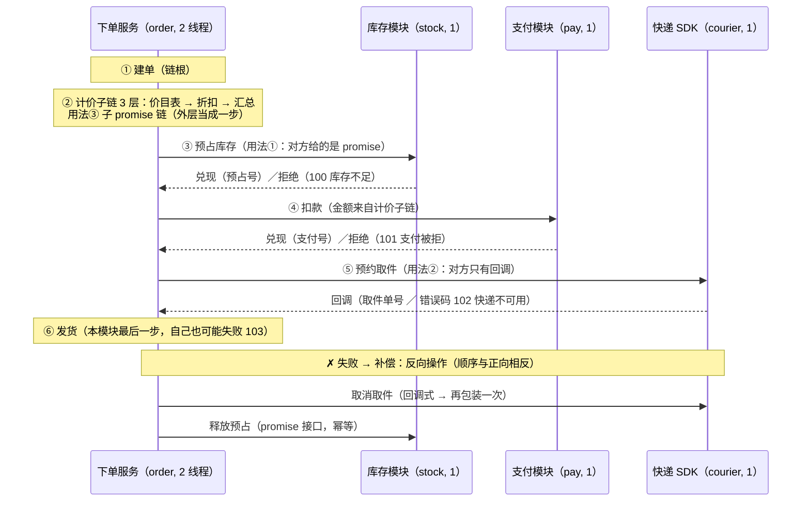
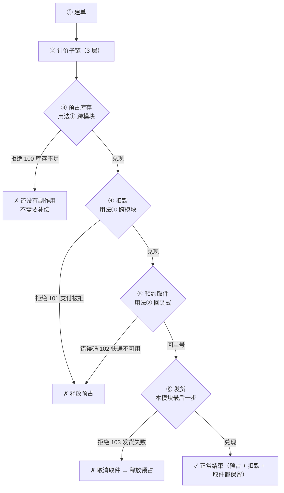

# 示例：同一条跨模块下单流程的几种写法

一条业务流程里，「不是自己家的异步」通常有三类 —— 本篇用**同一个业务流程**把它们在五种写法里各写一遍：

| 用法 | 对方给你的东西 | 本框架里怎么接 |
| --- | --- | --- |
| ① 跨模块异步调用 | 一条 promise（对方在自己的执行器上跑） | `ThenBridge(fnCreate, fnApply)`，或协程里 `CO_AWAIT(子 promise)` |
| ② 包装非 Promise 的异步调用 | 只有回调（外部 SDK / 老代码 / C 接口） | `exec.NewPromise(spCtx, fnStarter)` —— 就是 JS 的 `new Promise((resolve, reject) => …)` |
| ③ 子 Promise 链 | 本模块自己的多步过程，想当成**一步**用 | `ThenPromise(工厂)`（同上下文直接 adopt） |

业务流是「下单服务 → 库存模块预占 → 支付模块扣款 → 快递 SDK 预约取件 → 发货」，失败要补偿。
正文每节只讲「这一段怎么接」，把各节代码按顺序拼起来就是一个**可编译可运行**的程序
（§6 有编译命令与实测输出）。

| # | 写法 | ① 跨模块 | ② 包装回调式接口 | ③ 子链 |
| --- | --- | --- | --- | --- |
| 1 | then 链（默认） | `ThenBridge` 一行 | `ThenPromise(包装函数)` | `ThenPromise(子链工厂)` |
| 2 | 协程 | `CO_AWAIT(子 promise)` + 搬数据 | `CO_AWAIT(包装函数)` | `CO_AWAIT(子链)` |
| 3 | 手写桥接 | `NewPromise(fnStarter)` + `OnSettled` | 同写法 1 | 同写法 1 |
| 4 | 并行汇聚 | 扇出 + `WhenAll` | 同写法 1 | 同写法 1 |
| 5 | 失败补偿 | 反向再桥一次 | 反向再包装一次 | —（补偿不属于这三类） |

## 0. 业务流程与公共部分（只写一次）

### 0.1 流程、参与方与五条业务路径

四个参与方各持自己的执行器（括号里是执行器名与线程数）；**跨模块只交换 promise + 上下文**：



五条业务路径（每种写法都跑这五条，好对照；`✗` 后面是**必须撤掉**的副作用）：



| 路径 | 失败在哪一步 | 已经发生的副作用 | 需要补偿什么 |
| --- | --- | --- | --- |
| 正常 | — | 预占 + 扣款 + 取件 | 不需要 |
| 库存不足（码 100） | ③ | 无 | 不需要 |
| 支付被拒（码 101） | ④ | 预占 | 释放预占 |
| 快递不可用（码 102） | ⑤（回调里返回错误码） | 预占 + 扣款 | 释放预占 |
| 发货失败（码 103） | ⑥ | 预占 + 扣款 + 取件 | 取消取件 + 释放预占 |

> 「扣款成功要退款」也是同形的第三个反向操作，本篇只演示机制，不再多写一个模块。

### 0.2 文件头与业务码

```cpp
#include <cstdio>
#include <functional>
#include <memory>
#include <string>

#include "Async/AsyncExecutor.h"
#include "Async/Promise.h"
#include "Coroutine/Coroutine.h"

using common::async::CPromise;
using common::async::CPromiseResult;
```

```cpp
/// 业务拒绝码（从 `kBusinessBase` 起取；层间只传码，文案自己查表）。
enum
{
    kStockShortage = common::async::kBusinessBase,  ///< 库存不足
    kPayDeclined,                                   ///< 支付被拒
    kCourierUnavailable,                            ///< 快递不可用
    kShipFailed                                     ///< 发货失败（仓库故障）
};

/// 拒绝码 → 文案。
static const char* CodeText(int nCode)
{
    switch (nCode)
    {
        case kStockShortage:
            return "库存不足";
        case kPayDeclined:
            return "支付被拒";
        case kCourierUnavailable:
            return "快递不可用";
        case kShipFailed:
            return "发货失败";
        case common::async::kStopped:
            return "执行器已停";
        case common::async::kException:
            return "系统错误";
        default:
            return "未知错误";
    }
}
```

### 0.3 库存模块（用法① 的对象：**对方给 promise**）

```cpp
//================ 库存模块（别的模块：自持执行器 + 自持上下文） ================

/// 库存模块自己的上下文（本模块看不到它的字段）。
struct CStockCtx
{
    std::string strOrderId;
    int nQty;
    int nReserveNo;

    CStockCtx() : nQty(0), nReserveNo(0)
    {}
};

/// 库存模块：预占 / 释放都是它自己的链，跑在它自己的执行器上。
class CStockModule
{
public:
    CStockModule() : m_exec("stock", 1), m_bShortage(false), m_nNextReserveNo(5000)
    {}

    bool Start()
    {
        return m_exec.Start();
    }

    void Stop()
    {
        m_exec.Stop();
    }

    /// 造「库存不足」路径用（真实系统里由库存自己决定）。
    void SetShortage(bool bShortage)
    {
        m_bShortage = bShortage;
    }

    /// 对外异步接口①：预占库存（**对方给的就是 promise**）。
    CPromise<CStockCtx> ReserveAsync(const std::string& strOrderId, int nQty)
    {
        const std::shared_ptr<CStockCtx> spCtx = std::make_shared<CStockCtx>();
        spCtx->strOrderId = strOrderId;
        spCtx->nQty = nQty;

        const int nReserveNo = m_nNextReserveNo++;
        const bool bShortage = m_bShortage;
        const CPromise<CStockCtx>::ChainStarter fnStarter =
            [this, spCtx, nReserveNo, bShortage](
                const CPromise<CStockCtx>::ResolveFn& fnResolve, const CPromise<CStockCtx>::RejectFn& fnReject)
        {
            // 只发起动作 + 登记回调（不阻塞调用方线程）。
            const bool bPosted = m_exec.Post(
                [spCtx, nReserveNo, bShortage, fnResolve, fnReject]()
                {
                    if (bShortage)
                    {
                        fnReject(kStockShortage);  // 业务拒绝：只给码
                        return;
                    }
                    spCtx->nReserveNo = nReserveNo;
                    std::printf("      库存模块: 预占 %d 件（预占号 %d）\n", spCtx->nQty, spCtx->nReserveNo);
                    fnResolve();
                });
            if (!bPosted)
            {
                fnReject(common::async::kStopped);  // 本模块已停：别让对方的链永久挂着
            }
        };
        return m_exec.NewPromise(spCtx, fnStarter, ASYNC_LOC);
    }

    /// 对外异步接口②：释放预占（补偿用）。**幂等**：传 0（没预占过）就是空操作。
    CPromise<CStockCtx> ReleaseAsync(const std::string& strOrderId, int nReserveNo)
    {
        const std::shared_ptr<CStockCtx> spCtx = std::make_shared<CStockCtx>();
        spCtx->strOrderId = strOrderId;
        spCtx->nReserveNo = nReserveNo;

        const CPromise<CStockCtx>::ChainStarter fnStarter =
            [this, spCtx](const CPromise<CStockCtx>::ResolveFn& fnResolve, const CPromise<CStockCtx>::RejectFn& fnReject)
        {
            const bool bPosted = m_exec.Post(
                [spCtx, fnResolve]()
                {
                    if (spCtx->nReserveNo != 0)
                    {
                        std::printf("      库存模块: 释放预占 %d\n", spCtx->nReserveNo);
                    }
                    fnResolve();
                });
            if (!bPosted)
            {
                fnReject(common::async::kStopped);
            }
        };
        return m_exec.NewPromise(spCtx, fnStarter, ASYNC_LOC);
    }

private:
    common::async::CAsyncExecutor m_exec;  ///< 模块私有执行器（不对外传递）。
    bool m_bShortage;                      ///< 造「库存不足」路径用。
    int m_nNextReserveNo;                  ///< 预占号发生器。
};
```

- 模块**自持执行器**（`("stock", 1)`）：跨模块只交换 promise + 上下文，不传执行器。
- 对外接口自己决定什么时候 settle（这里是 `Post` 到本模块线程后 `fnResolve()` / `fnReject(码)`）。
- `ReleaseAsync` 特意做成**幂等**：传 `0`（没预占过）就是空操作 —— 补偿层因此不必先判断有没有东西要撤。

### 0.4 支付模块（用法① 的另一个对象）

```cpp
//================ 支付模块（另一个别的模块） ================

/// 支付模块自己的上下文。
struct CPayCtx
{
    std::string strOrderId;
    int nAmount;
    int nPayNo;

    CPayCtx() : nAmount(0), nPayNo(0)
    {}
};

/// 支付模块：扣款是它自己的链。
class CPayModule
{
public:
    CPayModule() : m_exec("pay", 1), m_bDecline(false), m_nNextPayNo(9000)
    {}

    bool Start()
    {
        return m_exec.Start();
    }

    void Stop()
    {
        m_exec.Stop();
    }

    /// 造「支付被拒」路径用。
    void SetDecline(bool bDecline)
    {
        m_bDecline = bDecline;
    }

    /// 对外异步接口：扣款（也是 promise）。
    CPromise<CPayCtx> ChargeAsync(const std::string& strOrderId, int nAmount)
    {
        const std::shared_ptr<CPayCtx> spCtx = std::make_shared<CPayCtx>();
        spCtx->strOrderId = strOrderId;
        spCtx->nAmount = nAmount;

        const int nPayNo = m_nNextPayNo++;
        const bool bDecline = m_bDecline;
        const CPromise<CPayCtx>::ChainStarter fnStarter =
            [this, spCtx, nPayNo, bDecline](
                const CPromise<CPayCtx>::ResolveFn& fnResolve, const CPromise<CPayCtx>::RejectFn& fnReject)
        {
            const bool bPosted = m_exec.Post(
                [spCtx, nPayNo, bDecline, fnResolve, fnReject]()
                {
                    if (bDecline)
                    {
                        fnReject(kPayDeclined);
                        return;
                    }
                    spCtx->nPayNo = nPayNo;
                    std::printf("      支付模块: 扣款 %d 元（支付号 %d）\n", spCtx->nAmount, spCtx->nPayNo);
                    fnResolve();
                });
            if (!bPosted)
            {
                fnReject(common::async::kStopped);
            }
        };
        return m_exec.NewPromise(spCtx, fnStarter, ASYNC_LOC);
    }

private:
    common::async::CAsyncExecutor m_exec;  ///< 模块私有执行器。
    bool m_bDecline;                       ///< 造「支付被拒」路径用。
    int m_nNextPayNo;                      ///< 支付号发生器。
};
```

### 0.5 快递 SDK（用法② 的对象：**只有回调，没有 promise**）

```cpp
//================ 快递模块（**回调式接口**：外部 SDK / 老代码的典型形态） ================

/// 第三方快递 SDK：**没有 promise，只有回调** —— 这正是本篇要「包装」的对象。
class CCourierSdk
{
public:
    /// 预约取件的回调：成功给单号（错误码 0），失败给错误码。
    typedef std::function<void(int nPickupNo, int nErrCode)> PickupCallback;

    CCourierSdk() : m_exec("courier", 1), m_bUnavailable(false), m_nNextPickupNo(7000)
    {}

    bool Start()
    {
        return m_exec.Start();
    }

    void Stop()
    {
        m_exec.Stop();
    }

    /// 造「快递不可用」路径用。
    void SetUnavailable(bool bUnavailable)
    {
        m_bUnavailable = bUnavailable;
    }

    /// 预约取件：立即返回，完成后在 **SDK 自己的线程**上回调。
    bool SchedulePickup(const std::string& strOrderId, const PickupCallback& fnCallback)
    {
        return m_exec.Post(
            [this, strOrderId, fnCallback]()
            {
                if (m_bUnavailable)
                {
                    fnCallback(0, kCourierUnavailable);
                    return;
                }
                const int nPickupNo = m_nNextPickupNo++;
                std::printf("      快递模块: 取件单 %d（%s）\n", nPickupNo, strOrderId.c_str());
                fnCallback(nPickupNo, 0);
            });
    }

    /// 取消取件（补偿用）：也是回调式。
    bool CancelPickup(int nPickupNo, const std::function<void()>& fnDone)
    {
        return m_exec.Post(
            [nPickupNo, fnDone]()
            {
                std::printf("      快递模块: 取消取件单 %d\n", nPickupNo);
                fnDone();
            });
    }

private:
    common::async::CAsyncExecutor m_exec;  ///< SDK 自己的线程（调用方不该碰）。
    bool m_bUnavailable;                   ///< 造「快递不可用」路径用。
    int m_nNextPickupNo;                   ///< 取件单号发生器。
};
```

- 它只认识回调：`SchedulePickup(orderId, callback)` 立即返回，完成时在 **SDK 自己的线程**上回调。
- 它并不关心（也无从知道）调用方是 then 链、协程还是别的什么 —— 这正是要包装的原因。

### 0.6 本模块的上下文与步骤

```cpp
//================ 本模块（下单服务）：上下文 + 步骤 ================

/// 本模块的共享上下文：跨模块 / 回调拿到的数据都搬进这里；层与层之间只传「兑现 / 拒绝」。
struct COrderCtx
{
    std::string strOrderId;  ///< 本模块生成
    int nQty;                ///< 下单件数
    int nAmount;             ///< 计价子链算出的金额（已含折扣）
    int nReserveNo;          ///< 库存模块的预占号（桥接搬回来）
    int nPayNo;              ///< 支付模块的支付号（桥接搬回来）
    int nPickupNo;           ///< 快递 SDK 的取件单号（回调搬进来）
    int nFailCode;           ///< 非 0 = 流程失败过（补偿层据此决定动不动手）
    std::string strTrace;    ///< 步骤轨迹（自校验）

    CStockModule* pStock;                  ///< 要调的别的模块（真实项目里是接口指针 / ScopedInterfacePtr）
    CPayModule* pPay;                      ///< 同上
    CCourierSdk* pCourier;                 ///< 同上（回调式）
    common::async::CAsyncExecutor* pExec;  ///< 本模块执行器（并行写法要用它做汇聚）

    /// 并行写法用：两条跨模块调用的句柄（拿到它们才能取对方的上下文）。
    std::shared_ptr<CPromise<CStockCtx> > spReserve;
    std::shared_ptr<CPromise<CPayCtx> > spCharge;

    COrderCtx()
        : nQty(0),
          nAmount(0),
          nReserveNo(0),
          nPayNo(0),
          nPickupNo(0),
          nFailCode(0),
          strTrace(),
          pStock(NULL),
          pPay(NULL),
          pCourier(NULL),
          pExec(NULL),
          spReserve(),
          spCharge()
    {}
};

/// 步骤①：建单（链根）。
static CPromiseResult StepCreateOrder(CPromiseResult /*upResult*/, const std::shared_ptr<COrderCtx>& spCtx)
{
    spCtx->strOrderId = "SO-1001";
    spCtx->strTrace += "建单;";
    std::printf("    本模块: 建单 %s（%d 件）\n", spCtx->strOrderId.c_str(), spCtx->nQty);
    return CPromiseResult::Resolve();
}

/// 造「发货失败」路径用（真实系统里由仓库系统决定；这里用一个演示开关）。
static bool g_bWarehouseDown = false;

/// 步骤⑥：发货（三类调用全部成功才会跑到这里）—— 但它**自己也可能失败**：
/// 仓库故障发生在所有外部调用之后，正是「要回滚前面已经发生的副作用」的典型场景。
static CPromiseResult StepShip(CPromiseResult /*upResult*/, const std::shared_ptr<COrderCtx>& spCtx)
{
    spCtx->strTrace += "发货;";
    if (g_bWarehouseDown)
    {
        return CPromiseResult::Reject(kShipFailed);
    }
    std::printf("    本模块: 发货（预占号 %d / 支付号 %d / 取件单 %d）\n", spCtx->nReserveNo, spCtx->nPayNo, spCtx->nPickupNo);
    return CPromiseResult::Resolve();
}

/// 兜底（不恢复）：报告拒绝后原样返回 → 拒绝继续往后传（后续 `Then` 跳过，`Finally` 仍执行）。
static CPromiseResult StepReportReject(CPromiseResult upResult, const std::shared_ptr<COrderCtx>& spCtx)
{
    spCtx->strTrace += "拒绝;";
    std::printf("    兜底: 流程中断 [%d] %s\n", upResult.Code(), CodeText(upResult.Code()));
    return upResult;
}

/// 收尾审计（finally）：所有路径都会跑到。
static CPromiseResult StepAudit(CPromiseResult /*upResult*/, const std::shared_ptr<COrderCtx>& spCtx)
{
    std::printf("    审计: 轨迹=%s\n", spCtx->strTrace.c_str());
    return CPromiseResult::Resolve();
}
```

- 层与层之间**只传「兑现 / 拒绝」**，数据全放共享上下文 → 所以五种写法的步骤完全一样。
- `nFailCode`：兜底层记下「流程失败过」，补偿层据此判断要不要真的动手（§5）。
- `spReserve` / `spCharge`：并行写法要拿它们的上下文取数据（§4）。

### 0.7 用法③：子 Promise 链（本模块的多步过程，外层当成一步）

```cpp
//———— 用法③：子 Promise 链 —— 本模块自己的「三步计价」，外层把它当成一步 ————

/// 子链第 1 层：查价目表（真实场景是又一次异步调用）。
static CPromiseResult StepQuotePrice(CPromiseResult /*upResult*/, const std::shared_ptr<COrderCtx>& spCtx)
{
    spCtx->nAmount = spCtx->nQty * 100;
    std::printf("    本模块: 价目表 单价 100 元\n");
    return CPromiseResult::Resolve();
}

/// 子链第 2 层：会员折扣。
static CPromiseResult StepQuoteDiscount(CPromiseResult /*upResult*/, const std::shared_ptr<COrderCtx>& spCtx)
{
    spCtx->nAmount = spCtx->nAmount * 9 / 10;  // 9 折
    std::printf("    本模块: 会员 9 折\n");
    return CPromiseResult::Resolve();
}

/// 子链第 3 层：汇总（「计价」这一大步在这里记一笔轨迹）。
static CPromiseResult StepQuoteSum(CPromiseResult /*upResult*/, const std::shared_ptr<COrderCtx>& spCtx)
{
    spCtx->strTrace += "计价;";
    std::printf("    本模块: 计价 %d 元\n", spCtx->nAmount);
    return CPromiseResult::Resolve();
}

/// 造计价子链：**三步一条链**（首层由执行器投递，对调用方是真异步），跑完才轮到外层的下一层。
static CPromise<COrderCtx> BuildQuoteChain(common::async::CAsyncExecutor& exec, const std::shared_ptr<COrderCtx>& spCtx)
{
    return exec.NewPromise(spCtx, &StepQuotePrice, ASYNC_LOC).Then(&StepQuoteDiscount, ASYNC_LOC).Then(&StepQuoteSum, ASYNC_LOC);
}
```

- `BuildQuoteChain` 返回一条 **3 层的链**（首层由执行器投递 → 对调用方是真异步）。
- 外层用 `ThenPromise(工厂)` 接住它：**同 `TContext` → 直接 adopt**，外层等子链跑完才继续；
  子链被拒绝 → 本层以同一拒绝码被拒绝。
- 契约：工厂**必须**给出可等待的子链（框架里没有「返回空 = 没有子链」这条路）；真要条件分支，
  就在工厂里返回不同形状的链。
- 如果这条子链跑在**别的模块的执行器**上（跨上下文）→ 那就该用 `ThenBridge`（= `ThenPromise` + 落定时搬数据）。

### 0.8 用法②：把回调式接口包成 promise

```cpp
//———— 用法②：包装非 Promise 的异步调用 —— 回调式 SDK → promise ————

/// 把「预约取件」的回调式接口包成 promise。
///
/// `NewPromise(spCtx, fnStarter)` 就是 JS 的 `new Promise((resolve, reject) => …)`；包装只做三件事：
/// **发起调用** → 回调里**成功 `fnResolve()` / 失败 `fnReject(码)`** → 把回调给的数据落进上下文。
static CPromise<COrderCtx> WrapCourierPickup(common::async::CAsyncExecutor& exec, const std::shared_ptr<COrderCtx>& spCtx)
{
    const CPromise<COrderCtx>::ChainStarter fnStarter =
        [spCtx](const CPromise<COrderCtx>::ResolveFn& fnResolve, const CPromise<COrderCtx>::RejectFn& fnReject)
    {
        spCtx->strTrace += "取件;";
        const bool bPosted = spCtx->pCourier->SchedulePickup(spCtx->strOrderId,
            [spCtx, fnResolve, fnReject](int nPickupNo, int nErrCode)
            {
                if (nErrCode != 0)
                {
                    fnReject(nErrCode);  // 回调里的失败 → promise 拒绝
                    return;
                }
                spCtx->nPickupNo = nPickupNo;  // 回调里的数据 → 上下文
                fnResolve();                   // 回调里的成功 → promise 兑现
            });
        if (!bPosted)
        {
            fnReject(common::async::kStopped);  // 发起就失败：别让链永久挂着
        }
    };
    return exec.NewPromise(spCtx, fnStarter, ASYNC_LOC);
}
```

包装就三件事，缺一件都会留坑：

1. **发起**：只在 starter 里发起调用 + 登记回调（starter 是**同步执行**的，别做重活）；
2. **收口**：回调里成功 `fnResolve()`、失败 `fnReject(码)`，回调给的数据落进上下文；
3. **边界**：发起就失败（`Post` 返回 `false` / 执行器已停）必须 `fnReject(kStopped)`，否则链会**永久挂着**。

- 包装出来的 promise 建在**本模块执行器**上（`exec.NewPromise`），所以后续层自动回到本模块线程。
- 建议抽成独立函数（`WrapCourierPickup(exec, spCtx)`）：协程写法与补偿路径都要用它。

### 0.9 用法①：跨模块桥接的两个自由函数

```cpp
//———— 用法①：跨模块桥接用的自由函数（对方给 promise，但数据要搬回本上下文） ————

/// `fnCreate`：起对方的链（跑在**本链线程**上，只做「起链 + 登记」）。
static CPromise<CStockCtx> CreateReserve(const std::shared_ptr<COrderCtx>& spSelf)
{
    spSelf->strTrace += "预占;";
    return spSelf->pStock->ReserveAsync(spSelf->strOrderId, spSelf->nQty);
}

/// `fnApply`：把对方上下文的数据搬回本上下文（跑在**对方线程**上 —— 只搬字段，别碰本模块状态）。
static void ApplyReserve(const std::shared_ptr<COrderCtx>& spSelf, const std::shared_ptr<CStockCtx>& spChild)
{
    spSelf->nReserveNo = spChild->nReserveNo;
}

/// `fnCreate`：起支付模块的链。
static CPromise<CPayCtx> CreateCharge(const std::shared_ptr<COrderCtx>& spSelf)
{
    spSelf->strTrace += "扣款;";
    return spSelf->pPay->ChargeAsync(spSelf->strOrderId, spSelf->nAmount);
}

/// `fnApply`：把支付号搬回来。
static void ApplyCharge(const std::shared_ptr<COrderCtx>& spSelf, const std::shared_ptr<CPayCtx>& spChild)
{
    spSelf->nPayNo = spChild->nPayNo;
}
```

- `fnCreate` 跑在**本链线程**上（只做「起对方的链 + 登记」）；
- `fnApply` 跑在**对方线程**上（子链结算线程）—— 所以只搬字段，别碰本模块的其它状态；
- 两者合成一层，就是 `ThenBridge` 的全部语义。

### 0.10 把「执行器 + 上下文」适配成工厂（各写法共用）

```cpp
//================ 三个入参适配成工厂（各写法共用） ================

/// 子链与包装都需要「本模块执行器 + 上下文」两个入参 → 用 lambda 适配成 `PromiseFactory`。
static CPromise<COrderCtx>::PromiseFactory MakeQuoteFactory(common::async::CAsyncExecutor& exec)
{
    return [&exec](const std::shared_ptr<COrderCtx>& spSelf)
    {
        return BuildQuoteChain(exec, spSelf);
    };
}

/// 同上：包装函数也适配成工厂。
static CPromise<COrderCtx>::PromiseFactory MakePickupFactory(common::async::CAsyncExecutor& exec)
{
    return [&exec](const std::shared_ptr<COrderCtx>& spSelf)
    {
        return WrapCourierPickup(exec, spSelf);
    };
}

/// 备好上下文（各写法一样）。
static std::shared_ptr<COrderCtx> MakeOrderCtx(
    common::async::CAsyncExecutor& exec, CStockModule& stock, CPayModule& pay, CCourierSdk& courier)
{
    const std::shared_ptr<COrderCtx> spCtx = std::make_shared<COrderCtx>();
    spCtx->nQty = 3;
    spCtx->pStock = &stock;
    spCtx->pPay = &pay;
    spCtx->pCourier = &courier;
    spCtx->pExec = &exec;
    return spCtx;
}
```

几条**所有写法都适用**的规矩：

- 处理器签名固定 `CPromiseResult handler(CPromiseResult upResult, const std::shared_ptr<COrderCtx>& spCtx)`。
- `then` 层不用判断 `upResult.IsRejected()`（上游被拒绝 → 框架直接跳过本层）；只有 `Catch` / `Finally` 要看它。
- 拒绝只有 `int` 码（业务码从 `kBusinessBase` 起取），文案自己查表（`CodeText`）。
- 「层跑在哪条线程上」只需看**起链的执行器**：每层都在本链执行器线程上跑，跨模块返回后自动拉回。

## 1. 写法 1：then 链 + `ThenBridge` + `ThenPromise`（默认写法）

```cpp
//================ 写法 1：then 链 + `ThenBridge` + `ThenPromise`（默认写法） ================

/// 写法 1：建单 → 计价子链 → 〔桥接：预占〕 → 〔桥接：扣款〕 → 〔包装：取件〕 → 发货 → 兜底 → 审计。
static void RunBridgeFlow(common::async::CAsyncExecutor& exec, CStockModule& stock, CPayModule& pay, CCourierSdk& courier)
{
    const std::shared_ptr<COrderCtx> spCtx = MakeOrderCtx(exec, stock, pay, courier);

    exec.NewPromise(spCtx, &StepCreateOrder, ASYNC_LOC)
        .ThenPromise(MakeQuoteFactory(exec), ASYNC_LOC)        // ③ 子链：同上下文 → 直接 adopt
        .ThenBridge(&CreateReserve, &ApplyReserve, ASYNC_LOC)  // ① 跨模块：预占库存
        .ThenBridge(&CreateCharge, &ApplyCharge, ASYNC_LOC)    // ① 跨模块：扣款
        .ThenPromise(MakePickupFactory(exec), ASYNC_LOC)       // ② 包装回调式 SDK：等它回调
        .Then(&StepShip, ASYNC_LOC)
        .Catch(&StepReportReject, ASYNC_LOC)
        .Finally(&StepAudit, ASYNC_LOC)
        .Await();
}
```

三类用法各占一行，一眼能对上：

- ③ 子链 → `.ThenPromise(MakeQuoteFactory(exec))`（同上下文直接 adopt）
- ① 跨模块 → `.ThenBridge(&CreateReserve, &ApplyReserve)`（起子链 + 搬数据合成一层）
- ② 包装 → `.ThenPromise(MakePickupFactory(exec))`（等回调兑现的那条 promise）

子链被拒绝 / 回调报错 / 对方模块拒绝，都会**以同一个拒绝码**拒绝本层：后续 `Then` 跳过，
`Catch` 与 `Finally` 照常执行。两段跨模块调用是**串行**的（预占成功才扣款），要并行见写法 4。

## 2. 写法 2：协程（`CO_AWAIT` 直线书写）

```cpp
//================ 写法 2：协程（`CO_AWAIT` 直线书写） ================

/// 协程体里三类调用都只是「一行 await」：子链、跨模块、包装出来的回调 promise。
/// 被 await 的层被拒绝 → 协程立即终止、拒绝码透传（与 then 的失败即停一致）。
class COrderCoroutine : public common::async::CCoroutine<COrderCtx>
{
public:
    COrderCoroutine(common::async::CAsyncExecutor& exec, const std::shared_ptr<COrderCtx>& spCtx, CStockModule& stock,
        CPayModule& pay, CCourierSdk& courier)
        : common::async::CCoroutine<COrderCtx>(spCtx),
          m_exec(exec),
          m_stock(stock),
          m_pay(pay),
          m_courier(courier),
          m_pQuote(),
          m_pReserve(),
          m_pCharge(),
          m_pPickup()
    {}

    void Run() override
    {
        CO_BEGIN();
        CO_AWAIT(NewPromise(StepCreateOrder));  // 本模块步骤：协程内起一条子 promise 等它

        // ③ 子链：本模块的三步计价（同上下文 → 直接 await，不需要桥接）
        m_pQuote = std::make_shared<CPromise<COrderCtx> >(BuildQuoteChain(m_exec, GetContext()));
        CO_AWAIT(*m_pQuote);

        // ① 跨模块：库存模块（对方上下文类型不同，也能 await）
        GetContext()->strTrace += "预占;";
        m_pReserve = std::make_shared<CPromise<CStockCtx> >(m_stock.ReserveAsync(GetContext()->strOrderId, GetContext()->nQty));
        CO_AWAIT(*m_pReserve);
        GetContext()->nReserveNo = m_pReserve->GetContext()->nReserveNo;  // 搬数据（一行）

        // ① 跨模块：支付模块
        GetContext()->strTrace += "扣款;";
        m_pCharge = std::make_shared<CPromise<CPayCtx> >(m_pay.ChargeAsync(GetContext()->strOrderId, GetContext()->nAmount));
        CO_AWAIT(*m_pCharge);
        GetContext()->nPayNo = m_pCharge->GetContext()->nPayNo;

        // ② 包装回调式 SDK：await 一条「由回调兑现」的 promise
        m_pPickup = std::make_shared<CPromise<COrderCtx> >(WrapCourierPickup(m_exec, GetContext()));
        CO_AWAIT(*m_pPickup);

        CO_AWAIT(NewPromise(StepShip));
        CO_RETURN(CPromiseResult::Resolve());
        CO_END();
    }

private:
    common::async::CAsyncExecutor& m_exec;  ///< 本协程的执行器（= 本模块执行器）。
    CStockModule& m_stock;                  ///< 别的模块（生命周期由调用方保证）。
    CPayModule& m_pay;
    CCourierSdk& m_courier;

    /// 跨 await 的变量必须是成员（无栈协程）；`CPromise` 没有默认构造 → 用 `shared_ptr` 装。
    std::shared_ptr<CPromise<COrderCtx> > m_pQuote;
    std::shared_ptr<CPromise<CStockCtx> > m_pReserve;
    std::shared_ptr<CPromise<CPayCtx> > m_pCharge;
    std::shared_ptr<CPromise<COrderCtx> > m_pPickup;
};

/// 写法 2：起协程 + 在协程的 promise 上挂兜底与审计。
static void RunCoroutineFlow(common::async::CAsyncExecutor& exec, CStockModule& stock, CPayModule& pay, CCourierSdk& courier)
{
    const std::shared_ptr<COrderCtx> spCtx = MakeOrderCtx(exec, stock, pay, courier);

    exec.CoStart<COrderCoroutine>(exec, spCtx, stock, pay, courier)
        ->AsPromise()
        .Catch(&StepReportReject, ASYNC_LOC)
        .Finally(&StepAudit, ASYNC_LOC)
        .Await();
}
```

- 三类用法都变成「一行 `CO_AWAIT`」：子链、跨模块（**对方的上下文类型也能 await**）、包装出来的回调 promise。
- 协程与它起的子 promise 共用**同一上下文与执行器**（`NewPromise`）；「搬数据」在这里就是一行
  `GetContext()->nReserveNo = m_pReserve->GetContext()->nReserveNo;` —— 也就是 `ThenBridge` 的 `fnApply` 做的事。
- 跨 `await` 的变量必须是**成员**（无栈协程）；`CPromise` 没有默认构造 → 用 `std::shared_ptr` 装。
- 被 await 的层被拒绝 → 协程**立即终止**、码透传 → 由外层 `AsPromise().Catch(...)` 接住。
- 补偿不要写在协程体里（拒绝会终止协程）：放外层 `Catch` + 反向操作层（§5）。

## 3. 写法 3：手写桥接（不用 `ThenBridge`）

```cpp
//================ 写法 3：手写桥接（不用 `ThenBridge`） ================

/// 手写跨模块桥接：造一条「本上下文」的桥接链 —— 根层由**对方的落定**驱动（先搬数据，再 settle 本链）。
static CPromise<COrderCtx> BridgeReserveManually(common::async::CAsyncExecutor& exec, const std::shared_ptr<COrderCtx>& spCtx)
{
    // ① 起对方的链 —— 必须留住句柄（才能取它的上下文搬数据）；`CPromise` 无默认构造，用 shared_ptr 装。
    spCtx->strTrace += "预占;";
    const std::shared_ptr<CPromise<CStockCtx> > spChild =
        std::make_shared<CPromise<CStockCtx> >(spCtx->pStock->ReserveAsync(spCtx->strOrderId, spCtx->nQty));
    const std::shared_ptr<CStockCtx> spChildCtx = spChild->GetContext();

    // ② 桥接链的根层由外部 settle：对方的通知里搬数据 → resolve / reject
    const CPromise<COrderCtx>::ChainStarter fnStarter =
        [spChild, spChildCtx, spCtx](
            const CPromise<COrderCtx>::ResolveFn& fnResolve, const CPromise<COrderCtx>::RejectFn& fnReject)
    {
        spChild->OnSettled(
            [spChildCtx, spCtx, fnResolve, fnReject](CPromiseResult childResult)
            {
                if (childResult.IsRejected())
                {
                    fnReject(childResult.Code());  // 对方的拒绝码原样透传
                    return;
                }
                spCtx->nReserveNo = spChildCtx->nReserveNo;  // 搬数据（跑在对方线程上：只搬字段）
                fnResolve();
            });
    };

    // ③ 这条链就是「等对方」的桥接链：外层用 ThenPromise 接住它即可
    return exec.NewPromise(spCtx, fnStarter, ASYNC_LOC);
}

/// 写法 3：只把写法 1 的第一段跨模块换成手写桥接，其余（子链 / 包装 / 第二段跨模块）原样 —— 对照着看它省了什么。
static void RunManualFlow(common::async::CAsyncExecutor& exec, CStockModule& stock, CPayModule& pay, CCourierSdk& courier)
{
    const std::shared_ptr<COrderCtx> spCtx = MakeOrderCtx(exec, stock, pay, courier);

    const CPromise<COrderCtx>::PromiseFactory fnReserveBridge = [&exec](const std::shared_ptr<COrderCtx>& spSelf)
    {
        return BridgeReserveManually(exec, spSelf);
    };

    exec.NewPromise(spCtx, &StepCreateOrder, ASYNC_LOC)
        .ThenPromise(MakeQuoteFactory(exec), ASYNC_LOC)      // ③ 子链
        .ThenPromise(fnReserveBridge, ASYNC_LOC)             // ① 跨模块：手写桥接（写法 1 是一行 ThenBridge）
        .ThenBridge(&CreateCharge, &ApplyCharge, ASYNC_LOC)  // ① 跨模块：第二段仍用 ThenBridge（对照）
        .ThenPromise(MakePickupFactory(exec), ASYNC_LOC)     // ② 包装回调式 SDK
        .Then(&StepShip, ASYNC_LOC)
        .Catch(&StepReportReject, ASYNC_LOC)
        .Finally(&StepAudit, ASYNC_LOC)
        .Await();
}
```

`ThenBridge` 到底替你做了什么？不用它就得自己拼三件事 + 收两个边界：

- 留住子 promise 句柄（`shared_ptr` 装，才能 `GetContext()` 取对方数据）；
- 在对方的 `OnSettled` 回调里**搬数据**；
- 把对方的拒绝码**原样透传**（`fnReject(childResult.Code())`）；
- 外加「对方已落定 / 执行器已停」这些收口 —— 这就是被收掉的样板。

结论：默认用 `ThenBridge`；手写版只用于理解机制或需要完全自定义收口逻辑。
包装回调式接口**不建议手写**（§0.8 抽成函数更划算：协程与补偿路径都要复用）。

## 4. 写法 4：两个模块并行调用（`WhenAll` 汇聚）

```cpp
//================ 写法 4：两个模块并行调用（`WhenAll` 汇聚） ================

/// 扇出层：同时发起两条跨模块调用（各自跑在自己模块的执行器上），句柄记进上下文（汇聚后要取数据）。
static CPromiseResult StepFanOutModules(CPromiseResult /*upResult*/, const std::shared_ptr<COrderCtx>& spCtx)
{
    spCtx->strTrace += "并行;预占;扣款;";  // 两条调用都在这一层发起
    spCtx->spReserve = std::make_shared<CPromise<CStockCtx> >(spCtx->pStock->ReserveAsync(spCtx->strOrderId, spCtx->nQty));
    spCtx->spCharge = std::make_shared<CPromise<CPayCtx> >(spCtx->pPay->ChargeAsync(spCtx->strOrderId, spCtx->nAmount));
    return CPromiseResult::Resolve();
}

/// 汇聚桥接的 `fnCreate`：等两条都落定（`WhenAll`：全部兑现才兑现，任一拒绝立即以该码拒绝）。
static CPromise<COrderCtx> CreateAggregateModules(const std::shared_ptr<COrderCtx>& spSelf)
{
    return spSelf->pExec->WhenAll(spSelf, *spSelf->spReserve, *spSelf->spCharge);
}

/// 汇聚桥接的 `fnApply`：把两边的数据搬回本上下文。
static void ApplyAggregateModules(const std::shared_ptr<COrderCtx>& spSelf, const std::shared_ptr<COrderCtx>& /*spAgg*/)
{
    spSelf->nReserveNo = spSelf->spReserve->GetContext()->nReserveNo;
    spSelf->nPayNo = spSelf->spCharge->GetContext()->nPayNo;
}

/// 写法 4：计价子链 → 扇出 → 汇聚 → 包装取件 → 发货。
static void RunParallelFlow(common::async::CAsyncExecutor& exec, CStockModule& stock, CPayModule& pay, CCourierSdk& courier)
{
    const std::shared_ptr<COrderCtx> spCtx = MakeOrderCtx(exec, stock, pay, courier);

    exec.NewPromise(spCtx, &StepCreateOrder, ASYNC_LOC)
        .ThenPromise(MakeQuoteFactory(exec), ASYNC_LOC)                          // ③ 子链（金额要先算出来）
        .Then(&StepFanOutModules, ASYNC_LOC)                                     // ① 两条跨模块调用同时发起
        .ThenBridge(&CreateAggregateModules, &ApplyAggregateModules, ASYNC_LOC)  // 等两条都落定 + 搬数据
        .ThenPromise(MakePickupFactory(exec), ASYNC_LOC)                         // ② 包装回调式 SDK
        .Then(&StepShip, ASYNC_LOC)
        .Catch(&StepReportReject, ASYNC_LOC)
        .Finally(&StepAudit, ASYNC_LOC)
        .Await();
}
```

- 预占与扣款互不依赖时可以**同时发起**：扇出层把两条跨模块调用都发出去，句柄记进上下文。
- `exec.WhenAll(spCtx, *spReserve, *spCharge)` 对齐 JS `Promise.all`：**全部兑现才兑现，任一拒绝立即以该码拒绝**；
  另外还有 `WhenAllSettled`（全部落定即继续，不看成败）/ `WhenRace`（首个落定）/ `WhenAny`（首个兑现）。
- 两个子 promise **上下文类型可以不同**（聚合只关心成败），所以汇聚后要用 `fnApply` 一次性搬两边的数据。
- **并行分支互不取消**：看「库存不足」那条路径 —— 库存拒绝的同时，支付模块那条链照样跑完，
  扣款这个副作用**已经发生了** → 这种路径要补偿（§5）。
- 并行分支只能写**不同字段**（这里是各自的子上下文），本上下文只在汇聚层写一次。

## 5. 写法 5：失败补偿（`Catch` 分流 + 反向操作）

```cpp
//================ 写法 5：失败补偿（`Catch` 分流 + 反向操作） ================

/// 兜底：记下「流程失败过」，按码分流后**返回 Resolve() = 恢复** —— 让链继续走到补偿层与审计层。
static CPromiseResult StepRecoverByCode(CPromiseResult upResult, const std::shared_ptr<COrderCtx>& spCtx)
{
    spCtx->nFailCode = upResult.Code();  // 补偿层据此判断「要不要真的动手」
    spCtx->strTrace += "拒绝;";
    if (upResult.Code() >= common::async::kBusinessBase)
    {
        std::printf("    补偿: 业务拒绝 [%d] %s\n", upResult.Code(), CodeText(upResult.Code()));
    }
    else
    {
        std::printf("    补偿: 系统错误 [%d] %s\n", upResult.Code(), CodeText(upResult.Code()));
    }
    return CPromiseResult::Resolve();  // 恢复：链继续（补偿层 / 审计层照常跑）
}

/// 反向操作②：释放预占（库存模块的 promise 接口）。条件 = **流程失败过 且 真的预占过**。
static CPromise<CStockCtx> CreateCompensateStock(const std::shared_ptr<COrderCtx>& spSelf)
{
    const bool bNeedRollback = (spSelf->nFailCode != 0 && spSelf->nReserveNo != 0);
    if (bNeedRollback)
    {
        spSelf->strTrace += "释放;";
    }
    // 释放接口是幂等的：传 0 表示「没有要回滚的东西」，库存模块那边是空操作。
    return spSelf->pStock->ReleaseAsync(spSelf->strOrderId, bNeedRollback ? spSelf->nReserveNo : 0);
}

/// 反向操作①：取消取件 —— **又是回调式接口，所以又要包装一次**（这次不抽独立函数，直接内联在工厂里）。
static CPromise<COrderCtx> CreateCompensatePickup(common::async::CAsyncExecutor& exec, const std::shared_ptr<COrderCtx>& spSelf)
{
    const bool bNeedCancel = (spSelf->nFailCode != 0 && spSelf->nPickupNo != 0);
    if (bNeedCancel)
    {
        spSelf->strTrace += "取消取件;";
    }

    const CPromise<COrderCtx>::ChainStarter fnStarter =
        [spSelf, bNeedCancel](const CPromise<COrderCtx>::ResolveFn& fnResolve, const CPromise<COrderCtx>::RejectFn& fnReject)
    {
        if (!bNeedCancel)
        {
            fnResolve();  // 没有要取消的东西：直接兑现（补偿层必须能「什么都不做」）
            return;
        }
        const bool bPosted = spSelf->pCourier->CancelPickup(spSelf->nPickupNo,
            [fnResolve]()
            {
                fnResolve();
            });
        if (!bPosted)
        {
            fnReject(common::async::kStopped);
        }
    };
    return exec.NewPromise(spSelf, fnStarter, ASYNC_LOC);
}

/// 写法 5：同一条链，但兜底层「恢复」，后面接两层反向操作（顺序与正向相反：先撤取件，再撤预占）。
static void RunCompensatingFlow(common::async::CAsyncExecutor& exec, CStockModule& stock, CPayModule& pay, CCourierSdk& courier)
{
    const std::shared_ptr<COrderCtx> spCtx = MakeOrderCtx(exec, stock, pay, courier);

    const CPromise<COrderCtx>::PromiseFactory fnCompensatePickup = [&exec](const std::shared_ptr<COrderCtx>& spSelf)
    {
        return CreateCompensatePickup(exec, spSelf);
    };

    exec.NewPromise(spCtx, &StepCreateOrder, ASYNC_LOC)
        .ThenPromise(MakeQuoteFactory(exec), ASYNC_LOC)        // ③ 子链
        .ThenBridge(&CreateReserve, &ApplyReserve, ASYNC_LOC)  // ① 跨模块：预占
        .ThenBridge(&CreateCharge, &ApplyCharge, ASYNC_LOC)    // ① 跨模块：扣款
        .ThenPromise(MakePickupFactory(exec), ASYNC_LOC)       // ② 包装回调式 SDK
        .Then(&StepShip, ASYNC_LOC)
        .Catch(&StepRecoverByCode, ASYNC_LOC)                          // 分流 + 恢复
        .ThenPromise(fnCompensatePickup, ASYNC_LOC)                    // 反向操作①：取消取件（又是包装）
        .ThenBridge(&CreateCompensateStock, &ApplyReserve, ASYNC_LOC)  // 反向操作②：释放预占
        .Finally(&StepAudit, ASYNC_LOC)
        .Await();
}
```

- `Catch` 里返回 `Resolve()` = **恢复**（吞掉拒绝，链继续往下走，补偿层与审计层照常跑）；
  返回 `upResult` 则继续以拒绝状态透传（写法 1 的兜底就是这么写的）。
- 补偿按**与正向相反的顺序**做：正向是「预占 → 扣款 → 取件」，反向就是「取消取件 → 释放预占」。
- **补偿层是链上的普通层，成功路径也会跑到** —— 所以每个补偿层都必须能「什么都不做」。
  本例两个判据都要带上下两半：`nFailCode != 0`（流程失败过）**且** 那个副作用真的发生过。
  这是本篇最容易踩的坑：第一版只判了后者，结果**正常路径把已经预约好的取件单给取消了**。
- 反向操作面对的接口形态不同，收尾方式也不同：
  库存模块给的是 promise（而且 `ReleaseAsync(0)` 幂等）→ 直接桥一层；
  快递 SDK 只有回调 → **再包装一次**（这次内联在工厂里，因为只有补偿路径用）。
- 真实系统里还要有「补偿也失败」的兜底（重试 / 记待办 / 人工介入），本篇只演示机制。

## 6. 一次跑完

把上面各段按顺序拼成一个文件，跑五种写法 × 五条路径：

```cpp
//================ 一次跑完：五种写法 × 四条业务路径 ================

int main()
{
    common::async::CAsyncExecutor exec("order", 2);  // 本模块（下单服务）
    CStockModule stock;                              // 库存模块（自持执行器 "stock"）
    CPayModule pay;                                  // 支付模块（自持执行器 "pay"）
    CCourierSdk courier;                             // 快递 SDK（自持执行器 "courier"）
    if (!exec.Start() || !stock.Start() || !pay.Start() || !courier.Start())
    {
        std::printf("执行器启动失败\n");
        return 1;
    }

    struct CFlow
    {
        const char* pszName;
        void (*fnRun)(common::async::CAsyncExecutor&, CStockModule&, CPayModule&, CCourierSdk&);
    };
    const CFlow aFlows[] = {
        {"1. then 链 + ThenBridge（默认）", &RunBridgeFlow},
        {"2. 协程（CO_AWAIT）", &RunCoroutineFlow},
        {"3. 手写桥接（不用 ThenBridge）", &RunManualFlow},
        {"4. 两个模块并行（WhenAll）", &RunParallelFlow},
        {"5. 失败补偿（Catch 分流 + 反向操作）", &RunCompensatingFlow},
    };

    struct CScenario
    {
        const char* pszName;
        bool bShortage;       // 库存不足
        bool bPayDeclined;    // 支付被拒
        bool bCourierDown;    // 快递不可用
        bool bWarehouseDown;  // 发货失败（发生在最后一步：前面的副作用都要回滚）
    };
    const CScenario aScenarios[] = {
        {"正常", false, false, false, false},
        {"库存不足", true, false, false, false},
        {"支付被拒", false, true, false, false},
        {"快递不可用", false, false, true, false},
        {"发货失败", false, false, false, true},
    };

    for (size_t i = 0; i < sizeof(aFlows) / sizeof(aFlows[0]); ++i)
    {
        for (size_t j = 0; j < sizeof(aScenarios) / sizeof(aScenarios[0]); ++j)
        {
            stock.SetShortage(aScenarios[j].bShortage);
            pay.SetDecline(aScenarios[j].bPayDeclined);
            courier.SetUnavailable(aScenarios[j].bCourierDown);
            g_bWarehouseDown = aScenarios[j].bWarehouseDown;
            std::printf("\n[%s] 场景=%s\n", aFlows[i].pszName, aScenarios[j].pszName);
            aFlows[i].fnRun(exec, stock, pay, courier);
        }
    }

    exec.Stop();
    stock.Stop();
    pay.Stop();
    courier.Stop();
    return 0;
}
```

编译运行（先 `./build.sh --debug Common` 生成 `build/debug/libCommon.a`）：

```bash
g++ -std=c++11 -Wall -Wextra -O0 -g -pthread -ICommon async_style.cpp build/debug/libCommon.a -o /tmp/async_style
/tmp/async_style
```

```text
[1. then 链 + ThenBridge（默认）] 场景=正常
    本模块: 建单 SO-1001（3 件）
    本模块: 价目表 单价 100 元
    本模块: 会员 9 折
    本模块: 计价 270 元
      库存模块: 预占 3 件（预占号 5000）
      支付模块: 扣款 270 元（支付号 9000）
      快递模块: 取件单 7000（SO-1001）
    本模块: 发货（预占号 5000 / 支付号 9000 / 取件单 7000）
    审计: 轨迹=建单;计价;预占;扣款;取件;发货;

[1. then 链 + ThenBridge（默认）] 场景=库存不足
    本模块: 建单 SO-1001（3 件）
    本模块: 价目表 单价 100 元
    本模块: 会员 9 折
    本模块: 计价 270 元
    兜底: 流程中断 [100] 库存不足
    审计: 轨迹=建单;计价;预占;拒绝;

[1. then 链 + ThenBridge（默认）] 场景=支付被拒
    本模块: 建单 SO-1001（3 件）
    本模块: 价目表 单价 100 元
    本模块: 会员 9 折
    本模块: 计价 270 元
      库存模块: 预占 3 件（预占号 5002）
    兜底: 流程中断 [101] 支付被拒
    审计: 轨迹=建单;计价;预占;扣款;拒绝;

[1. then 链 + ThenBridge（默认）] 场景=快递不可用
    本模块: 建单 SO-1001（3 件）
    本模块: 价目表 单价 100 元
    本模块: 会员 9 折
    本模块: 计价 270 元
      库存模块: 预占 3 件（预占号 5003）
      支付模块: 扣款 270 元（支付号 9002）
    兜底: 流程中断 [102] 快递不可用
    审计: 轨迹=建单;计价;预占;扣款;取件;拒绝;

[1. then 链 + ThenBridge（默认）] 场景=发货失败
    本模块: 建单 SO-1001（3 件）
    本模块: 价目表 单价 100 元
    本模块: 会员 9 折
    本模块: 计价 270 元
      库存模块: 预占 3 件（预占号 5004）
      支付模块: 扣款 270 元（支付号 9003）
      快递模块: 取件单 7001（SO-1001）
    兜底: 流程中断 [103] 发货失败
    审计: 轨迹=建单;计价;预占;扣款;取件;发货;拒绝;

[2. 协程（CO_AWAIT）] 场景=正常
    本模块: 建单 SO-1001（3 件）
    本模块: 价目表 单价 100 元
    本模块: 会员 9 折
    本模块: 计价 270 元
      库存模块: 预占 3 件（预占号 5005）
      支付模块: 扣款 270 元（支付号 9004）
      快递模块: 取件单 7002（SO-1001）
    本模块: 发货（预占号 5005 / 支付号 9004 / 取件单 7002）
    审计: 轨迹=建单;计价;预占;扣款;取件;发货;

[2. 协程（CO_AWAIT）] 场景=库存不足
    本模块: 建单 SO-1001（3 件）
    本模块: 价目表 单价 100 元
    本模块: 会员 9 折
    本模块: 计价 270 元
    兜底: 流程中断 [100] 库存不足
    审计: 轨迹=建单;计价;预占;拒绝;

[2. 协程（CO_AWAIT）] 场景=支付被拒
    本模块: 建单 SO-1001（3 件）
    本模块: 价目表 单价 100 元
    本模块: 会员 9 折
    本模块: 计价 270 元
      库存模块: 预占 3 件（预占号 5007）
    兜底: 流程中断 [101] 支付被拒
    审计: 轨迹=建单;计价;预占;扣款;拒绝;

[2. 协程（CO_AWAIT）] 场景=快递不可用
    本模块: 建单 SO-1001（3 件）
    本模块: 价目表 单价 100 元
    本模块: 会员 9 折
    本模块: 计价 270 元
      库存模块: 预占 3 件（预占号 5008）
      支付模块: 扣款 270 元（支付号 9006）
    兜底: 流程中断 [102] 快递不可用
    审计: 轨迹=建单;计价;预占;扣款;取件;拒绝;

[2. 协程（CO_AWAIT）] 场景=发货失败
    本模块: 建单 SO-1001（3 件）
    本模块: 价目表 单价 100 元
    本模块: 会员 9 折
    本模块: 计价 270 元
      库存模块: 预占 3 件（预占号 5009）
      支付模块: 扣款 270 元（支付号 9007）
      快递模块: 取件单 7003（SO-1001）
    兜底: 流程中断 [103] 发货失败
    审计: 轨迹=建单;计价;预占;扣款;取件;发货;拒绝;

[3. 手写桥接（不用 ThenBridge）] 场景=正常
    本模块: 建单 SO-1001（3 件）
    本模块: 价目表 单价 100 元
    本模块: 会员 9 折
    本模块: 计价 270 元
      库存模块: 预占 3 件（预占号 5010）
      支付模块: 扣款 270 元（支付号 9008）
      快递模块: 取件单 7004（SO-1001）
    本模块: 发货（预占号 5010 / 支付号 9008 / 取件单 7004）
    审计: 轨迹=建单;计价;预占;扣款;取件;发货;

[3. 手写桥接（不用 ThenBridge）] 场景=库存不足
    本模块: 建单 SO-1001（3 件）
    本模块: 价目表 单价 100 元
    本模块: 会员 9 折
    本模块: 计价 270 元
    兜底: 流程中断 [100] 库存不足
    审计: 轨迹=建单;计价;预占;拒绝;

[3. 手写桥接（不用 ThenBridge）] 场景=支付被拒
    本模块: 建单 SO-1001（3 件）
    本模块: 价目表 单价 100 元
    本模块: 会员 9 折
    本模块: 计价 270 元
      库存模块: 预占 3 件（预占号 5012）
    兜底: 流程中断 [101] 支付被拒
    审计: 轨迹=建单;计价;预占;扣款;拒绝;

[3. 手写桥接（不用 ThenBridge）] 场景=快递不可用
    本模块: 建单 SO-1001（3 件）
    本模块: 价目表 单价 100 元
    本模块: 会员 9 折
    本模块: 计价 270 元
      库存模块: 预占 3 件（预占号 5013）
      支付模块: 扣款 270 元（支付号 9010）
    兜底: 流程中断 [102] 快递不可用
    审计: 轨迹=建单;计价;预占;扣款;取件;拒绝;

[3. 手写桥接（不用 ThenBridge）] 场景=发货失败
    本模块: 建单 SO-1001（3 件）
    本模块: 价目表 单价 100 元
    本模块: 会员 9 折
    本模块: 计价 270 元
      库存模块: 预占 3 件（预占号 5014）
      支付模块: 扣款 270 元（支付号 9011）
      快递模块: 取件单 7005（SO-1001）
    兜底: 流程中断 [103] 发货失败
    审计: 轨迹=建单;计价;预占;扣款;取件;发货;拒绝;

[4. 两个模块并行（WhenAll）] 场景=正常
    本模块: 建单 SO-1001（3 件）
    本模块: 价目表 单价 100 元
    本模块: 会员 9 折
    本模块: 计价 270 元
      库存模块: 预占 3 件（预占号 5015）
      支付模块: 扣款 270 元（支付号 9012）
      快递模块: 取件单 7006（SO-1001）
    本模块: 发货（预占号 5015 / 支付号 9012 / 取件单 7006）
    审计: 轨迹=建单;计价;并行;预占;扣款;取件;发货;

[4. 两个模块并行（WhenAll）] 场景=库存不足
    本模块: 建单 SO-1001（3 件）
    本模块: 价目表 单价 100 元
    本模块: 会员 9 折
    本模块: 计价 270 元
      支付模块: 扣款 270 元（支付号 9013）
    兜底: 流程中断 [100] 库存不足
    审计: 轨迹=建单;计价;并行;预占;扣款;拒绝;

[4. 两个模块并行（WhenAll）] 场景=支付被拒
    本模块: 建单 SO-1001（3 件）
    本模块: 价目表 单价 100 元
    本模块: 会员 9 折
    本模块: 计价 270 元
      库存模块: 预占 3 件（预占号 5017）
    兜底: 流程中断 [101] 支付被拒
    审计: 轨迹=建单;计价;并行;预占;扣款;拒绝;

[4. 两个模块并行（WhenAll）] 场景=快递不可用
    本模块: 建单 SO-1001（3 件）
    本模块: 价目表 单价 100 元
    本模块: 会员 9 折
    本模块: 计价 270 元
      库存模块: 预占 3 件（预占号 5018）
      支付模块: 扣款 270 元（支付号 9015）
    兜底: 流程中断 [102] 快递不可用
    审计: 轨迹=建单;计价;并行;预占;扣款;取件;拒绝;

[4. 两个模块并行（WhenAll）] 场景=发货失败
    本模块: 建单 SO-1001（3 件）
    本模块: 价目表 单价 100 元
    本模块: 会员 9 折
    本模块: 计价 270 元
      库存模块: 预占 3 件（预占号 5019）
      支付模块: 扣款 270 元（支付号 9016）
      快递模块: 取件单 7007（SO-1001）
    兜底: 流程中断 [103] 发货失败
    审计: 轨迹=建单;计价;并行;预占;扣款;取件;发货;拒绝;

[5. 失败补偿（Catch 分流 + 反向操作）] 场景=正常
    本模块: 建单 SO-1001（3 件）
    本模块: 价目表 单价 100 元
    本模块: 会员 9 折
    本模块: 计价 270 元
      库存模块: 预占 3 件（预占号 5020）
      支付模块: 扣款 270 元（支付号 9017）
      快递模块: 取件单 7008（SO-1001）
    本模块: 发货（预占号 5020 / 支付号 9017 / 取件单 7008）
    审计: 轨迹=建单;计价;预占;扣款;取件;发货;

[5. 失败补偿（Catch 分流 + 反向操作）] 场景=库存不足
    本模块: 建单 SO-1001（3 件）
    本模块: 价目表 单价 100 元
    本模块: 会员 9 折
    本模块: 计价 270 元
    补偿: 业务拒绝 [100] 库存不足
    审计: 轨迹=建单;计价;预占;拒绝;

[5. 失败补偿（Catch 分流 + 反向操作）] 场景=支付被拒
    本模块: 建单 SO-1001（3 件）
    本模块: 价目表 单价 100 元
    本模块: 会员 9 折
    本模块: 计价 270 元
      库存模块: 预占 3 件（预占号 5022）
    补偿: 业务拒绝 [101] 支付被拒
      库存模块: 释放预占 5022
    审计: 轨迹=建单;计价;预占;扣款;拒绝;释放;

[5. 失败补偿（Catch 分流 + 反向操作）] 场景=快递不可用
    本模块: 建单 SO-1001（3 件）
    本模块: 价目表 单价 100 元
    本模块: 会员 9 折
    本模块: 计价 270 元
      库存模块: 预占 3 件（预占号 5023）
      支付模块: 扣款 270 元（支付号 9019）
    补偿: 业务拒绝 [102] 快递不可用
      库存模块: 释放预占 5023
    审计: 轨迹=建单;计价;预占;扣款;取件;拒绝;释放;

[5. 失败补偿（Catch 分流 + 反向操作）] 场景=发货失败
    本模块: 建单 SO-1001（3 件）
    本模块: 价目表 单价 100 元
    本模块: 会员 9 折
    本模块: 计价 270 元
      库存模块: 预占 3 件（预占号 5024）
      支付模块: 扣款 270 元（支付号 9020）
      快递模块: 取件单 7009（SO-1001）
    补偿: 业务拒绝 [103] 发货失败
      快递模块: 取消取件单 7009
      库存模块: 释放预占 5024
    审计: 轨迹=建单;计价;预占;扣款;取件;发货;拒绝;取消取件;释放;
```

怎么读这份输出：

- `审计: 轨迹=…` 是每一步的**自校验**：同一条业务路径下，写法 1 / 2 / 3 / 5 的轨迹**逐字一致**
  —— 三种用法换了写法，业务步骤没变。
- 写法 4 的轨迹多一个 `并行;`（预占与扣款是同时发起的）；它的「库存不足」路径里
  `支付模块: 扣款 …` 照样打印 —— 并行分支不会被聚合的失败取消，扣款这个副作用真的发生了。
- 只有写法 5 的轨迹会多出 `释放;` / `取消取件;`，而且**只在副作用真的发生过的那几条路径上**：
  库存不足 → 什么都不用撤；支付被拒 / 快递不可用 → 释放预占；发货失败 → 取消取件 + 释放预占。
- 预占号 / 支付号 / 取件单号一路递增，所以同一场景在不同写法里编号不同，不影响对照。
- 写法 4 并行场景里两个模块的打印先后不定（上面取自一次实际运行）；本框架不保证跨线程打印顺序，
  但**业务轨迹**是确定的。

## 7. 五种写法对照表与判据

| | 1. then 链（默认） | 2. 协程 | 3. 手写桥接 | 4. 并行汇聚 | 5. 失败补偿 |
| --- | --- | --- | --- | --- | --- |
| ① 跨模块 | `ThenBridge(fnCreate, fnApply)` | `CO_AWAIT(子 promise)` + 手动搬数据 | `NewPromise(fnStarter)` + `OnSettled` + `ThenPromise` | 扇出 + `WhenAll` + `ThenBridge` 汇聚 | 反向再桥一次 |
| ② 包装回调式接口 | `ThenPromise(包装函数)` | `CO_AWAIT(包装函数)` | 同写法 1 | 同写法 1 | 反向再包装一次（内联） |
| ③ 子链 | `ThenPromise(子链工厂)` | `CO_AWAIT(子链)` | 同写法 1 | 同写法 1 | — |
| 对方的拒绝怎么处理 | 同码拒绝本层（后续跳过） | 协程立即终止、码透传 | 手动 `fnReject(childResult.Code())` | 聚合立即拒绝（分支不取消） | `Catch` 分流后可**恢复** |
| 失败要做反向操作 | `Catch` + 反向层（写法 5） | 放外层 `Catch` | 同写法 1 | 同写法 1（注意并行的副作用） | 就是本法 |
| 代码量 | 最少 | 中（跨 await 变量要变成员） | 多（自己收口边界） | 中（多一层扇出） | 中（多两个判空 + 反向层） |
| 什么时候用 | **默认** | 步骤多 / 分支循环多 | 只为了理解 `ThenBridge` 内部 | 两个调用互不依赖、要压时延 | 有跨模块副作用要回滚 |

判据（从上往下问自己）：

1. **对方给的是 promise 还是回调？** promise → 跨模块用 `ThenBridge`、本模块内部用 `Then` / `ThenPromise`；
   只有回调 → 先按 §0.8 包装成 promise（**包装函数要能复用**：协程和补偿路径都会用到）。
2. **这段过程是不是本模块自己的多步流程？** 是 → 写成子链，用 `ThenPromise(工厂)` 接；
   子链在别的模块跑（跨上下文）→ 换成 `ThenBridge`。
3. **几个调用之间有依赖吗？** 没有 → 扇出 + `WhenAll` 汇聚；只关心「全部有结论」→ `WhenAllSettled`。
4. **步骤又多又带分支/循环？** → 协程直线写，末尾统一 `Catch` + `Finally`。
5. **失败要不要回滚？** → `Catch` 分流（返回 `Resolve()` 恢复）+ 反向操作层，**每个反向层都要判空**。

相关：执行器归属与跨模块细则见 [async-usage.md](async-usage.md) §6.3 / §8，
桥接层的结算线程、通知不迁移等机制见 [async-impl.md](async-impl.md) §6.1 / §7，
协程写法见 [coroutine-usage.md](coroutine-usage.md)。
