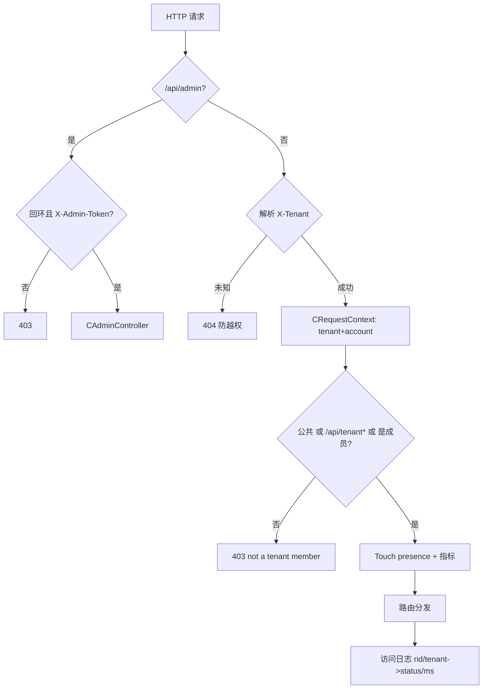
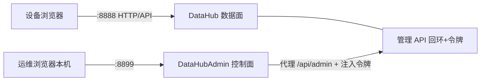

# 本项目（DataHub）的租户实现

> **本文档讲本仓库 DataHub 是怎么实现租户的**，并与通用概念、业界实现逐条对照。
> 相关文档：[租户概念详解](tenant-concepts.md) · [业界与其他项目实现](tenant-industry.md)
>
> DataHub 是跑在 COM-Framework（ServerCore 骨架 + Sogou Workflow HTTP）上的**局域网设备间数据传输**示例；租户是其隔离与授权主线。

## 1. 选型映射：把业界结论落地

| 通用/业界结论（见前两篇） | 本项目落地 |
|---|---|
| 组织 = 租户（Slack/企微） | 租户=有边界组织；进租户才能协作；聊天页**不内切租户** |
| shared table + tenant_id | 共享表模型（单 `CFileStore` + 每行租户列 + 强制按租户过滤） |
| 账号 ≠ 租户 | 账号=`X-Client-Id`（浏览器持久化 UUID）；membership+role 在花名册 |
| 角色 Owner/Member | `TenantRole{owner, member}` |
| 请求级租户上下文 | `CRequestContext{tenant, accountId, requestId}` 经 `UserData` 下传 |
| 数据层强制谓词 + 防 BOLA | `CFileStore` 所有读/列/删强制按租户过滤；跨租户=not found |
| 控制面/数据面分离 | `DataHub`(8888 数据面) + `DataHubAdmin`(8899 控制面独立 exe) |
| 实时/推送隔离 | 目前 presence 30s TTL + 轮询；SSE/WS 演进见 §11 |
| 交互先选组织 | 根路径 `/` = 租户选择页，进入后才 `/chat` |

## 2. 领域实体（`DataHub/Module/Tenant/CTenant.h`，命名空间 `sc`）

| 类型 | 字段 / 含义 |
|---|---|
| `CTenantLimits` | `nMaxItems`/`nMaxTotalBytes`/`nMaxItemBytes`（0=不限） |
| `CTenant` | `strCode` 租户码（6 位可分享短码）、`strName`、`limits`、`nCreateMs` |
| `TenantRole` | `kOwner`（删任意/管成员）、`kMember`（读写/自删） |
| `CTenantMember` | `strAccountId`（=账号）、`role`、`nJoinMs` |
| `DataItemInfo` | 消息/文件元信息（id/kind/name/from/size/created/seq） |

**公共租户（public）**：内置，人人皆成员、无 Owner、无花名册、不可删，是"未选租户"的兜底。其"特殊性"作为单条内置记录 + 语义收口集中在 `CTenantModule`（对应业界"表里一行 + kind 标志"，而非为它造子类）。

## 3. 代码分层

```text
DataHub/
├─ Module/Tenant/    ITenantService + CTenantModule（注册表+花名册）
├─ Module/Storage/   IDataStore + CDataStoreModule（把 CTenant 翻译成 tenant_id）
├─ Module/Http/      入口/闸门/控制器/在线成员/页面
│   ├─ HttpServerModule   装配：解析租户→闸门→路由→日志/指标
│   ├─ CHttpHandlers      租户内业务 list/text/file/item/delete
│   ├─ CTenantsController 设备侧自服务 create/info/join/members
│   ├─ CAdminController   内部管理 API（回环+令牌）
│   ├─ CMemberService     在线成员 presence（30s TTL）
│   └─ CRequestContext    请求上下文（tenant/account/requestId）
└─ Web/               前端（index/app/common/tenants/style）
Common/Storage/CFileStore   共享表多租户存储（纯内存）
DataHubAdmin/              【独立进程】控制面：管理网页+代理→DataHub
```

依赖方向（单向、无环）：`业务服务器 → ServerCore → Common → 第三方`。

## 4. 数据模型（共享表 + tenant_id）实现

`CFileStore`（`Common/Storage/`）逻辑上是"一张表"：
- `m_mapItems`：`id→Item`，每行带 `strTenant`（tenant_id 列）；
- `m_mapStats`：每租户 `{nItems,nBytes}`（配额计数）；
- `m_nNextSeq`：**全局单调序号**（≈自增主键），各租户增量游标天然单调；
- 一切读/列/删强制按租户过滤（`WHERE tenant_id=?`），线程安全。

```mermaid
erDiagram
    TENANT ||--o{ ITEM : owns
    TENANT ||--o{ MEMBER : has
    ITEM { string id PK; string strTenant FK "tenant_id"; enum kind; string name; string from; bytes content; uint64 seq; int64 createdMs }
    MEMBER { string tenantCode FK; string accountId "X-Client-Id"; enum role "owner|member"; int64 joinedMs }
```

> 演进注记：早期"每租户一个 store 实例"→ 重构为共享表 + tenant_id（对齐业界，commit `ac540c1`）。

## 5. 一次请求的生命周期（核心）



要点：未知租户 404（防越权到别的租户）；非公共租户读写删都须成员（`/api/tenant*` 平台能力豁免）；删除授权 Owner 任意 / Member 自删（按账号比对）。

## 6. 授权与守卫一览

| 规则 | 位置 |
|---|---|
| 创建者自动 Owner；凭码加入=幂等 Member | `CreateTenant`/`JoinTenant` |
| 公共租户人人成员/无花名册 | `TenantRoleOf`/`ListMembers` |
| 公共不可删；移除/降级成员保留 ≥1 Owner；角色只对已加入成员 | `CTenantModule` |
| 配额在保存时按租户执行 | `CFileStore` |
| 管理 API = 回环 + 令牌双闸门 | `HttpServerModule` |

## 7. API 总览

**设备侧**（`X-Client-Id` + `X-Tenant`）：`POST /api/tenant`（创建）、`GET /api/tenant/info?code=`、`POST /api/tenant/join`、`GET /api/tenant/members`、`GET /api/list[?since]`、`POST /api/text|file`、`GET /api/text|file/{id}`（文件 Range 分段）、`DELETE /api/item/{id}`、`GET /api/members`。

**管理侧 `/api/admin/*`**（回环+`X-Admin-Token`）：`overview`、`tenant?code`（详情）、`DELETE tenant`、`rename`、`limits`、`item`（预览/删除）、`member`（移除）、`member/role`。

## 8. 双服务器拓扑



- 配置：`DataHub/datahub.ini`（`[server][http][store][admin].token`）；`DataHubAdmin/datahub-admin.ini`（`[server]port`、`[upstream]base/token`），两处 token 一致。

## 9. 前端：页面与状态

- `/`（根）= **租户选择页**：创建/凭码加入/我的租户/进入；展示各租户角色标签（从花名册比对账号得出）→ 默认落地即"先选组织"。
- `/chat` = 聊天室，**固定于当前租户、无页内切换**（对应"租户=有边界组织"）。
- `common.js（window.DH）`：账号 `CLIENT_ID`、我的租户/当前租户（localStorage）、`apiFetch` 自动附 `X-Client-Id`+`X-Tenant`、`setCurrent/addTenant/removeTenant`。
- 进入非公共租户做幂等 join 登记成员。

## 10. 数据同步：现状 vs 真实业务应有行为

服务端内部多按**不可变租户码**键存，改名等大多自洽；**真正失步的是客户端 localStorage 缓存**与被删/被踢后的自愈缺失：

| 变更 | 现状 | 真实业务应有 |
|---|---|---|
| 改名 | 客户端缓存旧名 | 在线刷新；历史消息不跟着改 |
| 删租户 | 客户端永久 404 卡死 | 通知解散、全员离场、离线者进入即提示回落 |
| 被踢 | 客户端一直 403 | 通知/断连、即时离场并清理 |
| 角色 | 服务端即时 | 通知本人，UI 联动 |
| 删一条数据 | 已加载气泡残留 | 撤回/删除事件随游标 |
| 服务重启 | 内存全清、客户端缓存留着 | 持久化 + 会话可恢复（本项目为演示内存态是有意为之） |

**传输层结论（已论证）**：workflow nossl **无 WS 服务端**（WS 只有客户端分支），WFServer 是请求/应答模型、无连接接管/外部推送 API → 想真下行优先 **SSE**（纯 HTTP）；确要 WS 协议需在 Common 自研轻量 WS 服务端（同进程双监听，HTTP 仍 workflow）。推荐演进：`/api/tenant/state` 状态对账 → 需要实时上 SSE → 再考虑自研 WS。

## 11. 已知限制与演进路线

| 限制 | 说明/演进 |
|---|---|
| 纯内存 | 重启即清；真实化需持久化 |
| 无会话/多端 | 账号即 UUID，无令牌与多端互踢 |
| 无推送 | SSE / 自研 WS |
| 无状态对账 | 建议 `/api/tenant/state` + 客户端 reconcile |

建议下一步（按价值）：① 设备自愈状态对账 → ② 持久化 → ③ SSE 事件 → ④ 可选自研 WS。

## 12. 构建 / 运行 / 冒烟

```bash
./build.sh --debug Common DataHub DataHubAdmin
cd DataHub && ../build/debug/datahub 8888            # 数据面
cd DataHubAdmin && ../build/debug/datahub-admin 8899 # 控制面
```

实测要点：无/错令牌 403；非成员读写 403；Owner 删任意、Member 自删、删他人 403；未知租户 404；改名/配额/角色/移除/删除守卫生效；`./build/debug/tests`=81/81。
浏览器：`http://localhost:8888/`（选租户）→ `/chat`；`http://127.0.0.1:8899/`（管理，仅本机）。

## 13. 术语小表

| 词 | 含义 |
|---|---|
| 租户 Tenant | 隔离/授权单元 = 一个组织 |
| 租户码 code | 6 位分享码；`public` 内置公共租户 |
| 账号 Account | `X-Client-Id`，缺省退化为 `IP:port` |
| Owner/Member | 所有者/成员 |
| 花名册 roster | 租户内账号+角色的权威名单 |
| presence | 在线成员（30s TTL） |
| 共享表+tenant_id | 数据模型（见 concepts §4 第三种） |
| X-Tenant/X-Client-Id/X-Admin-Token | 请求头：当前租户/账号/管理令牌 |

---

*相关：总体架构见 [../../architecture.md](../../architecture.md)；ServerCore 模块/DI/网络见 [../../servercore/](../../servercore/)。代码目录 `DataHub/Module/{Tenant,Storage,Http,Admin}` 与 `DataHubAdmin/`。*
