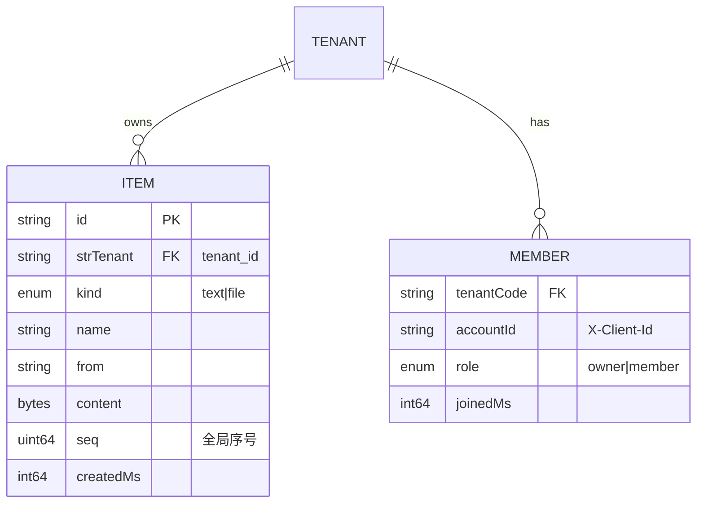
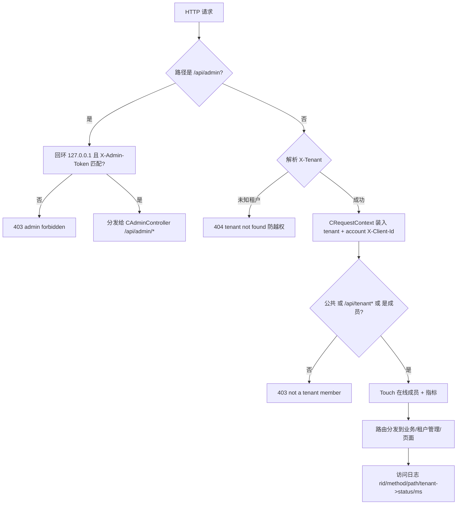

# DataHub 租户（Tenant）完全指南

> 供学习：从"为什么有租户"到"数据怎么存、请求怎么鉴权、前端怎么交互、运维怎么管理、有哪些边界与演进方向"，一次讲透。

DataHub 是一个跑在 COM-Framework（ServerCore 骨架 + Sogou Workflow HTTP）上的**局域网设备间数据传输**示例：设备（浏览器）加入一个"租户"后，可互发文本与文件。**租户（Tenant）**是本系统的隔离单元与权限边界，也是理解整个工程设计的主线。

---

## 1. 一句话

> **租户 = 一个有边界的"组织/工作区"**（类比公司/团队/Workspace）。设备不是互相乱聊，而是先**进入某个租户**，只能在**该租户内部**看到数据、成员和进行授权操作。就像你不能在 Slack 的聊天窗里直接切到另一家公司一样——**切换/管理租户必须在租户选择页做**，聊天页固定于当前租户。

早期版本用过"空间 / X-Space"的叫法，后按业界语义统一为 **租户 / `X-Tenant`**。

---

## 2. 为什么要租户

| 问题 | 没有租户 | 有租户后 |
|---|---|---|
| 数据边界 | 所有设备一个"房间"，没有隔离 | 每个租户一套数据/成员/配额，互不可见 |
| 越权 | 谁能删谁的东西说不清 | Owner / 成员角色化授权 |
| 规模化 | 一锅粥 | 共享表 + tenant_id，与业界一致，可按租户观测 |
| 使用心智 | 频道式随手切换，边界模糊 | 组织式：先入组、后协作 |

多租户在业界有两种典型实现，本项目采用后者（主流方案）：

| 模型 | 做法 | 本项目 |
|---|---|---|
| 隔离存储（database-per-tenant） | 每租户独立库/表 | ❌ 早期如此，已弃 |
| **共享存储 + tenant_id（shared-table）** | 单表 + 每行租户列 + `WHERE tenant_id=?` | ✅ 当前 |

---

## 3. 数据模型（共享表 + tenant_id）

存储层在 **Common 的 `CFileStore`**（`Common/Storage/`），逻辑上是一张"共享表"：

- `m_mapItems`：全局一张表，`id → Item`，**每行带 `strTenant`（tenant_id 列）**；
- `m_mapStats`：每租户统计 `{nItems, nBytes}`（配额计数）；
- `m_nNextSeq`：**全局单调自增序号**（相当于自增主键），各租户增量游标因此天然单调；
- 所有读/列/删都强制按租户过滤（等价 `WHERE tenant_id=?`），**业务不可能跨租户读到数据**；
- 纯内存、线程安全（内部加锁）。



> 演进注记：早期按"每租户一个 store 实例"隔离 → 重构为共享表模型，正是为了对齐业界"共享存储 + 租户列"的规模化思路（commit `ac540c1`）。

---

## 4. 领域实体（`DataHub/Module/Tenant/CTenant.h`，命名空间 `sc`）

| 类型 | 字段 / 含义 |
|---|---|
| `CTenantLimits` | `nMaxItems` 条数、`nMaxTotalBytes` 总字节、`nMaxItemBytes` 单条字节；**0 = 不限**。配额随租户实体传递 |
| `CTenant` | `strCode` 租户码（6 位短码，可分享）、`strName` 名、`limits` 配额、`nCreateMs` 创建时间 |
| `TenantRole` | `kOwner`（可删任意/管成员）、`kMember`（读写/自删） |
| `CTenantMember` | `strAccountId` 账号（浏览器 `X-Client-Id`）、`role`、`nJoinMs` |
| `DataItemInfo` | 消息/文件元信息：`strId/kind/strName/strFrom/nSize/nCreateMs/nSeq` |

**账号（Account）** = `X-Client-Id`（浏览器持久化 UUID，跨请求标识同一浏览器；命令行缺省退化为来源 `IP:port`）。授权、成员、删除判定**全部基于账号**，不是基于 IP/端口（避免成员按端口膨胀）。

---

## 5. 公共租户（public）与特殊语义

系统内置**公共租户**（码 `public`，名"公共租户"），是"未选择租户"时的默认地、向后兼容兜底。它的特殊性（在 `CTenantModule` 中集中处理，前端为常量）：

- 人人皆成员（`TenantRoleOf` 恒为 `member`）；
- 无 Owner、无花名册（`ListMembers` 为空）；
- 不可删除、码固定；
- 配额使用全局默认（`[store]` 配置）。

> 设计讨论（供学习）：公共租户"能不能提取成一个类？"——正确边界**不是**给 `CTenant` 造子类（`CTenant` 是值实体、差异是策略而非结构），而是把它作为**单条内置记录 + 语义收口**（码/名/规则集中在模块内），业界普遍是"表里一行 + kind/is_default 标志"，而非类爆炸。

---

## 6. 代码分层

```text
DataHub/
├─ Module/Tenant/    领域层：ITenantService（接口）+ CTenantModule（注册表+花名册）
├─ Module/Storage/   IDataStore（接口）+ CDataStoreModule（把 CTenant 翻译成 tenant_id）
├─ Module/Http/      装配与业务层：
│   ├─ HttpServerModule    入口/闸门/路由/观测
│   ├─ CHttpHandlers       租户内业务（list/text/file/item/delete）
│   ├─ CTenantsController  设备侧租户自服务（create/info/join/members）
│   ├─ CAdminController    内部管理 API（/api/admin/*，回环+令牌）
│   ├─ CMemberService      在线成员（presence，30s TTL）
│   ├─ CRequestContext     每请求上下文（tenant/account/requestId）
│   └─ WebPageController   静态页/资源（路由表驱动）
├─ Module/Admin/     装配给 HttpServerModule 用的管理控制器
└─ Web/              前端（index.html/app.js/common.js/tenants.html/tenants.js/style.css）

Common/Storage/CFileStore   共享表多租户存储（纯内存）
DataHubAdmin/               【独立进程】控制面：管理网页 + 代理 /api/admin/* → DataHub
```

依赖方向（单向、无环）：`业务服务器 → ServerCore → Common → 第三方`。

---

## 7. 一次请求的生命周期（核心）

`HttpServerModule::OnRequest`（workflow 线程池中执行）：



要点：
- **`CRequestContext`**：`tenant + strAccountId + strRequestId + bResolved`，经 `req.UserData()` 供控制器读取（`RequestContextOf(req)`），是后续鉴权/限流/追踪中间件的"地基"；
- **权限闸门统一裁决**：非公共租户的读/写/删都须是该租户成员；`/api/tenant*` 是跨租户平台能力、豁免；公共租户人人可访问；
- **删除授权**：Owner 可删本租户任意条目；Member 仅可删自己条目（按账号比对）；
- **未知租户 404**：防止越权到别的租户（也意味着：客户端如果带着"已不存在"的租户码，会永久 404——见 §11 的同步问题）。

---

## 8. 授权与守卫一览

| 规则 | 位置 | 说明 |
|---|---|---|
| 创建租户者自动为 Owner | `CreateTenant` | 非空账号 |
| 凭码加入 = 幂等成为 Member | `JoinTenant` | 已在花名册则返回原角色 |
| 公共租户人人成员/无花名册 | `TenantRoleOf`/`ListMembers` | |
| 成员/角色/删除守卫 | `CTenantModule` | 公共不可删；移除/降级成员须保留 ≥1 Owner；改角色只对已加入成员 |
| 数据配额在保存时按租户执行 | `CFileStore` | 超限保存失败 |
| 管理 API 双闸门 | `HttpServerModule` | 回环 + 令牌 |
| 短码字符集 | `CTenantModule` | 去掉易混淆 0/O/1/I/l |

---

## 9. API 总览

### 设备侧（浏览器，`X-Client-Id` + `X-Tenant` 头）

| 方法/路径 | 作用 |
|---|---|
| `POST /api/tenant` | 创建租户（body=名称），创建者成 Owner，返回 `{code,name,role}` |
| `GET /api/tenant/info?code=` | 按码查租户（名称） |
| `POST /api/tenant/join` | 凭码加入（body=code），返回 `{role}` |
| `GET /api/tenant/members` | 当前租户花名册 |
| `GET /api/list[/?since=]` | 租户内消息/文件列表（增量游标） |
| `POST /api/text` `POST /api/file` | 发文本/上传文件 |
| `GET /api/text/{id}` `GET /api/file/{id}` | 取内容（文件走 Range 分段，绕开大响应截断） |
| `DELETE /api/item/{id}` | 删除（Owner 任意/成员自删） |
| `GET /api/members` | 在线成员（presence） |

### 管理侧（`/api/admin/*`，仅本机回环 + `X-Admin-Token`）

| 方法/路径 | 作用 |
|---|---|
| `GET /overview` | 全部租户 + 汇总统计（成员/条目/字节） |
| `GET /tenant?code=` | 单租户详情（成员 + 条目） |
| `DELETE /tenant?code=` | 删除租户（含清数据；公共不可删） |
| `POST /tenant/rename` | 改名（表单 `code,name`） |
| `POST /tenant/limits` | 配额（`maxItems/maxTotalBytes/maxItemBytes`，0=不限） |
| `GET /item?code&id` | 条目元信息 + 文本预览 |
| `DELETE /item?code&id` | 删条目 |
| `DELETE /member?code&account` | 移除成员（守卫保留 Owner） |
| `POST /member/role` | 改角色（owner/member） |

> 这些管理接口由**独立的 DataHubAdmin 控制面**经反向代理调用（令牌只在服务器配置里，不进浏览器）。浏览器直连 8888 的 `/api/admin/*` 会 403。

---

## 10. 双服务器拓扑（控制面 / 数据面）

```mermaid
flowchart LR
    subgraph 数据面 DataHub :8888
      R[HTTP 业务 /api + 页面]
      A[管理 API /api/admin 回环+令牌]
    end
    subgraph 控制面 DataHubAdmin :8899（独立 exe，仅本机）
      P[管理网页]
      PR[代理 /api/admin/* + 注入令牌]
    end
    D[设备浏览器] --> R
    O[运维浏览器本机] --> P
    P --> PR
    PR -->|http://127.0.0.1:8888| A
```

- **DataHub**（`build/debug/datahub 8888`）：持有租户/成员/数据（进程内内存），也是唯一事实源；
- **DataHubAdmin**（`build/debug/datahub-admin 8899`）：独立服务器 exe，只承载管理网页并代理管理 API；不持有数据，天然与 DataHub 解耦；
- 配置：`DataHub/datahub.ini`（`[server] [http] [store] [admin] token`）；`DataHubAdmin/datahub-admin.ini`（`[server] port`、`[upstream] base/token`）；两处 `token` 必须一致。

---

## 11. 前端：页面与状态（重要）

| 路由 | 页面 | 职责 |
|---|---|---|
| `/` | 租户选择页（`tenants.html`+`tenants.js`） | 默认落地：创建/凭码加入/我的租户列表/进入；展示我在各租户的角色标签（从花名册比对账号得出） |
| `/chat` | 聊天室（`index.html`+`app.js`） | 固定于"当前租户"，**无页内切换**（租户=有边界组织）；顶栏显示当前租户 + 「管理/切换」→ `/` |

**`common.js`（`window.DH`）**：两页共享的公共小件
- 账号 `DH.CLIENT_ID`（localStorage `datahub_client_id`）；
- 我的租户/当前租户（`datahub_tenants` / `datahub_current_tenant`）；
- `DH.apiFetch`：自动附 `X-Client-Id` 与 `X-Tenant`（允许按租户覆写，管理页查角色用）；
- `DH.setCurrent/addTenant/removeTenant/tenantNameOf`。

进入非公共租户时做一次**幂等 join** 登记成员；管理页"进入"→ setCurrent + 跳 `/chat`。

---

## 12. 数据同步与"真实业务该有的行为"（学习重点）

服务端内部：多数实体只存**不可变租户码**，所以改名/删租户大多天然自洽（E3/E4 按 code 键，不存名字）。**真正会失步的是客户端 localStorage 缓存**，以及"被删/被踢后无自愈路径"：

| 变更 | 影响 | 真实业务应有的行为 |
|---|---|---|
| 改名 | 各浏览器缓存旧名 | 在线即时刷新；**历史消息不跟着改名**（数据按 id/code 引用，从不按名字快照） |
| 删租户 | 客户端仍指向已删码 → 永久 404 | 服务端通知"租户已解散"，全员离场；离线者进入发现码不存在即清理回落 |
| 被踢 | 客户端仍在轮询 → 403 | 服务端主动断连/通知"你已被移出"，客户端立即离开并清理 |
| 角色变更 | 服务端即时生效 | 通知本人/Owner；UI 联动显隐管理按钮 |
| 配额 | 只影响下次写 | 不推 |
| 删一条数据 | 已加载客户端残留气泡 | 撤回/删除事件随增量游标下发，前端移除 |
| 服务重启 | 内存态全清，客户端缓存却留着 | 真实业务必须持久化 + 会话可恢复（本项目为演示，内存态是有意为之） |

**传输层怎么选**（结论已论证）：
- 当前是"2s 轮询 + 状态对账"；workflow nossl **没有 WS 服务端**（只有 WS 客户端分支），WFServer 是请求/应答模型、无连接接管/外部推送 API；
- 想真下行又不改第三方 → **SSE**（纯 HTTP，最适合低频控制面事件）；
- 想要真 WS 协议 → Common 自实现轻量 WS 服务端（握手+帧+会话表+线程安全推送），HTTP 仍用 workflow、同进程双监听。

**推荐演进顺序**：先做 `/api/tenant/state` 状态对账（改名/删租户/被踢自动回落）→ 需要实时时上 SSE → 确需 WS 再自研组件。

---

## 13. 已知限制 & 演进路线

| 限制 | 说明 / 演进 |
|---|---|
| 纯内存 | 重启即清（有意为之）。真实化需持久化租户/成员/数据 |
| 无会话/多端 | 账号即 `X-Client-Id`，无登录令牌与多端互踢 |
| 无服务端推送 | workflow 无 WS server；可 SSE / 自研 WS |
| 无服务端事件对账 | 建议 `/api/tenant/state` + 客户端 reconcile |
| 配额不追溯 | 缩减配额不清超限存量（语义如此） |

**建议下一步（按价值排序）**：① `/api/tenant/state` 设备自愈对账；② 数据/成员持久化；③ SSE 事件通道；④ 可选自研 WS。

---

## 14. 构建 / 运行 / 冒烟

```bash
# 构建（DataHub 与 DataHubAdmin 都含 Linux/Makefile，自动发现）
./build.sh --debug Common DataHub DataHubAdmin
# 数据面
cd DataHub && ../build/debug/datahub 8888
# 控制面（另一个终端）
cd DataHubAdmin && ../build/debug/datahub-admin 8899
```

冒烟要点（均已实测通过）：
- 无令牌/错令牌访问 `/api/admin/*` → 403；正确令牌 → 200；
- 非成员读写私有租户 → 403；Owner 可删任意、成员自删、非本人删他人 → 403；
- 未知租户 → 404；公共租户默认开放；
- 改名/配额/角色/移除/删除等守卫（公共不可删、保留 ≥1 Owner）生效；
- 单元回归 `./build/debug/tests` = 81/81。

浏览器：`http://localhost:8888/`（选租户）→ 进入 → `/chat`；`http://127.0.0.1:8899/`（服务端管理，仅本机）。

---

## 15. 术语小表

| 词 | 含义 |
|---|---|
| 租户 Tenant | 隔离/授权单元，= 一个组织/工作区 |
| 租户码 code | 6 位分享码；`public` 为内置公共租户 |
| 账号 Account | `X-Client-Id`（浏览器持久化 UUID），缺省退化为 `IP:port` |
| Owner / Member | 所有者 / 成员 |
| 花名册 roster | 某租户内账号+角色的权威名单（`ListMembers`） |
| presence | 在线成员（`CMemberService`，30s TTL），与花名册是两回事 |
| X-Tenant / X-Client-Id / X-Admin-Token | 请求头：当前租户 / 账号 / 管理令牌 |
| 共享表 + tenant_id | 数据模型：单表每行带租户列 |

---

*相关：总体架构见 [../architecture.md](../architecture.md)，ServerCore 模块/DI/网络见 [../servercore/*](../servercore/)。DataHub 前端路由与页面部署见 DataHub/Makefile 与 `DataHub/Web/`。*
