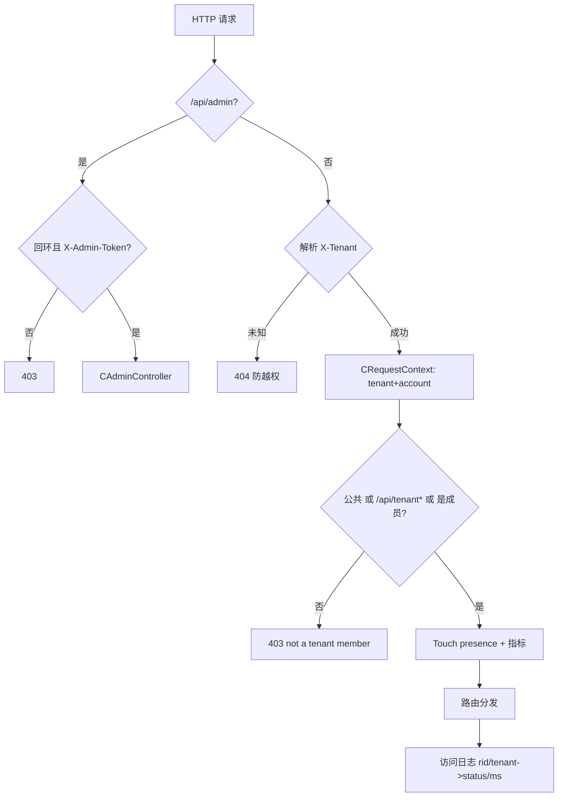
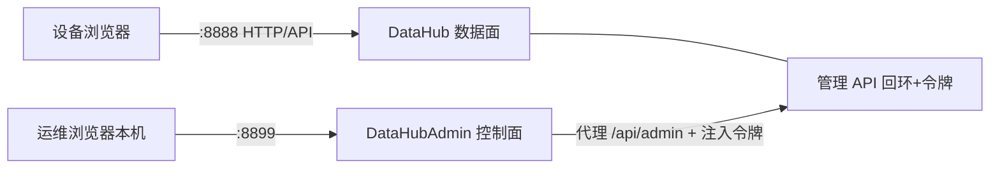

# 租户（Tenant / Multi-Tenancy）完全指南

> **阅读顺序即三层递进**：
> 第 1 部分讲**与任何项目都无关的通用租户知识**（概念、隔离模型、漏洞、账号/角色模型）；
> 第 2 部分讲**业界与其它项目是怎么实现的**（Salesforce/Slack/AWS/主流框架…）；
> 第 3 部分才落到**本仓库（DataHub）的具体实现**，并与前两部分对照。
>
> 若只想快速了解本仓库怎么做的，可直接跳第 3 部分；但建议完整读，因为第 3 部分的每个设计点几乎都对应第 1、2 部分的某个业界结论。

---

# 第 1 部分 · 通用租户知识（与具体项目无关）

## 1.1 什么是多租户（Multi-tenancy）

**多租户**是一种软件架构：**同一套软件/同一份部署，服务多个相互隔离的"客户组织（租户）"**。租户之间看不到彼此的数据、成员与配置，但共享计算与运维成本。

三个词先分清：

| 词 | 含义 |
|---|---|
| **租户（Tenant）** | 隔离单元 = 一个客户组织/团队/工作区。例如"某公司"、"某工作室" |
| **账号（Account / User）** | 一个登录主体。**账号可以属于多个租户**（一个人在不同公司） |
| **成员资格（Membership）** | "某账号在某租户内"这件事，通常带角色（如 所有者/管理员/成员） |

> 业界对"租户"的叫法很多但意思相同：Org（GitHub 的组织）、Workspace（Slack 工作区）、Site（Atlassian）、Space/Team（飞书/Notion）、Enterprise（企微/钉钉）、Account/Tenant（云厂商）。

## 1.2 为什么需要多租户

| 动机 | 说明 |
|---|---|
| **成本** | N 家客户不用 N 套独立部署，一套即可 |
| **隔离/合规** | 客户数据互不可见；满足数据合规与审计 |
| **规模** | 一层按组织隔离，再按产品放量 |
| **运营** | 统一升级、监控、计费、开通/停用 |
| **协作** | 同一组织内成员共享工作区，组织外天然不可见 |

**单租户 vs 多租户**不是好坏，是**业务形态**：面向大客户的重资产产品常"单租户专享实例"（物理隔离、定制、合规强），面向中小客户的 SaaS 产品普遍多租户。常见演进：多租户起步 → 高价值客户可升级"独立实例/专享集群"（**混合部署**，企业软件标配）。

## 1.3 隔离发生在哪些维度

新手以为"多租户 = 数据库加个字段"。其实隔离散落在每一层：

- **数据**（最核心）：库/表/行级隔离；
- **缓存**：Redis key 不加租户前缀会串租户；
- **对象存储/文件**：路径带租户前缀（否则 `GET /file/{id}` 换租户可读）；
- **任务/队列**：后台任务必须携带租户上下文（否则批处理把 A 的写进 B）；
- **日志/指标**：按租户打标签（排查与计量）；
- **配置/配额/计费**：每租户一套；
- **密钥/白标/域名**：每租户独立设置。

## 1.4 三类数据隔离模型（最核心的通用知识）

| 模型 | 做法 | 隔离 | 成本 | 单租户可扩展 | 适用 |
|---|---|---|---|---|---|
| **Database-per-tenant** | 每租户一个数据库 | 最强 | 最高 | 强 | 大客户、合规强、专享 |
| **Schema-per-tenant** | 共享数据库、每租户一个 schema | 强 | 中 | 中 | 中型、隔离与成本折中 |
| **Shared table + tenant_id** | 一张表，每行带租户列 | 逻辑隔离 | 最低 | 弱（单表膨胀） | 海量小租户、SaaS 起步 |

**这不是"选一个就完"**，业界常见**演进 + 混合**：
- 先 shared table 快速起量 → 大租户迁 schema/db（按租户路由，类似"读写分离的租户路由表"）；
- 或者反过来：默认每租户独享，成本高但隔离爽。

**Shared-table 的关键**：所有查询**必须强制 `WHERE tenant_id = ?`**，靠"约定 + 拦截"两层保证，任何漏掉的地方就是数据泄漏（见 1.6）。

## 1.5 应用层如何"感知租户"

多租户数据库方案解决"存哪"，但**请求怎么知道自己是哪个租户**要靠应用层：

1. **解析租户标识**：子域名（`acme.app.com`）、请求头、JWT/会话里的租户声明、或路径前缀；
2. **放进请求/线程上下文**（TenantContext/ThreadLocal/Context）——一次请求的生命周期内全局可读；
3. **传给数据访问层**并**强制拼接谓词**：不在 Controller 里手拼 `tenant_id`（会漏），而在**数据层/ORM/中间件统一注入**；
4. 进阶做法：数据库**行级安全（RLS，如 Postgres `row_security`）**——即便 SQL 忘写租户条件，DB 层按当前租户自动过滤，**双保险**；
5. 缓存/文件/任务同理会话级注入租户。

## 1.6 常见反模式与攻击面（面试/审核心考点）

| 反模式/漏洞 | 现象 | 防护 |
|---|---|---|
| **IDOR / 换租户越权** | 传 `id` 不校验归属，改个租户 id 就读到别人数据（`BOLA` 是 OWASP API 第 1 类） | 数据层强制租户谓词；对象必须"租户内查找"，跨租户即 not-found |
| 漏 `tenant_id` 过滤 | 聚合/统计/后台任务忘拼条件 | 统一拦截 + 行级安全兜底 |
| **缓存串租户** | key 不带租户 | key/namespace 加租户前缀 |
| 把租户 id 当"可信任入参" | 服务端直接信任前端传的租户 id | 从登录态/JWT 解析，不信任请求体 |
| 后台任务无租户上下文 | 批处理张冠李戴 | 任务携带租户上下文 |
| 只看存储不做边界 | 聊天/推送跨租户串 | presence/推送按租户订阅（见 2.5） |

## 1.7 组织 / 账号 / 成员 / 角色（RBAC）

一个常见误区：把"账号"当"租户"。正确建模是三层：

```text
账号（User，全局唯一）
   └─ 成员资格（在哪些租户、什么角色）
         ├─ Owner   拥有者：管理租户/成员/数据
         ├─ Admin/管理员：成员与配置
         └─ Member  成员：日常使用
租户（Org/Workspace）
   ├─ 数据 / 配额 / 设置
   └─ 成员表 membership(tenant_id, user_id, role)
```

租户级"邀请/加入"（凭邀请码/链接）与"踢出/退出"是组织软件的基本闭环。角色决定权限：Owner 可删任意、可管成员；Member 只能用自己的。

## 1.8 租户级功能（不止隔离）

成熟的 SaaS 对租户做：**配额与计量**（条数/容量/带宽/并发）、**计费套餐**、**每租户配置/白标**、**审计日志**、**按租户的监控告警**。这些都会回到 1.3 的"每层都要带租户"。

---

# 第 2 部分 · 业界与其它项目是怎么实现的

## 2.1 真实产品怎么做（对照学习）

| 产品 | 它的"租户" | 存储/隔离选择 | 可借鉴点 |
|---|---|---|---|
| **Salesforce** | Org | 早期就多租户共享数据库 + **元数据驱动**（租户 id 进主键） | 单 schema 海量租户可行；元数据驱动 |
| **Slack** | Workspace | workspace+channel 两级；**membership 驱动**加入 | "先进 workspace 再协作"的交互心智 |
| **GitHub** | Organization | org→repo→team 多层；角色 owner/member | 组织模型与权限分层 |
| **Atlassian/Jira** | Site | site=租户（含命名空间/独立子域） | 站点隔离 + 白标域名 |
| **飞书/企微/钉钉** | 企业/组织 | 企业=租户，内部再分部门/群 | 组织树、审批、成员管理完善 |
| **Notion/语雀/维格** | Space/团队 | space=租户、page/文档在 space 内 | "文档空间"式协作隔离 |
| **AWS** | Account | 账号=强隔离边界 + 成本/权限单位 | 隔离与计费、资源都绑账号 |
| **Azure/Entra** | Tenant（目录） | 目录级隔离 | 身份/目录即租户 |
| **K8s** | Namespace | 软隔离，配 RBAC/网络策略 | namespace 心智可类比 |

> 启示：成熟产品几乎都是"**租户入口先行**（选/建组织）+ **组织内共享** + **成员/角色管理** + **数据与实时都按组织隔离**"，这正是"租户 = 有边界组织"心智能被广泛接受的原因。

## 2.2 主流技术栈的落地方式

- **Spring（Java）**：`TenantContext`（ThreadLocal）由拦截器从 header/子域填好 → 数据访问用 **Hibernate 过滤器（filter）或 MyBatis 拦截器自动拼 tenant 条件**；租户多库用动态数据源/`apartment`（每 schema 一 context）。
- **Ruby/Rails**：`apartment`（schema-per-tenant）或 `acts_as_tenant`（shared table + 自动 scope）。
- **Django**：`django-tenants`（schema），`django-multitenant`（shared）。
- **Node/Go**：靠**请求级 context/中间件**（`context.WithValue(ctx, tenantID)`）贯穿，数据层强制拼接；Go 常用 `gorm` 回调或 wrapper 统一 `Where("tenant_id=?")`。
- **云数据库**：Postgres 直接支持**行级安全（RLS）**做共享表双保险；Snowflake/云数仓按组织命名空间。

共同结论：**语言无关的通用三件套 = ① 请求级租户上下文 ② 数据层统一注入/RLS ③ 跨层租户键（缓存/文件/任务/日志）**。

## 2.3 账号、身份与多组织

业界从不把"登录"和"进哪个租户"混为一谈：
- **统一身份认证（IdP）**一次登录 → 拿到"我的账号 + 我属于哪些组织 + 各组织的角色"；
- 选组织进入（应用入口往往是组织选择器，如 Slack 登录后先列 workspace）；
- 组织内再授权（RBAC/ABAC），成员/邀请/离职同步。

## 2.4 控制面（Admin）与数据面分离

中大型系统把"租户运营"独立成控制面：
- **数据面**跑业务流量（按租户隔离的数据、实时协作）；
- **控制面**管租户生命周期（开通/停用/配额/计费）、成员与角色、审计、全局观测；
- 两者可以是同一进程（小型）、独立服务、甚至独立账号体系与权限（运营侧 RBAC）。
> 这正是本仓库最后落地成"**DataHub（数据面）+ DataHubAdmin（控制面独立进程）**"的行业原型。

## 2.5 实时与协作：租户边界不止在数据库

聊天/文档/白板类产品的隔离还要覆盖**实时通道**：
- **在线成员（presence）按租户/会话隔离**，不能跨租户看到谁在线；
- **推送按租户订阅**：事件只发到"该租户内成员的连接"（WebSocket/SSE 频道 = `tenant:{id}`）；
- 被踢/离开 = 服务端**主动关连接/撤订阅**（在线状态由连接生命周期决定，而非心跳猜）；
- 会话重连后**对账**（拉租户名/角色/是否仍存在），补齐离线期间漏掉的事件。

## 2.6 业界共识速记（可直接抄的原则）

1. 租户 id 用不可变标识，数据只引用它、不按名字快照；
2. 查询强制租户谓词 + （有条件时）行级安全双保险；
3. 跨层（缓存/文件/队列/日志）统一带租户键；
4. 账号 ≠ 租户：membership + role 第三层建模；
5. 交互先"选/建组织"，组织内协作；
6. 被踢/解散要给用户明确事件与离场，不是悄悄 404；
7. 控制面与数据面分离，租户可运营（配额/计费/审计）。

---

# 第 3 部分 · 本仓库（DataHub）的实现

> 现在看本项目，会发现几乎每个设计都是上面业界结论的落地。DataHub 是跑在 COM-Framework（ServerCore 骨架 + Sogou Workflow HTTP）上的**局域网设备间数据传输**示例；租户是其隔离与授权主线。

## 3.1 映射：本项目怎么选型

| 通用/业界结论 | 本项目落地 |
|---|---|
| 组织 = 租户（2.1 Slack/企微） | 租户=有边界组织；进租户才能协作；聊天页**不内切租户** |
| shared table + tenant_id（1.4/2.2） | 共享表模型（单 `CFileStore` + 每行租户列 + 强制按租户过滤） |
| 账号 ≠ 租户（1.7） | 账号=`X-Client-Id`（浏览器持久化 UUID）；membership+role 在花名册 |
| 权限 Owner/Admin/Member（1.7） | `TenantRole{owner, member}` |
| 请求级租户上下文（1.5/2.2） | `CRequestContext{tenant, accountId, requestId}` 经 `UserData` 下传 |
| 数据层强制谓词 + 双保险（1.6） | `CFileStore` 所有读/列/删强制按租户过滤；跨租户=not found |
| 控制面/数据面分离（2.4） | `DataHub`(8888 数据面) + `DataHubAdmin`(8899 控制面独立 exe) |
| 实时/推送隔离（2.5） | 目前 presence 30s TTL + 轮询；SSE/WS 演进见 §3.11 |
| 交互先进组织（2.1） | 根路径 `/` = 租户选择页，进入后才 `/chat` |

## 3.2 领域实体（`DataHub/Module/Tenant/CTenant.h`，命名空间 `sc`）

| 类型 | 字段 / 含义 |
|---|---|
| `CTenantLimits` | `nMaxItems`/`nMaxTotalBytes`/`nMaxItemBytes`（0=不限） |
| `CTenant` | `strCode` 租户码（6 位可分享短码）、`strName`、`limits`、`nCreateMs` |
| `TenantRole` | `kOwner`（删任意/管成员）、`kMember`（读写/自删） |
| `CTenantMember` | `strAccountId`（=账号）、`role`、`nJoinMs` |
| `DataItemInfo` | 消息/文件元信息（id/kind/name/from/size/created/seq） |

**公共租户（public）**：内置，人人皆成员、无 Owner、无花名册、不可删，是"未选租户"的兜底；其"特殊性"作为单条内置记录 + 语义收口集中在 `CTenantModule`（业界"表里一行 + kind 标志"思路，而非为它造子类）。

## 3.3 代码分层

```text
DataHub/
├─ Module/Tenant/    ITenantService + CTenantModule（注册表+花名册）
├─ Module/Storage/   IDataStore + CDataStoreModule（把 CTenant 翻译成 tenant_id）
├─ Module/Http/      入口/闸门/控制器/在线成员/页面
│   ├─ HttpServerModule   装配：解析租户→闸门→路由→日志/指标
│   ├─ CHttpHandlers      租户内业务 list/text/file/item/delete
│   ├─ CTenantsController 设备侧自服务 create/info/join/members
│   ├─ CAdminController   内部管理 API（回环+令牌）
│   ├─ CMemberService     在线成员 presence（30s TTL）
│   └─ CRequestContext    请求上下文（tenant/account/requestId）
└─ Web/               前端（index/app/common/tenants/style）
Common/Storage/CFileStore   共享表多租户存储（纯内存）
DataHubAdmin/              【独立进程】控制面：管理网页+代理→DataHub
```

## 3.4 数据模型（共享表 + tenant_id）实现

`CFileStore`（`Common/Storage/`）逻辑上是"一张表"：
- `m_mapItems`：`id→Item`，每行带 `strTenant`（tenant_id 列）；
- `m_mapStats`：每租户 `{nItems,nBytes}`（配额计数）；
- `m_nNextSeq`：**全局单调序号**（≈自增主键），各租户增量游标天然单调；
- 一切读/列/删强制按租户过滤（`WHERE tenant_id=?`），线程安全。

```mermaid
erDiagram
    TENANT ||--o{ ITEM : owns
    TENANT ||--o{ MEMBER : has
    ITEM { string id PK; string strTenant FK "tenant_id"; enum kind; string name; string from; bytes content; uint64 seq; int64 createdMs }
    MEMBER { string tenantCode FK; string accountId "X-Client-Id"; enum role "owner|member"; int64 joinedMs }
```

> 演进注记：早期"每租户一个 store 实例"→ 重构为共享表 + tenant_id（对齐业界，commit `ac540c1`）。

## 3.5 一次请求的生命周期（核心）



要点：未知租户 404（防越权到别的租户）；非公共租户读写删都须成员（`/api/tenant*` 平台能力豁免）；删除授权 Owner 任意 / Member 自删（按账号比对）。

## 3.6 授权与守卫一览

| 规则 | 位置 |
|---|---|
| 创建者自动 Owner；凭码加入=幂等 Member | `CreateTenant`/`JoinTenant` |
| 公共租户人人成员/无花名册 | `TenantRoleOf`/`ListMembers` |
| 公共不可删；移除/降级成员保留 ≥1 Owner；角色只对已加入成员 | `CTenantModule` |
| 配额在保存时按租户执行 | `CFileStore` |
| 管理 API = 回环 + 令牌双闸门 | `HttpServerModule` |

## 3.7 API 总览

**设备侧**（`X-Client-Id` + `X-Tenant`）：`POST /api/tenant`（创建）、`GET /api/tenant/info?code=`、`POST /api/tenant/join`、`GET /api/tenant/members`、`GET /api/list[?since]`、`POST /api/text|file`、`GET /api/text|file/{id}`（文件 Range 分段）、`DELETE /api/item/{id}`、`GET /api/members`。

**管理侧 `/api/admin/*`**（回环+`X-Admin-Token`）：`overview`、`tenant?code`（详情）、`DELETE tenant`、`rename`、`limits`、`item`（预览/删除）、`member`（移除）、`member/role`。

## 3.8 双服务器拓扑



- 配置：`DataHub/datahub.ini`（`[server][http][store][admin].token`）；`DataHubAdmin/datahub-admin.ini`（`[server]port`、`[upstream]base/token`），两处 token 一致。

## 3.9 前端：页面与状态

- `/`（根）= **租户选择页**：创建/凭码加入/我的租户/进入；展示各租户角色标签（从花名册比对账号得出）→ 默认落地即"先选组织"（对应 2.1/2.6⑤）。
- `/chat` = 聊天室，**固定于当前租户、无页内切换**（对应"租户=有边界组织"，2.6⑤）。
- `common.js（window.DH）`：账号 `CLIENT_ID`、我的租户/当前租户（localStorage）、`apiFetch` 自动附 `X-Client-Id`+`X-Tenant`、`setCurrent/addTenant/removeTenant`。
- 进入非公共租户做幂等 join 登记成员。

## 3.10 数据同步：本仓库现状 vs 真实业务应有行为

服务端内部多按**不可变租户码**键存，改名等大多自洽；**真正失步的是客户端 localStorage 缓存**与被删/被踢后的自愈缺失：

| 变更 | 现状 | 真实业务应有（=2.6⑥） |
|---|---|---|
| 改名 | 客户端缓存旧名 | 在线刷新；历史消息不跟着改 |
| 删租户 | 客户端永久 404 卡死 | 通知解散、全员离场、离线者进入即提示回落 |
| 被踢 | 客户端一直 403 | 通知/断连、即时离场并清理 |
| 角色 | 服务端即时 | 通知本人，UI 联动 |
| 删一条数据 | 已加载气泡残留 | 撤回/删除事件随游标 |
| 服务重启 | 内存全清、客户端缓存留着 | 持久化 + 会话可恢复（本项目为演示内存态是有意为之） |

**传输层结论（已论证）**：workflow nossl **无 WS 服务端**（WS 只有客户端分支），WFServer 是请求/应答模型、无连接接管/外部推送 API → 想真下行优先 **SSE**（纯 HTTP）；确要 WS 协议需在 Common 自研轻量 WS 服务端（同进程双监听，HTTP 仍 workflow）。推荐演进：`/api/tenant/state` 状态对账 → 需要实时上 SSE → 再考虑自研 WS。

## 3.11 已知限制与演进路线

| 限制 | 说明/演进 |
|---|---|
| 纯内存 | 重启即清；真实化需持久化（对照 2.4 数据面应有状态） |
| 无会话/多端 | 账号即 UUID，无令牌与多端互踢（对照 2.3） |
| 无推送 | SSE / 自研 WS（对照 2.5） |
| 无状态对账 | 建议 `/api/tenant/state` + 客户端 reconcile |

建议下一步（按价值）：① 设备自愈状态对账 → ② 持久化 → ③ SSE 事件 → ④ 可选自研 WS。

## 3.12 构建 / 运行 / 冒烟

```bash
./build.sh --debug Common DataHub DataHubAdmin
cd DataHub && ../build/debug/datahub 8888            # 数据面
cd DataHubAdmin && ../build/debug/datahub-admin 8899 # 控制面
```
实测要点：无/错令牌 403；非成员读写 403；Owner 删任意、Member 自删、删他人 403；未知租户 404；改名/配额/角色/移除/删除守卫生效；`./build/debug/tests`=81/81。
浏览器：`http://localhost:8888/`（选租户）→ `/chat`；`http://127.0.0.1:8899/`（管理，仅本机）。

## 3.13 术语小表

| 词 | 含义 |
|---|---|
| 租户 Tenant | 隔离/授权单元 = 一个组织 |
| 租户码 code | 6 位分享码；`public` 内置公共租户 |
| 账号 Account | `X-Client-Id`，缺省退化为 `IP:port` |
| Owner/Member | 所有者/成员 |
| 花名册 roster | 租户内账号+角色的权威名单 |
| presence | 在线成员（30s TTL） |
| 共享表+tenant_id | 数据模型（1.4 的第三种） |
| X-Tenant/X-Client-Id/X-Admin-Token | 请求头：当前租户/账号/管理令牌 |

---

*相关文档：总体架构见 [../architecture.md](../architecture.md)；ServerCore 模块/DI/网络见 [../servercore/](../servercore/)。本仓库 DataHub 的租户代码目录为 `DataHub/Module/{Tenant,Storage,Http,Admin}` 与 `DataHubAdmin/`。*
