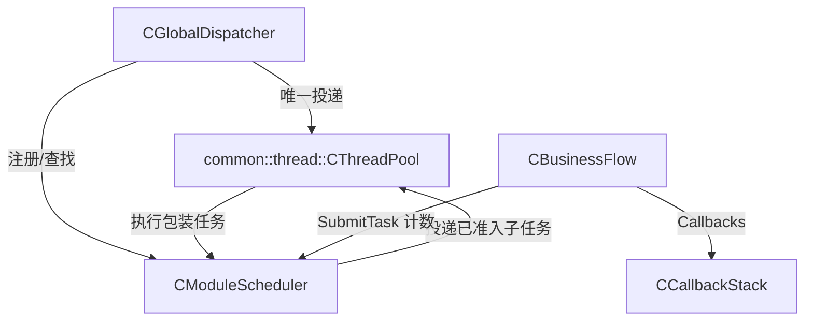
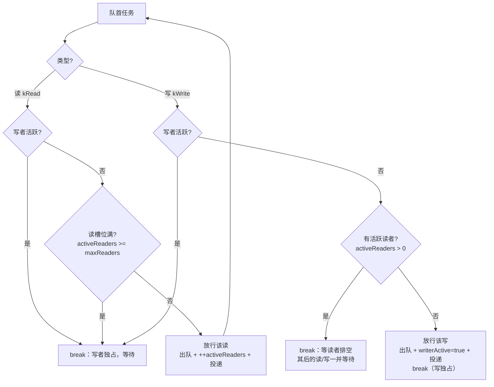
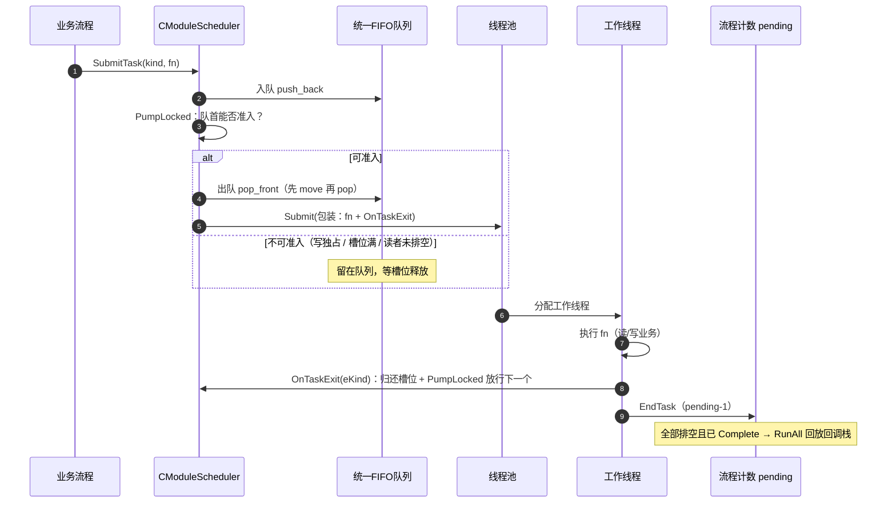
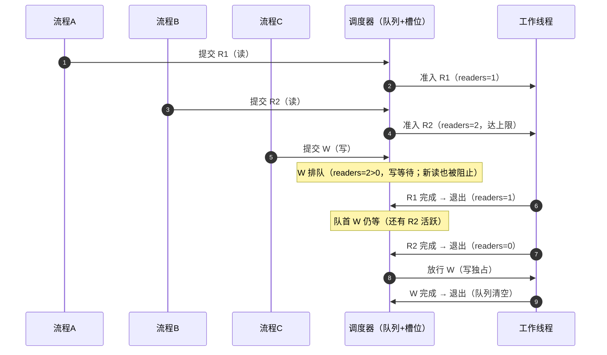
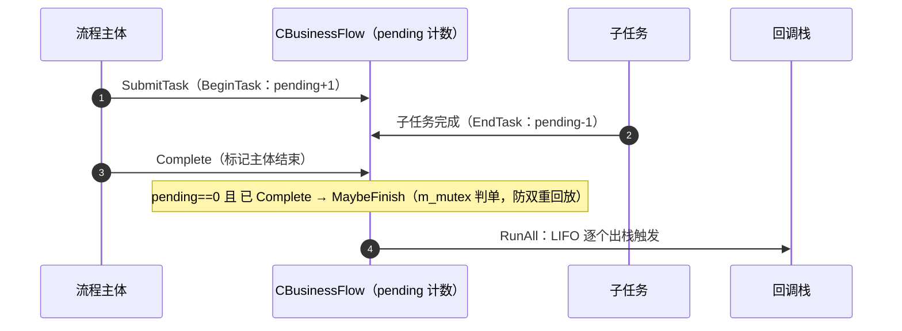

# Exec 并发调度组件库 — 实现文档

> 配套使用文档：[exec-usage.md](exec-usage.md)

## 1. 总体架构



线程归属：

| 对象 | 运行线程 |
|---|---|
| `Dispatch` 的流程主体 | 线程池任意工作线程（单个线程内跑完） |
| 子任务（`SubmitTask`） | 线程池工作线程（可能不同于主体线程） |
| `OnTaskExit`（归还槽位） | 执行该子任务的线程 |
| `RunAll`（回调栈回放） | 最后一个子任务结束的线程 |

## 2. CModuleScheduler（核心：公平 FIFO 读写调度）

### 2.1 数据结构

```cpp
std::deque<CDispatchEntry> m_dequeTasks;  // 统一 FIFO 队列（CDispatchEntry = 类型 + 任务）
std::atomic<int> m_nActiveReaders;        // 当前活跃读线程数
std::atomic<bool> m_bWriterActive;        // 是否有写线程在执行
mutable std::mutex m_mutex;               // 串行化队列与槽位计数
std::condition_variable m_condition;      // 供 Drain() 等待
```

采用**单一队列 + 队首顺序放行**，而非读写双队列——这是「公平 FIFO」的关键：
队首即最早提交的任务，保证不会出现「后来的写插队先前的读」。

### 2.2 Submit：统一入队 + 尝试放行

```cpp
bool Submit(ETaskKind eKind, const std::function<void()>& fnTask)
{
    if (m_pPool == nullptr || !m_pPool->IsRunning()) return false;
    std::vector<CDispatchEntry> vecDispatch;
    {
        std::lock_guard<std::mutex> lock(m_mutex);
        m_dequeTasks.push_back(entry);   // 统一入队（严格按提交顺序）
        PumpLocked(vecDispatch);         // 队首可准入则放行
    }
    DispatchToPool(vecDispatch);         // 锁外投递
    return true;
}
```

### 2.3 PumpLocked：队首顺序放行（公平 FIFO 核心）

```cpp
while (!m_dequeTasks.empty())
{
    const ETaskKind eFront = m_dequeTasks.front().eKind; // 只读队首类型
    if (eFront == ETaskKind::kRead)
    {
        if (m_bWriterActive.load())  break;                              // 写者独占
        if (达到 m_nMaxReaders)       break;                              // 读槽位满
        entry = std::move(front); pop_front();                           // 先移出再弹
        ++m_nActiveReaders; vecDispatch.push_back(std::move(entry));     // 放行该读
    }
    else // kWrite
    {
        if (m_bWriterActive.load())  break;
        if (m_nActiveReaders.load() > 0) break;   // 等先前读者排空（其后的任务一并等待）
        pop_front(); m_bWriterActive.store(true); vecDispatch.push_back(...);
        break;                                    // 写者独占
    }
}
```

**公平性论证**：队列严格 FIFO，放行从队首开始——队首是写且读者未排空时直接 `break`，
其后的读/写都不会被放行，因此**后来的任务永远不会越过先前的任务**；写也不会插队到
先前排队的读前面（读先于写在队首，先被放行）。

**准入决策图**（队首任务如何判定能否放行）：



### 2.4 OnTaskExit：归还槽位并继续泵出

子任务在线程池线程执行完（`DispatchToPool` 包装里 `fnTask()` 后）调用：

```cpp
void OnTaskExit(ETaskKind eKind)
{
    lock;
    if (kRead) --m_nActiveReaders; else m_bWriterActive.store(false);
    PumpLocked(vecDispatch);       // 槽位空出 → 放行下一个
    m_condition.notify_all();      // 唤醒 Drain()
    unlock;
    DispatchToPool(vecDispatch);
}
```

### 2.5 DispatchToPool：包装 + 异常防护 + 失败回滚

```cpp
fnWrapped = [this, eKind, fnTask]() {
    try { fnTask(); } catch (...) { LogCaughtException(...); }  // 线程池 worker 不捕获异常，必须兜底
    OnTaskExit(eKind);                                          // 无论成败都归还槽位
};
if (!pool->Submit(fnWrapped))
{
    // 线程池不可用：归还槽位 + 按原顺序放回队首（逆序 push_front），防槽位泄漏
}
```

### 2.6 为什么非阻塞

所有准入判定与排队都在 `m_mutex` 保护下完成；**进不了模块就留在队列，线程立即返回线程池**。
线程池线程永远不会被业务锁阻塞，因此不会因某模块写独占而占住线程导致池子耗尽。

### 2.7 调度时序示例

**① 一次子任务的完整旅程**（提交 → 准入 → 执行 → 归还槽位 → 流程计数）：



**② 读并发 + 写独占示例**（模块 `maxReaders=2`，按 R1、R2、W 顺序提交）：



**① 里线程被及时归还**：第 4 步不可准入时并不阻塞，`Submit` 直接返回，线程回到线程池；
槽位释放（`OnTaskExit`）时再由调度器重投递，因此线程池线程永不因业务锁被占用。

## 3. CBusinessFlow：业务流程（计数 + 完成判定）

```cpp
std::atomic<int>  m_nPending;    // 未结束的子任务数
std::atomic<bool> m_bCompleted;  // 是否已 Complete
std::atomic<bool> m_bFinished;   // 是否已回放回调栈
std::mutex m_mutex;              // 串行化完成判定（防双重回放）
CCallbackStack m_callbacks;
```

- `SubmitTask`：`BeginTask()` → 调度器 `Submit`（包装 `fnTask() + EndTask()`）→ 失败则立即 `EndTask()`；
- `EndTask`：`m_nPending.fetch_sub(1) == 1`（最后一个）时触发 `MaybeFinish()`；
- `Complete`：置 `m_bCompleted` 后触发 `MaybeFinish()`；
- `MaybeFinish`：在 `m_mutex` 内判定「已 Complete && pending==0」且未被 finish → 置 `m_bFinished`，
  锁外 `m_callbacks.RunAll()`。mutex 保证**恰好回放一次**（防两个线程同时判定完成）。

`enable_shared_from_this`：`SubmitTask` 内部 `shared_from_this()` 取自引用，子任务 lambda
按值捕获 `shared_ptr`，保证流程跨线程存活到最后一个子任务结束。

**约束**：回调栈回放后不得再提交子任务；每个 `BeginTask` 必须配对 `EndTask`。

**完成判定时序**（子任务计数归零 + `Complete` → 回放回调栈）：



## 4. CCallbackStack：线程安全回调栈

```cpp
std::vector<std::function<void()>> m_vecCallbacks; // 尾为栈顶
mutable std::mutex m_mutex;
```

- `Push`：加锁压入（线程安全）；
- `RunAll`：加锁 `swap` 取出全部 → **锁外**按 LIFO（尾→头）执行，单个回调异常捕获记录、不影响其余；
  锁外执行使回调内可再次 `Push`（不会本轮触发）而不会自锁；
- `Clear`：清空不触发。

## 5. CGlobalDispatcher：全局调度器

```cpp
common::thread::CThreadPool* m_pPool;            // 全局线程池（只执行）
std::unordered_map<std::string, CModuleScheduler*> m_mapSchedulers; // 模块名 → 调度器
mutable std::mutex m_mutex;
```

- `Dispatch(fnBody)`：`new CBusinessFlow()` 包进 `shared_ptr`，投递到线程池：
  `fnBody(spFlow)`（try/catch 记录异常）→ `spFlow->Complete()`；
- `FindScheduler`：加锁查表（业务里跨模块链式时用）；
- `DrainAll`：**先快照调度器列表、再锁外逐个 `Drain`**——若持注册表锁等待，工作线程恰好
  `FindScheduler` 会死锁。

## 6. 关键正确性论证

| 不变式 | 保证方式 |
|---|---|
| 读写互斥 | 写准入要求 `m_nActiveReaders==0`；读准入要求 `!m_bWriterActive`，且都在 `m_mutex` 内判定 |
| 写者唯一 | 一次只放行一个写（`PumpLocked` 放行写后 `break`，`m_bWriterActive` 独占） |
| 公平 FIFO | 统一队列队首放行；队首写阻塞时其后的任务一并等待 |
| 无死锁 | 全程非阻塞（进不了就排队）；`DrainAll` 锁外 Drain |
| 无槽位泄漏 | 子任务异常仍走 `OnTaskExit`；投递失败回滚槽位并放回队首 |
| 回调栈恰好一次 | `MaybeFinish` 用 `m_mutex` + `m_bFinished` 原子判单 |

## 7. 踩过的坑（经验沉淀）

1. **写优先插队倒置**：早期实现为「双队列 + 写优先」，排队的写会插到先前排队的读前面，
   导致同流程「先读后写」实际执行为「写→读」。改为统一队列公平 FIFO 后解决
   （`Exec_Rw_Order_ReadThenWrite` 回归测试）。
2. **deque 引用悬垂崩溃**：`PumpLocked` 曾持有 `front()` 的引用、`pop_front()` 后再 `move`，
   移动已销毁元素 → 段错误。必须**先 move 到局部再 pop**。
3. **全局 vs 按模块统计**：并发正确性不变量必须按模块（按调度器）独立统计读写——
   跨模块允许并发，全局计数会误报违例。

## 8. 与线程池的配合

`CModuleScheduler` 依赖 `common::thread::CThreadPool` 的 `Submit`。线程池需支持**突发批量
任务的并行度**（`Submit` 在排队积压时按空闲线程数补唤醒，见 `Common/Thread/ThreadPool`），
否则单线程突发投递长任务会退化为顺序执行，模块读并发无法真正并行
（`Exec_Rw_HighConcurrencyRead` / `ThreadPool_BurstParallelism` 回归测试）。
