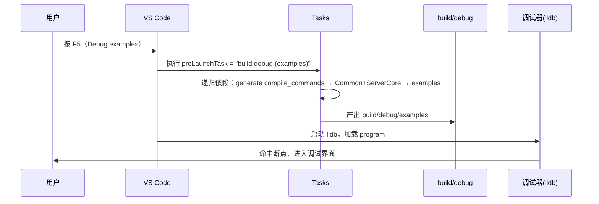

# VS Code tasks.json 与 launch.json 完全指南

> 讲解本项目 `.vscode/tasks.json` 与 `.vscode/launch.json` 的**运行逻辑**、
> **字段含义**、**依赖链**与**执行时序**，以及日常使用与排查方法。
> 配套：下拉框接入见 [vscode-select-dropdown.md](vscode-select-dropdown.md)，
> 常用命令见 [usage.md](usage.md)。

---

## 1. 两个文件的角色

| 文件 | 角色 | 何时执行 |
| --- | --- | --- |
| `.vscode/tasks.json` | 定义**任务**（构建、生成编译数据库、运行） | 手动 `Tasks: Run Task`，或被 launch 的 `preLaunchTask` 触发 |
| `.vscode/launch.json` | 定义**调试配置**（启动什么程序、用什么调试器、启动前做什么） | 按 **F5** / Run and Debug 面板选择配置 |

两者通过 **任务名（label）** 关联：launch 的 `preLaunchTask` 填的是 tasks.json 里某个任务的 `label`。

---

## 2. tasks.json 字段详解

### 2.1 顶层结构

```jsonc
{
    "version": "2.0.0",          // 任务 schema 版本，固定为 2.0.0
    "tasks": [ ... ],            // 任务定义数组
    "inputs": [ ... ]            // 任务参数输入定义（下拉、提示输入等）
}
```

### 2.2 任务对象字段（`tasks[]` 内每个元素）

```jsonc
{
    "label": "build (select project)",      // 任务唯一标识：供 Run Task 列表 / preLaunchTask 引用
    "type": "shell",                        // 任务类型：shell = 在终端执行命令
    "command": "./build.sh ${input:mode} ${input:project}",  // 要执行的命令；${input:xxx} 引用 inputs 输入
    "dependsOn": [                          // 依赖任务：执行本任务前先执行这些任务
        "generate compile_commands"
    ],
    "problemMatcher": ["$gcc"],             // 把终端输出解析为「问题面板」的错误/警告（$gcc 是内置 gcc 匹配器）
    "presentation": {                       // 终端呈现方式
        "reveal": "always",                 // 任务启动时始终显示终端
        "panel": "shared"                   // shared：任务共用同一终端面板；dedicated：独立终端
    }
}
```

| 字段 | 类型 | 含义 | 本项目用法 |
| --- | --- | --- | --- |
| `label` | string | 任务名（唯一） | 唯一标识，供下拉列表与 `preLaunchTask` 引用 |
| `type` | string | `shell`（终端命令） / `process`（可执行程序） | 全部用 `shell` |
| `command` | string | 要执行的命令 | 调 `build.sh` / `ThirdParty/build.sh` / `.tools/run_project.sh` |
| `args` | string[] | 命令参数（若用 `process` 类型则把参数拆开） | 未用（命令直接写在 `command`） |
| `dependsOn` | string[] | 依赖的任务 label 列表，先执行完再执行本任务 | 见 §3 依赖链 |
| `dependsOrder` | string | `sequence`（串行，默认）/ `parallel`（并行） | 未显式声明（默认串行） |
| `problemMatcher` | string[] | 终端输出 → 问题面板的匹配器 | `["$gcc"]` 解析 gcc 错误 |
| `presentation.reveal` | string | `always` / `silent` / `never` | `always` |
| `presentation.panel` | string | `shared`（共用面板）/ `dedicated`（独立面板）/ `new` | 构建用 `shared`，运行用 `dedicated` |
| `group` | string | `build` / `test` 等，把任务分组到对应的快捷键 | 未用（用 `Run Task` 手动触发） |

### 2.3 `inputs` 字段（任务参数输入）

```jsonc
{
    "id": "mode",                 // 标识，被 ${input:mode} 引用
    "type": "pickString",         // 静态下拉
    "options": [ { "label": "debug（默认）", "value": "--debug" } ],
    "default": "--debug"
}
```

| 类型 | 说明 |
| --- | --- |
| `pickString` | 静态选项下拉（`options` 数组） |
| `promptString` | 提示输入一段文本 |
| `command` | 执行某个 VS Code 命令取回输入（本项目配合 **Tasks Shell Input** 扩展的 `shellCommand.execute`，把命令的每行输出作为下拉选项） |

`${input:<id>}` 在 `command` 中被替换为所选值。

---

## 3. 本项目依赖链（tasks.json 实际内容）

```
Tasks: Run Task
 │
 ├─ build (select project)
 │    command: ./build.sh ${input:mode} ${input:project}
 │    dependsOn: [generate compile_commands]
 │
 ├─ run (select project)
 │    command: bash .tools/run_project.sh ${input:projectExec} ${input:mode}
 │    dependsOn: (无)
 │
 ├─ build debug (Common + ServerCore)
 │    command: ./build.sh --debug Common ServerCore
 │    dependsOn: [generate compile_commands]
 │
 ├─ build debug (examples)
 │    command: ./build.sh --debug examples
 │    dependsOn: [build debug (Common + ServerCore)]
 │
 └─ generate compile_commands
      command: ./build.sh --compiledb
      dependsOn: (无)
```

### 3.1 F5 调试触发的依赖链（重点）

当 `launch.json` 的 `preLaunchTask` 指向 `build debug (examples)` 时，VS Code 会**递归展开依赖**，按序执行：


即：**先生成编译数据库 → 再编译 Common + ServerCore → 再编译 examples → 最后启动调试器加载 `build/debug/examples`**。

> 依赖顺序由 `dependsOn` 隐式保证：`build debug (examples)` 依赖
> `build debug (Common + ServerCore)`，后者依赖 `generate compile_commands`。
> VS Code 先完成所有直接依赖，再执行任务本身（默认 `sequence`）。

---

## 4. launch.json 字段详解

### 4.1 顶层结构

```jsonc
{
    "version": "0.2.0",          // 调试配置 schema 版本，固定为 0.2.0
    "configurations": [ ... ]    // 调试配置数组
}
```

### 4.2 调试配置字段

```jsonc
{
    "name": "Debug examples (debug build)",  // 配置名：Run and Debug 下拉显示
    "type": "lldb",                          // 调试器类型（codeLLDB 提供）
    "request": "launch",                     // launch = 启动新进程；attach = 附加到已有进程
    "program": "${workspaceFolder}/build/debug/examples",  // 要启动并调试的可执行文件
    "args": [],                              // 传给程序的命令行参数
    "stopOnEntry": false,                    // 是否在程序入口处暂停（false = 直接运行到断点）
    "cwd": "${workspaceFolder}",             // 程序工作目录
    "env": {},                               // 附加环境变量
    "preLaunchTask": "build debug (examples)" // 启动前要执行的任务（label 引用）
}
```

| 字段 | 类型 | 含义 | 本项目 |
| --- | --- | --- | --- |
| `name` | string | 配置名（唯一） | `Debug examples (debug build)` |
| `type` | string | 调试器扩展类型 | `lldb`（需安装 CodeLLDB 扩展） |
| `request` | string | `launch` / `attach` | `launch` |
| `program` | string | 调试目标可执行文件（绝对/变量路径） | `${workspaceFolder}/build/debug/examples` |
| `args` | string[] | 程序启动参数 | `[]` |
| `stopOnEntry` | bool | 入口即停 | `false` |
| `cwd` | string | 工作目录 | 工作区根 |
| `env` | object | 附加环境变量 | `{}` |
| `preLaunchTask` | string | **启动前先执行的任务 label**（可触发其整条依赖链） | `build debug (examples)` |
| `preLaunchTask`（多任务） | string[] | 可指定多个任务（依次执行） | 本项目用单个聚合任务 |

> **关键点**：`preLaunchTask` 填的是**任务名**，不是命令。因此所有"启动前构建"
> 必须先在 `tasks.json` 定义任务，再在这里引用其 `label`。

### 4.3 自选可执行文件调试（`Debug (select executable)`）

`launch.json` 也支持 `${input:xxx}` 下拉输入（与 `tasks.json` 相同机制，配合
**Tasks Shell Input** 扩展）。本项目提供第二个配置 `Debug (select executable)`，
在 F5 前**弹出下拉选择 `build/debug/` 下的可执行文件**，`program` 动态指向所选文件：

```jsonc
{
    "name": "Debug (select executable)",
    "type": "lldb",
    "request": "launch",
    "program": "${workspaceFolder}/build/debug/${input:debugProgram}",
    "preLaunchTask": "generate compile_commands"
}
```

配套 `inputs` 定义：

```jsonc
"inputs": [{
    "id": "debugProgram",
    "type": "command",
    "command": "shellCommand.execute",
    "args": {
        "command": "find build/debug -maxdepth 1 -type f -executable -printf '%f\\n' | sort",
        "cwd": "${workspaceFolder}",
        "description": "选择要调试的可执行文件（build/debug/ 下，可手动输入）",
        "allowCustomValues": true
    }
}]
```

- 下拉列出 `build/debug/` 下全部可执行文件（如 `example`、`example_client`、`logserver`、
  `servertemplate`、`examples`、`demo_server`、`demo_client`、`demo_parallel`、`tests` 等），覆盖所有可执行项目。
- 选择后直接调试该文件；`allowCustomValues: true` 允许手动输入任意文件名。
- 使用前提：对应可执行文件已构建（可先 `Tasks: Run Task` → `build (select project)` 选 debug + 项目）。

### 4.4 F5 完整时序



---

## 5. 日常使用场景

| 场景 | 操作 | 实际执行 |
| --- | --- | --- |
| 构建某个项目（含 debug/release） | `Tasks: Run Task` → `build (select project)` → 选模式 + 项目 | `./build.sh <模式> <项目>` |
| 运行某个可执行项目 | `Tasks: Run Task` → `run (select project)` → 选模式 + 项目 | `.tools/run_project.sh <项目> <模式>` |
| 调试 examples | 按 **F5**（launch 配置 `Debug examples (debug build)`） | 先构建依赖链，再启动 lldb |
| 调试任意可执行文件 | 按 **F5**（launch 配置 `Debug (select executable)`）→ 下拉选文件 | 启动 lldb 加载所选文件 |
| 只生成编译数据库 | `Tasks: Run Task` → `generate compile_commands` | `./build.sh --compiledb` |
| 预编译 Common+ServerCore | `Tasks: Run Task` → `build debug (Common + ServerCore)` | `./build.sh --debug Common ServerCore` |

---

## 6. 常见问题排查

### 6.1 F5 报"找不到任务 build debug (examples)"

- 原因：`preLaunchTask` 引用的 label 在 `tasks.json` 中不存在（改名/删除后未同步）。
- 处理：确保 `launch.json` 的 `preLaunchTask` 与 `tasks.json` 中某任务 `label` **完全一致**（含空格与括号）。

### 6.2 F5 报"找不到可执行文件 build/debug/examples"

- 原因：`program` 指向的产物未构建。
- 处理：`preLaunchTask` 必须（直接或通过依赖链）构建出 `program` 所指产物；或先手动
  `Tasks: Run Task` → `build debug (examples)`。
- 若用 `Debug (select executable)` 下拉：确保所选文件已存在于 `build/debug/`，
  未列出说明尚未构建（先 `Tasks: Run Task` → `build (select project)` 选 debug + 项目）。

### 6.3 问题面板看不到错误

- 原因：`problemMatcher` 缺失或不匹配编译器输出。
- 处理：确认任务有 `"problemMatcher": ["$gcc"]`（gcc/g++ 输出）；用 clang 则用 `$gcc` 亦可识别，或自定义正则。

### 6.4 下拉没选项

- 原因：Tasks Shell Input 扩展未装或未重载，或 `build.sh --list/--executables` 输出为空。
- 处理：安装 `augustocdias.tasks-shell-input` 并 `Reload Window`；确认 `build.sh` 两命令有输出（见 [vscode-select-dropdown.md](vscode-select-dropdown.md)）。

### 6.5 改了 tasks.json 不生效

- VS Code 对 `tasks.json` 的修改通常即时生效；若下拉/任务列表未刷新，重载窗口。
- `launch.json` 同理。

---

## 7. 关键概念小结

1. **`label` 是任务的"身份证"**：`preLaunchTask` 与 `dependsOn` 都靠它引用。
2. **`dependsOn` 是"先做这个再做我"**：可以声明多个依赖，默认串行。
3. **`preLaunchTask` 只认任务名**：想"启动前构建"必须在 tasks.json 定义任务，不能直接写命令。
4. **`problemMatcher` 决定错误是否进面板**：构建任务建议配 `$gcc`。
5. **`presentation.panel` 决定终端共用与否**：构建共用（shared），长驻程序（server）用独立（dedicated）。
